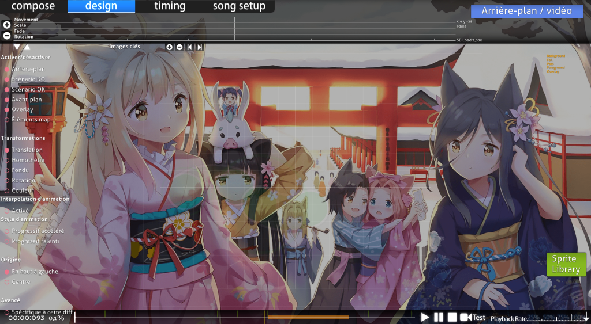
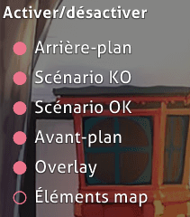
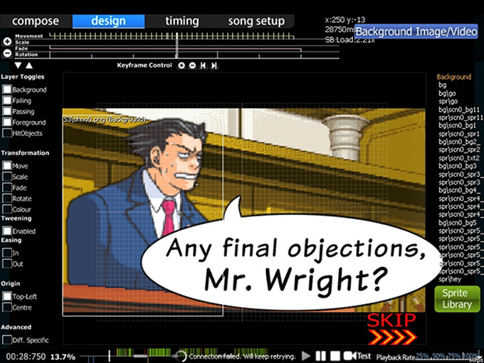
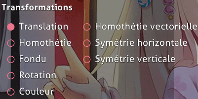

# Onglet Design

L'**Éditeur de Storyboard** est une section de l'[éditeur de beatmap](/wiki/Beatmap_Editor) du jeu, sous l'onglet Design, qui permet de faire du [Storyboarding](/wiki/Storyboards) simple. C'est une bonne introduction au concept fondamental avant le [Storyboard Scripting](/wiki/Storyboard_Scripting) plus avancé.

Il serait bon de faire des cours accélérés de toutes les commandes en utilisant des images aléatoires au moins une fois avant d'essayer de faire du storyboarding sérieux. Cela vous aidera à mieux mémoriser et comprendre l'utilisation.

## Démarrage

1. Placez tous vos éléments/photos du storyboard dans le dossier des chansons de votre map et créez un sous-dossier nommé "SB" pour eux.
2. Accédez à votre map via l'éditeur et allez dans l'onglet "Design".
3. Trouvez la bonne case sur la timeline au-dessus de laquelle vous voulez que votre élément de storyboard apparaisse, puis cliquez sur "Sprite Library" et sélectionnez votre image. Assurez-vous que votre élément ne dépasse pas 800x600 px. C'est le seuil maximum.
4. Sélectionnez maintenant la commande de ce que vous voulez que votre élément fasse (Déplacer, Échelle, Fondu, Rotation ou Couleur) et appuyez sur le "+" de "Keyframe Control" pour placer un point pour la commande au moment où vous vous trouvez. Le bouton "-" sur "Keyframe Control" supprime à nouveau le point, et les boutons fléchés vous permettent de sauter entre plusieurs points de la même commande pour le même élément du SB.
5. Trouvez maintenant le timing point auquel vous voulez que la commande se termine (à un moment ultérieur). Vous aurez ainsi 2 points pour elle et la ligne de couleur correspondante entre ces points. Vert - Déplacement ; Rouge - Échelle ; Rose - Fondu ; Jaune - Rotation ; Rose clair - Couleur
6. Aux points de commande, vous pouvez modifier les facteurs de la fonction en maintenant le bouton gauche de la souris enfoncé et en déplaçant votre curseur vers le haut (facteur croissant) ou vers le bas (facteur décroissant).
7. Répétez les étapes 3 à 6 pour les autres éléments. Pour les supprimer, utilisez la fonction `Supprimer` ou Éditer -> Supprimer dans le menu supérieur.

**Remarque :** si vous avez l'œil, le crochet vers le haut correspond au début de la transformation et le crochet vers le bas à la fin de la transformation. Une coche complète sur la ligne de transformation colorée signifie un changement de transformation (par exemple, déplacement vers le haut -> déplacement vers le bas).

## Caractéristiques

(En partant de haut en bas et de droite à gauche)

### En haut à gauche (Timeline de Transformation)

**Affiche la timeline des transformations de l'objet sélectionné.**

#### Timeline

| Nom | Description |
| :-- | :-- |
| Boutons `+`/`-` à gauche | Augmenter/diminuer le zoom de la timeline |
| Flèches `Haut`/`Bas` en bas à gauche | Faites défiler vers le haut/bas la timeline de transformation (pour voir la timeline des mouvements/couleurs). |
| Centre | Timeline de transformation pour l'objet SB sélectionné. |

#### Contrôle des keyframes

Il sera utilisé pour **ajouter des points d'ancrage (points de début/fin).** Il fonctionne à peu près de la même manière que les signets. Les boutons sont juste en dessous de la timeline.

| Nom | Description |
| :-- | :-- |
| Boutons `+`/`-` | Ajouter/supprimer des points d'ancrage pour la transformation sélectionnée. |
| Flèches `Gauche`/`Droite` | Sauter en arrière/en avant vers le point d'ancrage le plus proche de la transformation sélectionnée. |

S'il y a une transformation, celle-ci est éclairée avec sa couleur et aura deux demi-lignes séparées qui déterminent la durée. La ligne blanche complète détermine les points de changement de transformation (par exemple, monter -> descendre).

### En haut à droite (Lectures)

Affiche les **lectures** et un **bouton pour ajouter une image/vidéo en arrière-plan.** Le bouton est explicite.

Pour les lectures, **x/y** sont vos *propres* coordonnées de souris sur la beatmap et changeront frénétiquement lorsque vous déplacerez votre souris. **{number}ms** est l'horodatage en millisecondes. **Charge SB** est la quantité de puissance de traitement requise pour lire le storyboard *seul* uniquement. En général, gardez la charge SB aussi basse que possible (1,00~2,00) pendant la lecture et laissez-la tourner pendant les pauses/intro/outro.

### Au centre à gauche (Utilitaires)

#### Layer Toggles

Ceux-ci **désactiveront/activeront l'affichage des layers.** Si vous ne voulez pas voir la scène de passage (qui est toujours au-dessus de la scène d'échec dans l'éditeur), désactivez "Passage" et profitez de la scène d'échec. C'est utile lorsque vous voulez voir les commandes de différents objets mais que quelque chose vous en empêche.

Tous les boutons sont comme indiqué ci-dessous :

- Arrière-plan
- Scénario KO
- Scénario OK
- Avant-plan
- Overlay
- Objets (automatiquement désactivé)

**Note :** Objets > Avant-plan > Scénario KO/Scénario OK > Arrière-plan où ">" bloque cette couche. De plus, tous les nouveaux objets (ne provenant pas de "Compose") introduits sont réglés sur "Avant-plan" par défaut. Pour les transférer, faites un glisser-déposer vers l'onglet de la couche souhaitée.

#### Transformation (en fonction du temps)

Ce sont les commandes utilisées pour votre objet. Cinq de ces commandes ont été ajoutées : Translation, Homothétie, Fondu, Rotation et Couleur. Pour utiliser la boucle et les paramètres, vous devrez faire un peu de Storyboard Scripting pour les utiliser.

Pour les utiliser :

1. Cliquez sur l'élément Storyboard
2. Sélectionnez votre transformation
3. Définir la timeline pour la transformation (utiliser le "+" de Keyframe Control)
4. Définissez l'utilisation de l'effet (déplacez votre souris vers le haut ou le bas pour le déclencher)
5. Rincer et répéter.

##### Effets de transformation (en fonction du temps)

| Commande | Utilisation |
| :-- | :-- |
| Translation | Translation \[où aller (par exemple, monter)\]. |
| Homothétie | Agrandissement proportionnel (un carré reste un carré). |
| Fondu | Fade in/out. (assombrir ou éclaircir) |
| Rotation | Faire pivoter un certain nombre de "radian" (et non de degrés). |
| Couleur | Force la coloration du sprite. Peut changer de couleur progressivement en utilisant une couleur différente comme point final. "Effet permanent". Explication de base. |

##### Effets supplémentaires (survol de la barre de gauche)

| Commande | Utilisation |
| :-- | :-- |
| Homothétie vectorielle | Agrandissement irrégulier (un carré devient un rectangle). |
| Symétrie Horizontale/Verticale | Réflexion sur l'axe x/y respectivement |

##### Commandes supplémentaires

| Commande | Utilisation |
| :-- | :-- |
| Interpolation d'animation | Vous avez deux images clés (c'est-à-dire au début et à la fin), voulez-vous animer entre elles ? Si oui, activez l'interpolation d'animation. Sinon, désactivez-la. |
| Style d'animation | Commencez lentement/rapidement puis vite/lent vers le point final. Utile avec le Fade In. |
| Origine | Point d'origine. Coin "en haut à gauche" ou "centre" de l'image. |
| Spécifique à cette diff | Sauvegardez tous les SB dans le fichier `.osu` de cette difficulté au lieu du fichier `.osb`. |

**Note :**

- Couleur : "Effet permanent" - La couleur que vous avez définie sera toujours en vigueur même après la fin de la timeline. C'est très utile pour les images transparentes.
- `.osb` (base de l'événement osu!beatmap) : Base "design" (BG, Video, SB) pour chaque difficulté d'une beatmap set à suivre.
- `.osu` (osu!beatmap difficulté) : Fichier spécifique à la difficulté. Contient *beaucoup* d'informations.

### Centre (Storyboard de la beatmap)

Il s'agit de la **représentation visuelle du storyboard et elle change en fonction de la timeline et des bascules des layers.** Placez vos objets ici et créez le storyboard.

### Au centre à droite (Objets)

**Liste des objets SB dans leurs couches respectives**. Pour ajouter les objets SB, cliquez sur "Sprite Library". Pour allouer le nouveau sprite (objet SB), il suffit de le glisser-déposer dans la couche respective. Les nouveaux sprites se trouvent par défaut dans le calque "Avant-plan". En cliquant sur le nom du sprite, vous serez redirigé vers l'emplacement et la période de temps du sprite. Les duplicatas utilisent le même nom que le sprite original. Pour les supprimer, utilisez `Delete` ou Edit -> Delete dans le menu supérieur.

**Note:** Objets > Avant-plan > Scénario KO/Scénario OK > Arrière-plan où ">" bloque cette couche.

#### Bibliothèque des sprites

Cliquez sur le bouton "Browse..." pour rechercher le sprite à utiliser. Vous pouvez dupliquer le sprite en cliquant sur sa vignette dans la fenêtre de la bibliothèque de sprites.

### En bas (Timeline de jeu)

Joue la beatmap. Le storyboarding de l'outro nécessite un script de storyboarding. Playback Speed ralentit le morceau de % par rapport à la vitesse d'origine. Cette fonction devrait vous être familière si vous avez déjà fait du mapping dans l'onglet Compose.

## Limites

- Pas de support pour les effets sonores, ce n'est pas un gros problème car les effets sonores peuvent distraire les joueurs, surtout s'ils sont près des [objets](/wiki/Hit_Objects). L'utilisation d'effets sonores doit être réservée aux mappeurs expérimentés, avec l'aide d'un BN.
- Aucun support pour les [loop](/wiki/Storyboard_Scripting/Compound_Commands) et les [trigger](/wiki/Storyboard_Scripting/Compound_Commands).
- Aucune commande pour [Move-X](/wiki/Storyboard_Scripting/Commands)/[Move-Y](/wiki/Storyboard_Scripting/Commands).
- Les coordonnées du sprite sont *toujours* 320,240. Vous devrez utiliser la commande Move une fois pour définir l'emplacement (le point final n'est pas nécessaire).
  - Si vous faites *également* du [Storyboard Scripting](/wiki/Storyboard_Scripting), vous devrez *lire une ligne supplémentaire* par objet réalisé dans l'onglet Design.

## Source

- [m980's basic explanation](https://osu.ppy.sh/community/forums/posts/67660)
- [Kite's Basic Manual Storyboarding Guide](https://osu.ppy.sh/community/forums/topics/46111)
