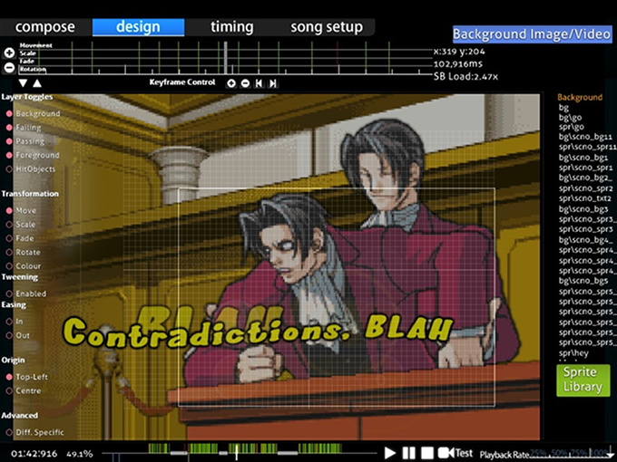
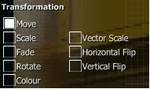

# Conception

L'éditeur de **Storyboard** est une section de [Beatmap Editor](/wiki/Beatmap_Editor) en jeu, sous l'onglet Conception, ce qui permet de faire du [Storyboarding](/wiki/Storyboards). C'est une bonne introduction au concept fondamental avant que les plus avancés fassent du [Storyboard Scripting](/wiki/Storyboard_Scripting).

Il serait favorable de faire des cours accélérés de toutes les commandes en utilisant des images aléatoires au moins une fois avant d'essayer de faire du storyboarding sérieux. Cela vous aiderait à mieux mémoriser et comprendre l'utilisation.

## Pour commencer

1.  Placez tous vos éléments/images du storyboard dans le dossier des chansons de votre carte et créez un sous-dossier nommé "SB" pour eux.
2.  Accédez à votre carte par l'éditeur et allez à l'écran "Design".
3.  Trouvez la bonne coche sur la timeline ci-dessus à l'endroit où vous voulez que votre élément de storyboard apparaisse, puis cliquez sur "Sprite Library" et sélectionnez votre image.

    Assurez-vous que votre élément ne dépasse pas 800x600 px. C'est le seuil maximum.

4.  Maintenant, sélectionnez la commande de ce que vous voulez que votre élément fasse (Déplacement, Échelle, Fondu, Rotation ou Couleur) et appuyez sur le "+" de "Keyframe Control" pour placer un point pour la commande au moment où vous êtes sur.

    "-" sur "Keyframe Control" supprime à nouveau le point, et les boutons fléchés vous permettent de sauter entre plusieurs points dans la même commande pour le même élément SB.

5.  Trouvez maintenant le point de chronométrage auquel vous voulez que la commande se termine (à un moment ultérieur) afin que vous ayez 2 points pour elle et la ligne de couleur correspondante entre ces points.

    Vert - Déplacement ; Rouge - Échelle ; Rose - Fondu ; Jaune - Rotation ; Rose clair - Couleur

6.  Aux points de commande, vous pouvez modifier les facteurs de la fonction en maintenant le bouton gauche de la souris enfoncé et en déplaçant votre curseur vers le haut (facteur croissant) ou vers le bas (facteur décroissant)
7.  Répétez les étapes 3 à 6 pour les autres éléments.

    Pour supprimer, utilisez `Supprimer` ou Édition -> Supprimer du menu supérieur.

**Note:** Si vous avez l'oeil vif ; Up-tick - Début de cette transformation ; Down-tick - Fin de ladite transformation. Une coche complète sur une ligne de transformation colorée signifie un changement dans la transformation (par exemple, monter -> descendre).

## Caractéristiques

(En partant du haut vers le bas, de gauche à droite)

### Haut-Gauche (Ligne de temps de la transformation)

**Affiche la timeline pour les transformations de l'objet sélectionné.**

#### Timeline

| Nom | Description |
| ---- | ----------- |
| Boutons  `+` / `-` à gauche | Augmenter / Diminuer le zoom de la timeline |
| Boutons fléchés `Haut` et `Bas` à gauche et en bas | Défilement vers le haut et vers le bas de la timeline de transformation (pour voir la timeline Déplacement/Couleur). |
| Centre | Ligne de temps de transformation pour l'objet SB sélectionné. |

#### Contrôle de la Keyframe

Cela sera utilisé pour **ajouter des points d'ancrage (points de départ/fin).** Cela fonctionne à peu près de la même manière que les signets. Les boutons sont juste en dessous de la timeline.

| Nom | Description |
| ---- | ----------- |
| Boutons `+`/`-` | Ajouter/Supprimer des points d'ancrage pour la transformation sélectionnée. |
| Boutons fléchés `Gauche` et `Droite` | Sauter en arrière/en avant vers le point d'ancrage le plus proche de la transformation sélectionnée. |

S'il y a une transformation, cette transformation est éclairée par sa couleur et aura deux demi-lignes séparées qui déterminent la durée. La ligne blanche complète détermine les points de commutation de la transformation (par exemple, aller vers le haut -> aller vers le bas).

### En haut à droite (lectures)

Montre les **lectures** et un **bouton pour ajouter une image/vidéo de fond.** Le bouton est auto-explicatif.

Pour les lectures, **x/y** sont les coordonnées de votre *propre* souris sur la carte des temps et changeront frénétiquement lorsque vous déplacerez votre souris. **{nombre}ms** est l'horodatage en millisecondes. **SB Load** est la quantité de puissance de traitement requise pour jouer le storyboard *seul* seulement. Généralement, gardez la charge SB aussi basse que possible (1.00~2.00) pendant le jeu et laissez-la rouler pendant la pause/l'introduction/la sortie.

### Centre gauche (Services publics)

#### Basculement des couches

Si vous ne voulez pas voir la scène de passage (qui est toujours au dessus de la scène d'échec dans l'éditeur),désactivez "Passing" et profitez de la scène d'échec. Ceci est utile lorsque vous voulez voir des commandes pour différents objets mais que quelque chose vous gêne.

Tous les boutons sont comme indiqué ci-dessous :

-   Background
-   Failing
-   Passing
-   Foreground
-   HitObjects (automatically disabled)

**Note:** HitObjects > Foreground > Passing/Failing > Background où ">" bloque ce calque. De plus, tout nouvel objet (ne provenant pas de "Compose") introduit est défini par défaut sur "Foreground". Pour transférer, glisser-déposer vers l'onglet du calque souhaité.

#### Transformation (basée sur le temps)

Ce sont les commandes utilisées pour votre objet. Cinq de ces commandes ont été mises en place : Déplacement, Échelle, Fondu, Rotation et Couleur. Pour utiliser la Boucle et les Paramètres, vous aurez besoin de faire un peu de Scripting Storyboard pour les utiliser.

Pour les utiliser :

1.  Cliquez sur l'élément Storyboard
2.  Sélectionnez votre transformation (MSFRC)
3.  Définissez la timeline pour la transformation (Utilisez le "+" du contrôle de l'image clé)
4.  Réglez l'utilisation de l'effet (déplacez votre souris vers le haut ou vers le bas pour le déclencher)
5.  Rincer et répéter.

##### Effets de transformation (basés sur le temps)

| Commande | Utilisation |
| ------- | ----- |
| Déplacement | Traduction [où aller (p. ex., se déplacer vers le haut)]. |
| Echelle | Agrandissement proportionnel (un carré reste un carré). |
| Fondu | Fondu en entrée/sortie. (assombrir vs éclaircir) |
| Faire pivoter | Faire pivoter un certain nombre de "Radians" (pas des degrés). |
| Coloration | Forcer la coloration du sprite. Peut changer de couleur progressivement en utilisant une couleur différente comme point final. "Effet permanent". Explication de base. |

##### Effets supplémentaires (survoler la barre de gauche) :

| Commande | Utilisation |
| ------- | ----- |
| Échelle vectorielle | Agrandissement irrégulier (un carré devient un rectangle). |
| Basculement horizontal/vertical | Réflexion sur l'axe x/y respectivement |

##### Commandes supplémentaires

| Commande | Utilisation |
| ------- | ----- |
| Tweening | Vous avez deux Keyframes (ie Start/End), voulez-vous animer entre elles ? Si oui, allumez Tweening. Sinon, désactivez-le. |
| Entrée/sortie de l'effacement | Démarrage lent / rapide puis rapide / lent près du point final. Utile pour le fondu enchaîné. |
| Origine | Point d'origine. Coin "Haut-Gauche" ou "Centre" de l'image |
| Diff. Spécifique | Sauvegardez tous les SB dans le fichier `.osu` de cette difficulté au lieu du fichier `.osb`. (Voir note ci-dessous) |

**Remarque :**

-   Couleur : " Effet permanent " - La couleur que vous avez définie sera toujours en vigueur même après la fin de sa ligne de temps. Ceci est très utile pour les images transparentes.
- `.osb` (osu!beatmap event base) : Base "Design" (BG, Video, SB) pour chaque difficulté du jeu de beatmap à suivre.
- `.osu` (osu!beatmap difficulty) : Fichier spécifique à la difficulté. Contient *beaucoup* d'informations.

### Centre (Storyboard de la carte des temps)

C'est la **représentation visuelle du storyboard et les changements basés à la fois sur la ligne de temps et les bascules de calque.** Placez vos objets ici et faites le storyboard.

### Centre-droit (Objets)

**Liste des objets SB dans leurs couches respectives**. Pour ajouter les objets SB, cliquez sur "Sprite Library". Pour attribuer le nouveau sprite (objet SB), il suffit de le glisser-déposer sur la couche respective. Les nouveaux sprites sont par défaut dans le calque "Foreground". En cliquant sur le nom du sprite, il sera affiché et transmis à l'emplacement et à la période du sprite. Les duplicatas utilisent le même nom que le sprite original. Pour les supprimer, utilisez "Supprimer" ou "Édition" -> "Supprimer du menu du haut".

**Note:** HitObjects > Foreground > Passing/Failing > Background où ">" bloque ce calque.

#### Bibliothèque de Sprites

Cliquez sur le bouton "Parcourir..." pour rechercher le sprite à utiliser. Vous pouvez dupliquer le sprite en cliquant sur sa miniature dans la fenêtre de la bibliothèque des sprites.

### Bas (Ligne de temps de lecture)

Joue le beatmap. L'Outro storyboarding nécessite un script de storyboard. La vitesse de lecture ralentit la chanson de % par rapport à la vitesse d'origine. Vous devriez être familier avec cela si vous aviez déjà fait du mapping avant à Compose.

## Limitations

-   Pas de support d'effets sonores, ce n'est pas un gros problème car les effets sonores peuvent distraire les joueurs, surtout s'ils sont à proximité [hit objects](/wiki/Hit_Objects). L'utilisation d'effets sonores doit être effectuée par des cartographes avancés seulement et avec les conseils d'un BAT.
-   Pas d'assistance pour [loop](/wiki/Storyboard_Scripting/Compound_Commands) et [trigger](/wiki/Storyboard_Scripting/Compound_Commands).
-   Pas de commandepour [Move-X](/wiki/Storyboard_Scripting/Commands)/[Move-Y](/wiki/Storyboard_Scripting/Commands).
-   Les coordonnées du sprite sont *toujours* 320,240. Vous devrez utiliser la commande Move une fois pour définir l'emplacement (point final non requis).
    -   Si vous faites *aussi* du [Storyboard Scripting](/wiki/Storyboard_Scripting), vous aurez besoin de *lire une ligne supplémentaire* par objet fait dans l'onglet Conception.

## Source

-   [m980's basic explanation](https://osu.ppy.sh/community/forums/posts/67660)
-   [Kite's Basic Manual Storyboarding Guide](https://osu.ppy.sh/community/forums/topics/46111)