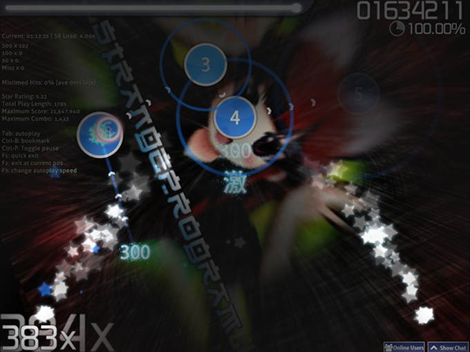

# Kiai Time

Le **Kiai Time** est défini par le [mapper](/wiki/Glossary) sur une [beatmap](/wiki/Beatmaps) entre deux [Timing Sections](/wiki/Beatmap_Editor/Timing). Vous pouvez reconnaître un Kiai time car l'écran clignote et vous verrez une fontaine d'étoiles, ensuite chaque [Hit Objects](/wiki/Hit_Objects) clignotera au rythme du [rythme principal](/wiki/Beatmap_Editor/Timing) et les étoiles vont exploser à partir du curseur quand un [Hit Circle](/wiki/Hit_Objects) est touché ou tombera du curseur lorsque vous suivez un [slider](/wiki/Hit_Objects) ou un [spinner](/wiki/Hit_Objects).

## Le Kiai time en beatmapping

Le moment le plus courant pour le Kiai time dans l'[édition](/wiki/Beatmap_Editor) de beatmaps est la "partie la plus forte de la chanson" c'est normalement le refrain de la chanson, cependant certaines chansons n'ont pas de refrain, mais elles ont une partie forte pour vous qui est cool, donc vous pouvez insérer le Kiai Time dans cette section. Sachez cependant que le fait de spammer les sections de début de kiai provoquera un spam dans les fontaines de kiai. C'est injustifiable, et surtout détesté par les joueurs à cause des lags que cela peut provoquer.

## Éléments à prendre en considération lors de l'utilisation du Kiai

1.  Sur les maps **[osu!taiko](/wiki/Game_Modes/osu!taiko)**, Les sections Kiai donnent 20% de [score](/wiki/Score) en plus, donc si vous mappez une [map](/wiki/Beatmaps) osu!taiko, prennez en considération le fait que le Kiai affecte le gameplay.
2.  **Soyez cohérent** ; c'est ennuyeux quand vous avez 3 sections de Kiai à différents endroits sur la même [difficultée](/wiki/Difficulties) et qu'ils aient l'air tous différents. De plus, il est apprécié que toutes les difficultés d'un même [mapper](/wiki/Glossary) aient exactement les mêmes Kiai time.
3.  **Ne pas utiliser de blanc en tant que [couleur de combo](/wiki/Glossary)** (255,255,255) ; cela rend le Kiai aveuglant et fait mal aux yeux.
4.  Il est normal qu'une section Kiai soit légèrement plus difficile que le reste du beatmapset, car le Kiai time est aussi la **partie la plus forte de la map**.
5.  5.  **Les [Guest difficulties](/wiki/Glossary) peuvent avoir des kiai différents. Ceci est dû au fait que tout le monde ne pense pas au même endroit qui leur semble le "meilleur" pour le placer sur la map ; cependant, le Kiai doit toujours être cohérent.
6.  6.  Un mélange de couleur pour faire Kiai avec un ensemble différent de [couleur de combos](/wiki/Glossary) est une bonne idée.