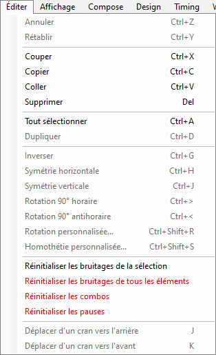
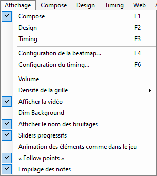
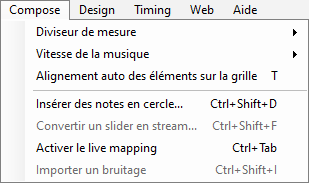
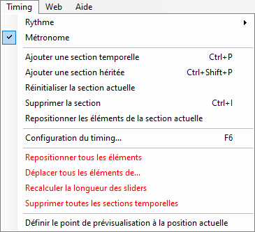

# Menu de l'éditeur de beatmap

## Fichier

**Commandes de base pour les fichiers.**

### Commandes de fichiers

| Nom | Description |
| :-- | :-- |
| Supprimer tout les élements (`Ctrl` + `N`) | Purger les notes de la difficulté actuelle. |
| Ouvrir la difficulté... | **Pour l'édition :** Passez rapidement d'une difficulté à l'autre. **Pour référence :** (osu!mania uniquement) Superpose la difficulté sélectionnée sur celle (actuellement) ouverte. |
| Enregistrer (`Ctrl` + `S`) | Sauvegarder les changements actuels (à la fois sur `.osu` et sur `.osb`) |
| Enregistrer en tant que nouvelle difficulté | Sauvegarder les changements actuels sur cette difficulté comme une nouvelle difficulté. L'ancienne difficulté est conservée dans son dernier état sauvegardé lorsqu'elle est rechargée. |

### Commandes d'annulation

| Nom | Description |
| :-- | :-- |
| Annuler toutes les modifications (cette diff) (`Ctrl` + `L`) | Annuler les modifications en cours et revenir au dernier état sauvegardé. Pour les problèmes d'ordre générales (notes). |
| Annuler toutes les modifications (beatmap) (`Ctrl` + `Shift` + `L`) | Annuler les modifications en cours et revenir au dernier état sauvegardé. Pour les problèmes complexes (timing, storyboard). |

### Commandes de dépannage

| Nom | Description |
| :-- | :-- |
| Tester la beatmap (`F5`) | Testez la beatmap. Les modifications actuelles seront sauvegardées afin de pouvoir la tester. |
| Ouvrir AiMod (`Ctrl` + `Shift` + `A`) | Ouvre [AiMod](/wiki/Beatmap_Editor/AiMod). |

### Commandes de package de la beatmap

| Nom | Description |
| :-- | :-- |
| Publier la beatmap... (`Ctrl` + `Shift` + `U`) | Téléchargez la beatmap dans la section [WIP](https://osu.ppy.sh/community/forums/10). Nécessite un osu!account connecté au site pour voir le forum "Beatmaps".    |
| Exporter la beatmap... | Exportez la beatmap en tant que `.osz`. Le fichier sera envoyé dans le dossier "Exports" et vous serez dirigé vers osu!/Exports depuis l'éditeur de beatmap. |
| Extraire le contenu de la beatmap | ? |
| Importer un fichier... | **bms/bme:** (osu!mania seulement) Ouvrez le fichier .bms/.bme à importer comme difficulté osu!mania. |

### Commandes pour les programmeurs

| Nom | Description |
| :-- | :-- |
| Ouvrir le dossier Songs | Ouvrez l'emplacement du dossier des chansons dans osu!/Songs. |
| Ouvrir le fichier `.osu` dans le bloc-note | Ouvrez le fichier de difficulté de la beatmap dans Microsoft Notepad. |
| Ouvrir le fichier `.osb` dans le bloc-note | Ouvrez le fichier de base (storyboard) dans Microsoft Notepad. |

### Commande de sortie d'urgence

| Nom | Description |
| :-- | :-- |
| Quitter... (`Esc`) | Quitter l'éditeur de Beatmap. Peut vous demander de sauvegarder les changements récents. Parfois *ignore* les modifications de l'onglet Design. |

## Éditer

*Commandes d'édition. Identique aux raccourcis Microsoft par défaut.*

### Commandes Rétablir/Annuler

Notez que ces commandes peuvent être désactivées dans les [Options](/wiki/Options) pour éviter les plantages lors de l'édition de chansons marathon.

| Nom | Description |
| :-- | :-- |
| Annuler (`Ctrl` + `Z`) | Annuler une étape. |
| Rétablir (`Ctrl` + `Y`) | Rétablir une étape. |

### Commandes d'édition (Select a note before use)

*Sélectionnez une note avant de l'utiliser*

| Nom | Description |
| :-- | :-- |
| Couper (`Ctrl` + `X`) | Coupez la ou les notes. |
| Copier (`Ctrl` + `C`) | Copier la ou les notes. |
| Coller (`Ctrl` + `V`) | Coller la ou les notes. |
| Supprimer (`Delete`) | Supprimer la ou les notes. |

### Commandes spéciales

| Nom | Description |
| :-- | :-- |
| Tout sélectionner (`Ctrl` + `A`) | Sélectionnez toutes les notes. |
| Dupliquer (`Ctrl` + `D`) | Copier + Coller. |

### Commandes de rotation

| Nom | Description |
| :-- | :-- |
| Inverser (`Ctrl` + `G`) | **Slider :** Inverser le placement de la numérotation. **Tout sélectionner :** Le design de votre beatmap va dans l'autre sens. Exemple : Un hitcircle à la 10ème seconde sera déplacé à la dernière 10ème seconde de la chanson et vice versa. |
| Symétrie horizontale (`Ctrl` + `H`) | Retourne la ou les notes de gauche à droite (par rapport à la ligne de l'axe des y de l'origine du terrain de jeu) et vice versa. |
| Symétrie verticale (`Ctrl` + `J`) | Retourne la ou les notes de haut en bas (par rapport à la ligne de l'axe x de l'origine du terrain de jeu) et vice versa. |
| Rotation 90° horaire (`Ctrl` + `>`) | Faire pivoter la ou les notes de 90° vers la droite. |
| Rotation 90° antihoraire (`Ctrl` + `<`) | Faites pivoter la ou les notes de 90° vers la gauche. |
| Rotation personnalisée... (`Ctrl` + `Shift` + `R`) | Définissez votre angle de rotation (+/- 180°) pour la ou les mauvaises notes. Vous pouvez régler la direction de rotation \[(Anti)Horaire\] et l'origine \[(Centre du terrain de jeu/Centre de la sélection)\]. |
| Homothétie personnalisée... (`Ctrl` + `Shift` + `S`) | Définissez votre taille d'agrandissement (0,500x - 1,200x) pour la ou les mauvaises notes. Vous pouvez régler l'origin \[(Centre du terrain de jeu/Centre de sélection)\] et "Appliquer à" (l'échelle d'agrandissement à) l'un ou l'autre ou les deux axes x et/ou y. |

### Boutons de réinitialisation

| Nom | Description |
| :-- | :-- |
| Réinitialiser les bruitages de la sélection | Supprimez les hitsounds de la note actuellement sélectionnée. |
| Réinitialiser les bruitages de tous les élements | Supprimez tous les hitsounds de toutes les notes de cette difficulté. |
| Réinitialiser les combos | Annulez toutes les colorations de combo sur les notes. |
| Réinitialiser les pauses | Annule les temps de pause. Ne fonctionne pas sur les temps de pause automatisés qui empêchent une consommation excessive du drain de vie |

### Commandes de coups de pouce

| Nom | Description |
| :-- | :-- |
| Déplacer d'un cran vers l'arrière (`J`) | Déplace la ou les notes d'un temps en arrière en fonction du diviseur de temps. |
| Déplacer d'un cran vers l'avant (`K`) | Déplace la ou les notes d'un temps en avant en fonction du diviseur de temps. |

## Affichage

*Lieu d'intérêt.*

### Commandes d'onglets

| Nom | Description |
| :-- | :-- |
| Compose (`F1`) | Accédez à l'onglet Compose. |
| Design (`F2`) | Accédez à l'onglet Design. |
| Timing (`F3`) | Accédez à l'onglet Timing. |

### Commandes de configuration

| Nom | Description |
| :-- | :-- |
| Configuration de la beatmap... (`F4`) | Accès direct à la fenêtre Song Setup. |
| Configuration du timing... (`F6`) | Accès direct à la fenêtre de timing. |

### Commandes spéciales

| Nom | Description |
| :-- | :-- |
| Volume | Régler deux volumes (Musique/Échantillon). |
| Densité de la grille | Taille du carré de la grille. 1(le plus clairsemé)/2/3/4 (le plus précis), soit Large/Medium/Small/Tiny, chacun étant nommé respectivement. |
| Afficher la vidéo | Montrer la vidéo. Généralement désactivé parce qu'il est gênant. |
| Dim Background | Affiche le son des touches attaché aux notes. Très utile dans osu!mania. |
| Afficher le nom des bruitages | Affichez le noms des bruitages. |
| Sliders progressifs | Animez les sliders comme si vous jouiez dans le jeu. |
| Animation des élements comme dans le jeu | Animez les cercles comme s'ils étaient cliqués (lorsque l'horodateur passe le cercle) dans le jeu. |
| "Follow points" | Affichez (et animez) les follow points comme dans le jeu. |
| Empilage des notes | Stack the overlaid hitcircles as if in-game (dependent on difficulty settings) |

## Compose

*Page principale : [Compose](/wiki/Beatmap_Editor/Compose)*

### Commandes des règles

| Nom | Description |
| :-- | :-- |
| Diviseur de mesure | [Beat Snap Divisor](/wiki/Beatmap_Editor/Beat_Snap_Divisor) |
| Vitesse de la musique | Identique à la vitesse de lecture. |
| Alignement auto des élements sur la grille (`T`) | Permet l'accrochage des notes par rapport à la ligne de grille actuelle. |

### Commandes spéciales

| Nom | Description |
| :-- | :-- |
| Insérer des notes en cercle... (`Ctrl` + `Shift` + `D`) | Créez un flow circulaire de cercles. Vous pouvez ajuster le Distance Snap (0.1x - 2.0x) {Espacement entre les notes}, l'angle Offset (0° - 180°) {Angle de rotation}, la répétition et les points (3 - 14/282) {Nombre de cercles}. |
| Convertir un slider en stream... | (Sélectionnez un slider) Changez le curseur en flow de cercles. Vous pouvez choisir entre deux options : Par nombre d'objets ou Par distance instantanée. **Par nombre d'objets :** Ajustez le slider flow avec la quantité donnée de cercles (1 - 17/100). **Par la distance instantanée :** Ajuste le slider flow avec une distance donnée entre deux notes (0.10x - 5.00x). Peut résulter en une quantité absurde de cercles, puisqu'il s'appuie sur le diviseur de mesure (un temps = une note). **Beat Snap Divisor :** Ajusteur de timing des notes. |
| Activer le live mapping (`Ctrl` + Tab) | Maps osu!/osu!catch/osu!taiko : utilisez les touches osu!taiko pour saisir des cercles/fruit/taiko, tout en jouant le morceau dans l'éditeur. Placé par l'emplacement du curseur. Différents sons en fonction de la touche osu!taiko sur laquelle vous avez appuyé. maps osu!mania : utilisez les touches osu!mania pour saisir des cercles, tout en jouant un morceau dans l'éditeur. Placés par la touche sur laquelle vous avez appuyé. Ne fonctionne pas pour les sliders/holds. |
| Importer un bruitage | [Keysound and Sound Sampling.](/wiki/Beatmap_Editor/Compose) |

## Design

*Page principale : [Design](/wiki/Beatmap_Editor/Design)*

| Nom | Description |
| :-- | :-- |
| Déplacer tous les élements du storyboard de... | Déplace *tout* par valeur #ms. Utile si vous avez changé le .mp3 ou le décalage. |

## Timing

*Page principale : [Timing](/wiki/Beatmap_Editor/Timing)*

### Commandes du métronome

| Nom | Description |
| :-- | :-- |
| Rythme | Timing valse (3/4) ou standard (4/4). Pour un timing exotique, utilisez Timing Setup. |
| Métronome | Autoriser/refuser le son "tic, tic, (tic) , toc" du métronome. |

### Commandes de signets

| Nom | Description |
| :-- | :-- |
| Ajouter une section temporelle (`Ctrl` + `P`) | Ajouter un décalage rouge (Nouveau BPM) |
| Ajouter une section héritée (`Ctrl` + `Shift` + `P`) | Ajout d'un décalage vert (Nouvel ajusteur) |
| Réinitialiser la section actuelle  | Supprimez tout les élements de la section actuelle |
| Supprime la section (`Ctrl` + `I`) | Supprimer le décalage rouge/vert (supprimer un avant la double ligne) |
| Repositionner les élements de la section actuelle | Repositionnez la section actuelle avec le nouveau timing actuel. |

### Configuration du timing

| Nom | Description |
| :-- | :-- |
| Configuration du timing... (`F6`) | [Timing Setup](/wiki/Beatmap_Editor/Timing). |

### Commandes spéciales

| Nom | Description |
| :-- | :-- |
| Repositionner tous les élements | Repositionnez toutes les notes à leurs sections respectives. |
| Déplacer tout les élements de... | Déplacer toutes les notes par #ms |
| Recalculer la longueur des sliders | Laissez osu! recalculer la longueur des sliders. (Il est préférable de l'utiliser si le bpm/la vitesse du curseur/le multiplicateur de vitesse du curseur a changé.) **Attention :** Faire cela peut raccourcir la longueur de tous les curseurs ! Vérifiez votre map après utilisation ! |
| Supprimer toutes les sections temporelles | Purgez le timing |

### Commande de prévisualisation

| Nom | Description |
| :-- | :-- |
| Définir le point de prévisualisation à la position actuelle | Définir ce timestamp comme marque jaune (extrait de démonstration pour Song Selection). |

## Web

*Ouvre votre navigateur. Vous envoie principalement vers le fil de discussion du beatmap (nécessite de se connecter au site).*

| Nom | Description |
| :-- | :-- |
| Page web de la beatmap | Allez à la page d'information de cette beatmap. Le lien est `https://osu.ppy.sh/beatmapsets/###` où "###" est l'ID de la beatmap. |
| Topic de la beatmap | Allez sur le fil de discussion de la beatmap |

## Aide

| Nom | Description |
| :-- | :-- |
| Afficher l'aide (menu Compose) | Ouvre la référence de l'aide en jeu. |
| Ouvrir la FAQ... | Liens vers [Beatmapping](/wiki/Beatmapping). |
