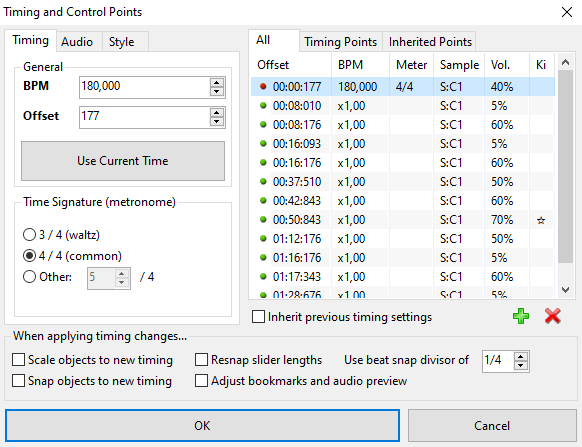

# Timing tab

*See also: [How to time songs](/wiki/Guides/How_to_Time_Songs)*

The **timing tab** of the [beatmap editor](/wiki/Beatmap_Editor) lets mappers change the timing settings of a [beatmap](/wiki/Beatmap). Timing is usually the first step in creating a new beatmap.

Timing consists of a song's [offset](/wiki/Beatmapping/Offset), [beats per minute (BPM)](/wiki/Beatmapping/Beats_per_minute), and [meter](https://en.wikipedia.org/wiki/Metre_(music)). Correct timing on beatmaps is necessary for players to maintain [accuracy](/wiki/Gameplay/Accuracy) while playing. Incorrectly timed beatmaps cannot pass through the [beatmap ranking procedure](/wiki/Beatmap_ranking_procedure).

## Timing and Control Points window

Timing points can be added from the `Timing and Control Points` window in the editor (default shortcut `F6`). Timing points divide a song into timing sections to accurately reflect changes to a song's timing.

### Uninherited timing point

An uninherited timing point, displayed as a red line, is the base for a timing section's BPM, offset, and meter. Every beatmap must have at least one red line, however some songs require multiple due to more complex composition or timing inaccuracies caused by live performance.

### Inherited timing point

An inherited timing point, displayed as a green line, inherits BPM, offset, and meter settings from the previous red line. Green lines are used to adjust [slider velocity](/wiki/Hit_object/Slider_velocity) and [hitsound](/wiki/Beatmapping/Hitsound) settings.

An inherited timing point cannot be placed before an uninherited one, because it would not inherit any settings.
