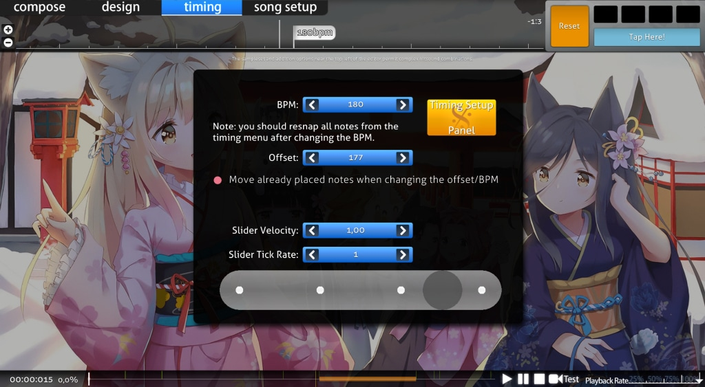

# Tab timing

*Kunjungi juga: [Bagaimana cara mengatur waktu lagu](/wiki/Guides/How_to_Time_Songs)*

**Tab timing** di dalam [beatmap editor](/wiki/Beatmap_Editor) memungkinkan para mapper untuk mengubah pengaturan timing dari sebuah [beatmap](/wiki/Beatmap). Timing biasanya merupakan sebuah langkah pertama dalam membuat sebuah beatmap.

Timing terdiri dari sebuah [offset](/wiki/Beatmapping/Offset) lagu, [beats per minute (BPM)](/wiki/Beatmapping/Beats_per_minute), dan [meter](https://en.wikipedia.org/wiki/Metre_(music)). Beatmap dituntut agar mempunyai timing yang akurat, supaya para pemain dapat menjaga akurasi saat bermain. Beatmap dengan timing yang tidak tepat, tidak dapat melewati [prosedur beatmap ranking](/wiki/Beatmap_ranking_procedure).

## Jendela Timing dan Control Point

Timing point dapat ditambahkan dari jendela `Timing dan Control Points` di editor (pintasan default `F6`). Timing point membagi lagu menjadi beberapa bagian timing untuk mencerminkan perubahan keakuratan timing lagu.

### Uninherited timing point

Uninherited timing point ditampilkan sebagai sebuah garis merah (*red line*), sebagai bagian dasar timing untuk BPM, offset, dan meter. Setiap beatmap wajib memiliki setidaknya satu garis merah, namun beberapa lagu memerlukan beberapa karena komposisi yang lebih kompleks atau ketidakakuratan timing yang disebabkan oleh pertunjukan langsung.

### Inherited timing point

Inherited timing point ditampilkan sebagai sebuah garis hijau (*green line*), inherits BPM, offset, dan pengaturan meter dari garis merah sebelumnya. Garis hijau digunakan untuk menyesuaikan pengaturan pada [slider velocity](/wiki/Hit_object/Slider_velocity) dan [hitsound](/wiki/Beatmapping/Hitsound).

Inherited timing point (*green line*) tidak bisa ditempatkan sebelum uninherited point pertama (*red line*), karena akan menyebabkan tidak dapat memasang pengaturan inherit apa pun.
