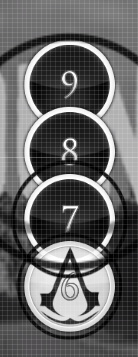
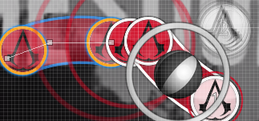

Las [dificultades](ES:Song_Setup#Difficulty) faciles son faciles de hacer una vez que entiendes sus bases. Primero, empieza siguiente la siguiente configuración recomendada para la difucultad:

-   Drenaje de HP: 4 o menos
-   Tamaño de circulos (CS) : 2 o 3
-   Velocidad de enfoque (AR): 4 or less
-   Dificultad general (OD): 4 or less
-   Velocidad de deslizadores: De acuerdo con los beats por minuto (BPM), puede ser desde 0.8x en canciones más rápidas o incluso 1.6x en canciones más lentas.

Ahora, vas a querer usar la función de [Distance Snap](ES:Distance_Snap) sobre todo en una dificultad Facil. Asi que, '''ajusta el multiplicador de la distancia de chasqueo de tal manera que los círculos que están separados por un sólo beat no se superpongan entre ellos. Para círculos tamaño 4 una distancia de chasqueo de .5 debería funcionar. Los nuevos jugadores a seguido notan que los círculos que se sobreponen así son difíciles de leer.

Los beats más alejados entre si son mejores para los jugadores nuevos.

Los beats más cercanos entre ellos son mejores para jugadores avanzados.

Ajusta el [Beat Snap Divisor](ES:Beat_Snap_Divisor) a 1/1, luego selecciona el círculo, presiona a reproducir y empieza a colocar círculos al ritmo de la música.

Ahora, tu ritmo principal aquí debería ser todo otro beat. Empieza con el [downbeat](ES:Timing) y comienza colocando un círculo en cada beat. Como sea, verás que esto es aburrido y da mucho sueño. Es por esto que regresamos y editamos cosas para pulir el caso un poco y que los jugadores no mueran de aburrimiento. Te conviene hacer tres cosas:

Mantenerte a ritmo
------------------

Imagina que un "." es un beat sin un [hit circle](ES:Hit_Object), y que una "O" es un beat con un "hit circle" (Las dificultades fáciles deberían ser mapeadas conforme al ritmo en la mayoría de los casos, con unas cuantas excepciones). Este es un patrón simple que podrías intentar:

O.O.OOO.

Ese patrón se usa a menudo a una velocidad más alta, pero, volviéndolo lento como aquí es intuitivo y funciona muy para una dificultad Fácil. Hay otros patrones que puedes usar también. Por ejemplo:

OOO.OOO.

Ese patrón funciona bien. Si quieres ser flojo, puedes usar el primer patrón durante el verso y el segundo patrón durante el coro. Pero no quieres que sea tan obvio que estás siendo flojo, así que puedes tratar de usar patrones planos con tildes rojas como (a 1/2) O..O..O.

Recuerda que puedes mapear alternando deslizadores/círculos: O.O.O.O puede mapearse como O=O.O=O ("=" representa un deslizador) o O=O=O.O (repitiendo deslizadores).

Ruletas
-------

Los Spinners (Ruletas) deben ser usadas muy moderadamente en dificultades faciles - generalmente al finalizar una parte mapeada y antes de un descanso, o también al final de la canción. Cuando uses una ruleta, asegurate de que su duración sea considerablemente larga. De 2 - 4 pulsos son buena guía.

La razón es porque la mayoría de los jugadores nuevos van a reaccionar muy lentamente a una ruleta, así que se retrasan para empezarlas. Lo que también provocará que empiecen a girar de manera alocada, usualmente rayando en todo el perimetro de la pantalla. Una vez que la ruleta este completada, estarán muy probablemente desorientados y preguntandose donde está su cursor. This is la razón por la que si tienes una ruleta enmedio de una fase mapeada, deberías permitirle al jugador el mayor tiempo posible para recuperarse. Esto es de 3-4 pulsos después de la ruleta, pero puede variar dependiendo del BPM. También se sugiere a los Mapeadores colocar las notas/deslizadores cerca del centro del área de juego una vez que la ruleta haya acabado.

Las ruletas son frecuentemente usadas en dificultades faciles en lugares donde un [stream](/wiki/Mapping_Techniques/Streams) iría en un mapa más dificil.

