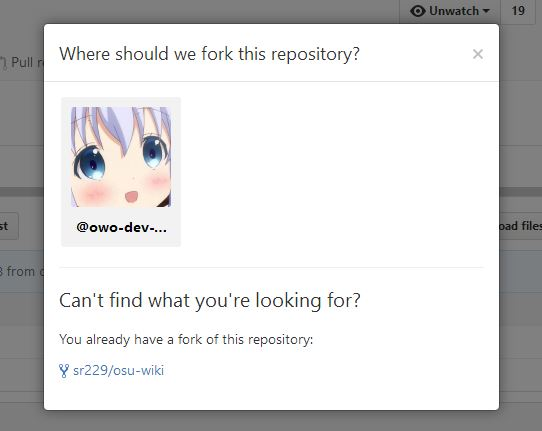

Getting Started on contributing to the osu!wiki
==================

Thanks for your interest in making osu!wiki Better! As you can see, we have moved everything to [GitHub](https://github.com/ppy/osu-wiki).
So here's some few things in mind to get you started in Contributing to the new Wiki.


### Prerequisites

To be able to contribute to osu!wiki you must have the following :

- Basic Knowledge in VCS (Version Control System), Particularly Git (If you plan to make changes locally).
- Basic Knowledge in Markdown.
- a Github Account.
- a Markdown Editor. We either use [Visual Studio Code](https://code.visualstudio.com) or [Atom](https://atom.io) (If you plan to make changes locally).
- a Markdown Previewer with **GFM** Support (Github-Flavoured Markdown). We use [Shiba](https://github.com/rhysd/Shiba) or Atom and Visual Studio Code's Built In Markdown Previewers (If you plan to make changes locally).

### Creating a GitHub Account 
 To get started in contributing to osu!wiki, you must first sign up for a GitHub Account.

 1:) Go to the [GitHub Homepage](https://github.com).

 

 Then click "Sign Up" and fill the following Fields like this example.

 

 Now Click "Create an account" and you have a GitHub Account! You're well on your way to Contribute to the Wiki.

 ### Forking
 
 To be able to make changes to the repository, you must first create your own copy of the repository. This is known as "Forking".
 
 Go to the [GitHub repository](https://github.com/ppy/osu-wiki).
 
 You should see something like this.


Now click the "Fork" Button on the top-right and it would prompt you on where to fork the repository.



If you have already made a fork, the Prompt will also say where was it forked.

Now click at your profile and GitHub would redirect you to where the fork is.

And you should see something like this.


Congratulations! You made a copy of the osu!wiki repository! You can now proceed in making changes.

### Making Changes 

#### Through GitHub's Web Editor
If you don't want the hassle of cloning your fork into your PC, GitHub offers Editing through your browser.

Go to your desired Folder that you want to edit and pick a Markdown File to edit.

_Note: Each article is grouped into folders and each folder contains markdown files and their media.
Please follow this format if you're creating a new Article._

Now click your desired Markdown file to edit. And you should see something like this.


Now Click on the Pencil Icon to edit. And it should redirect you to the Web Editor.


If you want to preview your changes, click the "Preview Changes" Tab. Click "Edit File" to go back to Editing.

After making your changes, scroll down and Fill the following fields to explain your edit to other contributors.


You would be given a option where to save your edits.

- Commit Directly to the ``xy`` branch will commit the changes through your branch directly.

- Create a New Branch will automatically create a Branch for your edits. This is useful if you're making bulk edits.

Pick a option and click "Commit Changes".

#### Through your local Machine

GitHub under the hood is a Git Service. You can clone your fork in your Machine and make changes there.

if you have git installed, put this in your Command Line Interface :
```armasm
git clone https://github.com/<username>/osu-wiki 
```
and this should clone your fork into your specified folder.

Now after Making your changes locally, we need to commit this on your local copy.

this can be done by 
```armasm
git add .
git commit -m "<commit message here>"
```
However, in some Editors like Visual Studio Code, they provide a Git Management Interface.


After Committing your changes, we ned to sync this on GitHub, to be able to do this, Enter the following in your Command Line Interface :

```armasm
git push
```
and this should upload your changes in GitHub.

### Pull Requests

After making your changes, you must make a "Pull Request" to be able for your changes to be made into the wiki.

Go to your Pull Requests tab.


