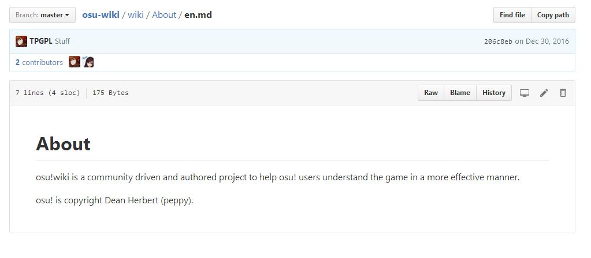
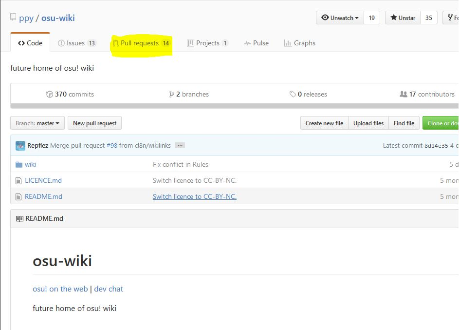
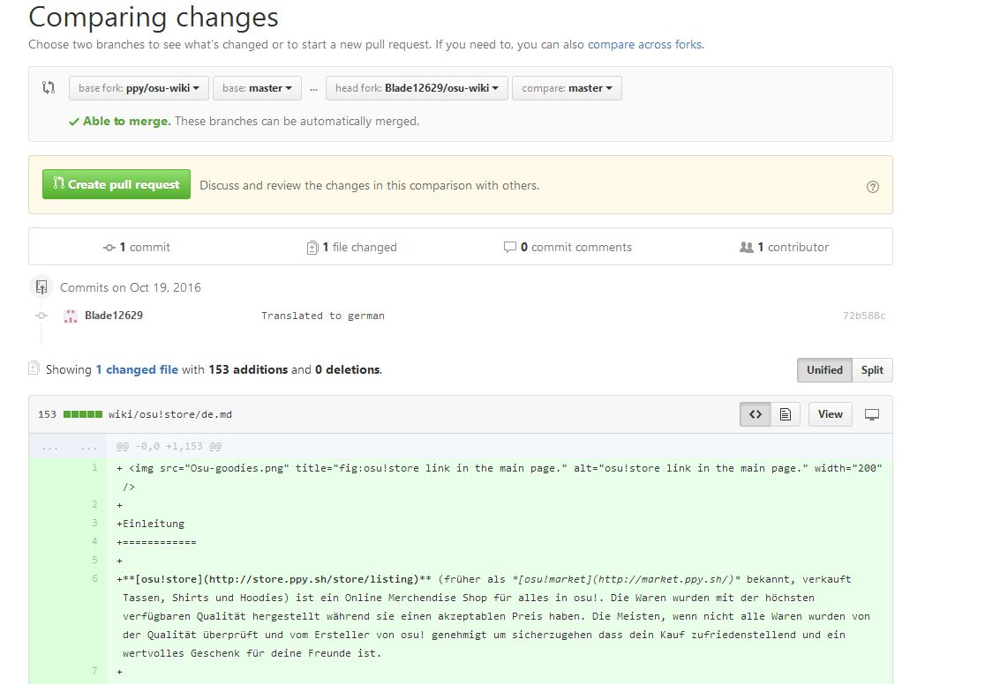
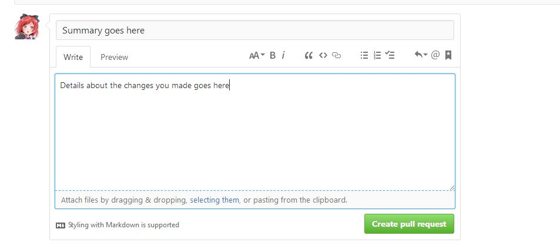

Getting Started on contributing to the osu!wiki
==================

Thanks for your interest in making osu!wiki Better! As you can see, we have moved everything to [GitHub](https://github.com/ppy/osu-wiki).
So here's some few things in mind to get you started in Contributing to the new Wiki.


## Prerequisites

To be able to contribute to osu!wiki you must have the following :

- Basic Knowledge in VCS (Version Control System), particularly Git (If you plan to make changes locally).
- Knowledge in [Markdown](https://github.com/adam-p/markdown-here/wiki/Markdown-Cheatsheet).
- A GitHub account.
- A markdown editor, we either use [Visual Studio Code](https://code.visualstudio.com) or [Atom](https://atom.io) (If you plan to make changes locally).
- A markdown previewer with **GFM** Support (Github-Flavoured Markdown), we use [Shiba](https://github.com/rhysd/Shiba) or Atom and Visual Studio Code's Built In Markdown Previewers (If you plan to make changes locally).

## Creating a GitHub Account 
 To get started in contributing to osu!wiki, you must first sign up for a GitHub Account.

 Go to the [GitHub Homepage](https://github.com).

 

 Then click "Sign Up" and fill the following Fields like this example.

 

 Now click "Create an account" and you're well on your way to contribute to osu!wiki.


## Forking
 
 To be able to make changes to the repository, you must first create your own copy of the repository. This is known as "Forking".
 
 Go to the [GitHub repository](https://github.com/ppy/osu-wiki).
 
 You should see something like this.


Now click the "Fork" Button on the top-right and it would prompt you on where to fork the repository.


If you have already made a fork, the Prompt will also say where was it forked.

Now click at your profile and GitHub would redirect you to where the fork is.

And you should see something like this.


Congratulations! You made a copy of the osu!wiki repository! You can now proceed in making changes.

## Making Changes 

### Through GitHub's Web Editor
If you don't want the hassle of cloning your fork into your PC, GitHub offers Editing through your browser.

Go to your desired Folder that you want to edit and pick a Markdown File to edit.

_Note: Each article is grouped into folders and each folder contains markdown files arranged by language and their media.
Please follow this format if you're creating a new Article._

Now click your desired Markdown file to edit. And you should see something like this.



Now Click on the Pencil Icon to edit. And it should redirect you to the Web Editor.


If you want to preview your changes, click the "Preview Changes" Tab. Click "Edit File" to go back to Editing.

After making your changes, scroll down and Fill the following fields to explain your edit to other contributors.


You would be given a option where to save your edits.

- "Commit Directly to the ``xy`` branch" will commit the changes through your branch directly.

- "Create a New Branch" will automatically create a Branch for your edits. This is useful if you're making bulk edits.

Pick a option and click "Commit Changes".

### Through your local Machine

GitHub under the hood is a Git Service. You can clone your fork in your Machine and make changes there.

if you have git installed, put this in your Command Line Interface :
```prolog
git clone https://github.com/<username>/osu-wiki 
```
and this should clone your fork into your specified folder.

Now after Making your changes locally, we need to commit this on your local copy.

this can be done by 
```prolog
git add .
git commit -m "<commit message here>"
```
However, in some Editors like Visual Studio Code, they provide a Git Management Interface.


After Committing your changes, we ned to sync this on GitHub, to be able to do this, Enter the following in your Command Line Interface :

```prolog
git push origin <branch>
```
and this should upload your changes in GitHub.

## Pull Requests

After making your changes, you must make a "Pull Request" to be able for your changes to be made into the wiki.

Go to your Pull Requests tab.



You should see the Pull Requests Page.


This is your Pull Request Page. Now click on "New Pull Request"

and you should see something like this.


Now we want to compare ``ppy:master`` against your changes.

Now Select where did you made your changes in "branch" beside your "head Fork".



_However if you made changes in your Master Branch, The Changes will be shown without changing anything in the head fork options_.

Now after viewing your changes, click "Create Pull Request" and fill it with the following details:

**Title** : The Summary of the Changes you've made.

**PR Sub-Message** : the Details of the changes you've made. 



Then Click "Create Pull Request" and wait for a Reviewer to check and possibly, Merge your changes.
 
 Your Changes must follow the [Article Styling Guidelines](wiki/Article_Style_Guide/en.md) to be able to get merged.

## FAQ

### Q: Why is the old osu!wiki not staying?

Due to abysmal Performance, the old wiki is getting deprecated
as stated [here](https://github.com/ppy/osu-wiki/issues/69).

### Q : How would this differ from the old wiki?

- We use GitHub for Collaboration. You can Make mass changes easily and efficiently and you can delay your changes as long as you like.
- Unlike the old osu!wiki, Changes has to go Pull Requests which are then reviewed by staff or someone with write permissions. This adds a layer of security against spammers and vandals.
- Linking is done Manually, and must be done using Static Linking.
- **No Templates**. You must duplicate the Template and paste it accordingly to your file.
- Deletion of Media is easier and requires no special wiki function. However, this has to go under go the Pull request Protocol and may cause Git Conflicts.
- Tables are supported bare-minimum by GFM without requiring extensions, unlike Mediawiki. However, this does mean we need to code some tables in HTML in extreme cases.
- Markdown is sensitive. any wrong Capitalization can break things like Static Links.

### Q: Can we use HTML?

We avoid to use HTML mostly in Wiki but in extreme cases, we allow HTML for Tables and Linking.


## Conclusion
I hope this briefs you on how to contribute to the new osu!wiki. If you have any more questions
you can inquire at the [osu!development Discord Server](https://discord.gg/ppy).