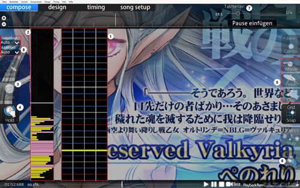
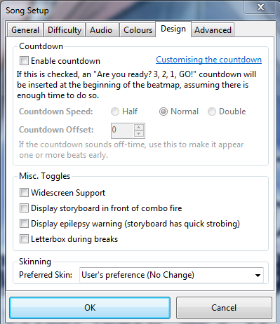
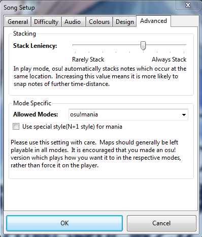
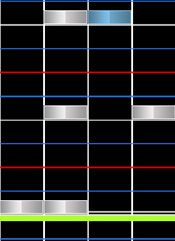
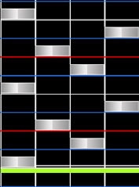
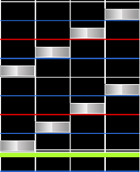
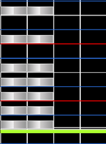
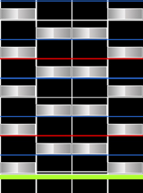
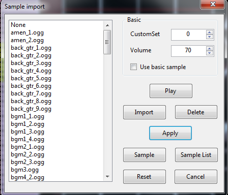

osu!mania Mapping Guide
====================================

Dieser Guide wurde von erstellt. Bei diesem Guide hat er sich ein wenig an Hanyuu's Mapping Guide (Englisch!) orientiert.

Vorwort
---------

### Was ist Mania?

Also was ist Mania? Viele von euch die Osu! bereits länger spielen werden es bestimmt wissen. Osu!Mania ist einer der 4 Game Modes. Viele die Osu!Mania zum ersten mal sehen oder spielen werden sich sicher denken: "Oh cool! Guitar Hero!". Tatsächlich ist Osu!Mania sehr ähnlich zu Guitar Hero. Beides sind sogenannte "VSRG" **Vertical Scrolling Rhythm Game**. Das bedeutet, wie der Name schon sagt, dass die Noten vertikal auf euch zu kommen. Es gibt viele ähnliche Spiele wie "Stepmania", "FlashFlashRevolution" oder "Beatmania IIDX".

Jedoch konzentrieren wir uns hier nur auf Osu!Mania!

Der vorteil an Osu!Mania ist, man kann sich den Scrollspeed (Die Fallgeschwindigkeit der Noten) einstellen. Auch die Noten zahl ist frei wählbar!\*¹

Schaut auch unbedingt in den Deutschsprachigen Osu!Mania Thread rein!

### Was ist der Editor?

Der Osu!Editor ermöglicht es uns eigene Beatmaps zu erstellen. Klar das die Maps, die wir alle Spielen, nicht einfach von allein entstehen. Für die Beatmaps sind die Beatmapper zuständig und jeder von uns kann einer werden. Auf den ersten Blick scheint der Editor sehr komplex und verwirrend, jedoch ist er viel einfacher zu bedienen als man denkt! Natürlich kann man mit dem Editor für jeden Spielmodus Beatmappen. In diesem Beitrag fokussieren wir uns jedoch nur auf Osu!Mania. Der Mania Editor hat einen großen und entscheidenen unterschied zu den anderen Modi. Die Mapping Fläche. Währen Standard, Catch the Beat und Taiko den ganzen Bildschirm benutzen haben wir in Osu!Mania nur links unsere Mapping Fläche. Je nachdem welchen Keycount ihr auswählt ist die Mapping Fläche breiter oder schmaler. In diesem Guide benutze ich 4Key.

Ich habe hier einen Screenshot vorbereitet um mal die Grundelemente des Mania Editors zu zeigen.

#### Mania Editor

**1. Mapping Fläche:** Hier sehen wir die Mania Mapping Fläche. Sie ist unterteilt in die sogenannten "Columns" Der Mania Editor nummeriert hier die Columns "Unsichtbar" in | 0 | 1 | 2 | 3 |. Viele bevorzugen es aber | 1 | 2 | 3 | 4 | zu benutzen. Dies ist allerdings nur relevant fürs Modding.

**2. Difficult Line:** Gut, den Namen habe ich jetzt erfunden da ich selber nicht weiß wie genau die heißt, jedoch finde ich den Namen sehr treffend. Hier sehen wir wie schwer die einzelnen Parts der Map sind für das aktuelle Starrating. Diese Beispiel Map hat 4,1 Stars. Je gefüllter der Einzelne Part ist, desto schwerer ist dieser zu Spielen. Pink bedeutet im Grunde das der Part sehr schwer ist für das aktuelle Starrating. Ihr solltet drauf achten nicht mehr als 30-40% Der Difficult Line Pink zu haben.

**3 & 4. Circle und Hold:** Wie auch in den anderen Modi benutzen wir zum Noten Platzieren die Menüpunkte "Circle" und "Hold". Wählen wir Circle aus können wir einzelne Noten in den jeweiligen Columns platzieren. Wählen wir Hold können wir eine "Long Note" oder auch "LN" platzieren. Dazu halten wir einfach die linke Maustaste gedrückt und ziehen den Mauszeiger nach oben, je nachdem wie lang die LN sein soll. Was genau eine LN ist und wann wir diese benutzen erkläre ich in einem anderen Teil!

**5. Hitsounds:** Hier haben wir, wie auch in den anderen Modi, die Hitsounds. Um einen Hitsound zu platzieren wählen wir zuerst die Note aus und wählen dann den Hitsound aus denn wir haben möchten. Genauer werde ich darauf im Part "Hitsounds" eingehen.

**6. Lock Notes:** Ein Punkt den viele nicht benutzen, welcher jedoch sehr hilfreich sein kann, vor allem beim Hitsounden. Aktivieren wir diesen Punkt, können wir die Noten und LN's nicht mehr bewegen. Sehr nützlich wenn wir viel Hitsounden möchten und sich die Noten nicht ständig verschieben sollen.

**7. Taktteiler:** Ein vor allem in Mania sehr wichtiges Werkzeug ist der Taktteiler! Hier können wir einstellen in welchem Takt wir Mappen möchten. Standardmäßig verwenden wir den 1/4 Takt (wie zu sehen). Jedoch hat Mania den großen vorteil wir können viel öfter im 1/6, 1/8 oder gar noch höheren Takt Mappen. Vor allem Piano Musik muss oft im 1/8 oder gar 1/16 Takt gemappt werden, um die Noten richtig zu treffen. Wichtig: Verwendet nichts über 1/4 Random mäßig! Mappt immer das, was ihr hört. Und vor allem dürfen bestimmte Pattern nicht in 1/8 oder höher gemappt werden! Auf diese gehe ich noch näher im Part "Pattern" ein.

**8. Sample Set:** Das Sample Set ermöglicht es uns noch mehr Hitsounds zu benutzen als in Punkt 5 gezeigt. Stellen wir das Sample Set auf "Drum" und fügen dann einen Finish hinzu, klingt es ganz anders als "Normal" Finish. Genauer gehe ich im Part "Hitsounds" darauf ein.

Soviel zum Editor. Ich hoffe ihr konntet mit meinem schönen Screen ein wenig mehr überblick gewinnen. Je mehr ihr Mappt umso vertrauter macht ihr euch damit!

### Alles klar! Ich will anfangen zu Mappen!

Wir wissen nun welcher Menüpunkt wozu gehört. Wir wissen was die "Columns" sind und wir wissen wie wir Noten platzieren.

Sollte noch etwas unklar sein schaut ruhig noch einmal nach und lest es in ruhe bis ihr es versteht. Die Maps laufen euch schon nicht davon!

Aber solltet ihr alles verstanden haben springen wir doch gleich zu Punkt 2, den Grundlagen des Guides!

Grundlagen
-------------

### Song Setup

Alles klar! Ziehen wir die .mp3 des Songs den wir mappen wollen einfach in Osu rein und öffnen diesen im Editor. Sobald ihr den Song zum ersten mal öffnet zeigt sich sofort das Song Setup. Wollt ihr euren Song ranken müsst ihr unter "General" mögliches alle Felder korrekt ausfüllen. Auch dies versuche ich mit Screenshots genauer zu zeigen!

#### General

| Name | Beschreibung |
| ---- | ------------ |
| Artist: | Hier tragen wir den Originalen Namen des Künstlers ein! Egal ob Japanisch, Russisch oder sonst wie. Kommt da auch nur ein Sonderzeichen drin vor, dass das Normale Alphabet nicht beinhaltet, kommt dort der Name rein. Als Beispiel: Wenn ihr einen Song von "Die Ärzte" Mappen wollt muss dort der Original Name rein wegen dem "Ä" |
| Romanised Artist: | Hier tragen wir den Namen des Künstlers ein wie er im Normalen Alphabet ausgeschrieben wird. Mit unserem Beispiel wäre es hier "Die Aerzte". Klingt zwar doof, ist aber wichtig da bei manchen das "Ä" nicht richtig dargestellt wird. Sollte euer Artist kein Sonderzeichen im Namen haben, wird dieses Feld Automatisch ausgefüllt |
| Title & Romanised Title: | Hier das gleiche wie beim Artist. Nur mit dem Titel des Musikstücks. |
| Beatmap Creator: | Hier steht immer euer Name von dem Account mit dem ihr eingeloggt seid. Mappt ihr Offline müsst ihr hier euren Namen eintragen. |
| Difficulty: | Hier benennt ihr euren Schwierigkeitsgrad. Normal ist für Osu!Mania "EZ" für Easy, "NM" für Normal, "HD" für Hard, "MX" für Insane, "SC" für Insane+ und "SHD" für Extra. Sollte euer Song jedoch aus einem anderen Rhythmgame sein könnt ihr die dortigen Schwierigkeitsgrad Namen auch nach Osu!Mania nehmen. Hier im Screenshot haben wir "GRAVITY Lv.16" da dieser Song aus "Sound Voltex III Gravity Wars" kommt. |
| Source: | Hier tragt ihr ein woher euer Song kommt. Wie unter "Difficulty" bereits erwähnt kommt dieser Song aus dem Spiel "Sound Voltex". Sollte das Spiel aus dem euer Song kommt noch extra namen haben, wie hier z.B "Gravity Wars" müsst ihr diesen auch eintragen! |
| Tags: | Tags sind Schlagwörter um euren Song in der Suche schneller zu finden. Eine bekannte Spielfirma? Kommen in eurem Songs bekannte Charaktere vor? Tragt es ein! |

#### Difficulty

| Name | Beschreibung |
| ---- | ------------ |
| HP Drain Rate: | Hier wählen wir aus wie viel HP der Spieler verliert wenn er eine Note nicht trifft. Wichtig!: Anders als in Standard oder Catch the Beat schwindet die HP in Mania nicht langsam von allein sonder nur wenn ihr eine Note nicht trefft! Die HP Drain Rate kann als beispiel etwas höher gestellt werden sollte euer Song viel einfacher zu spielen sein als für das Starrating eigentlich gewollt. Übertreibt es jedoch nicht. Alles über HP9 ist sehr sehr schwer zu halten! |
| Key Count: | Der Key Count ist die Tastenzahl in der wir Mappen wollen. In diesem Guide benutzen wir 4, für 4 Tasten. Ihr möchtet mehr Keys Mappen? Nur zu! Ihr habt die freie Wahl! 4K und 7K sind der am öftesten gespielte Key Count. Wichtig!: Nicht jeder Key Count ist Rankable! In Osu!Mania sind es aktuell nur: 4K, 5K, 6K, 7K, 8K, 9K. In Zukunft kommen bestimmt noch mehr dazu. Der Unterpunkt "Co-Op" wird ab 5K auswählbar. In Osu!Mania gibt es den "Co-Op" Mod der es euch ermöglicht auf 2 Spielfeldern zu spielen. Co-Op ist unrankable und einfach nur ein zusätzlicher Multiplayer Mod. |
| Approach Rate: | Dieser Punkt wird in Osu!Mania nicht benutzt und ist auch nicht verstellbar. |
| Overall Difficulty: | Die Overall Difficulty oder auch "OD" bestimmt die Genauigkeit, die ihr braucht, um z.B einen 300er zu Treffen. Die Regel für Osu!Mania ist: Je mehr LN's ihr benutzt, umso niedriger solltet ihr die OD stellen. (Immer zwischen 7 und 9 da alles andere zu einfach/zu schwer wäre). Je weniger LN's ihr habt desto höher solltet ihr die OD stellen und umgekehrt. |

#### Design

| Name | Beschreibung |
| ---- | ------------ |
| Countdown: | Hier könnt ihr einen Countdown einstellen, der runter zählt, sobald die Map kurz vor ihrem Anfang ist. Standardmäßig benutzt Osu!Mania dies nicht also sollte dieser punkt abgewählt sein. |
| Widescreen Support: | Schaltet diesen Punkt aus wenn ihr kein Storyboard benutzt. |
| Display epilepsy Warning: | Sollte eure Beatmap ein Video oder ein Storyboard mit sehr vielen oder sehr starken Lichteffekten haben schaltet diesen Punkt ein. Damit wird der Spieler vor den Effekten gewarnt und kann diese vorher ausschalten sollte er an Epilepsie leiden. Vergesst das bitte nicht, das ist sehr wichtig! |
| Letterboxing during Breaks: | Letterboxing blendet Schwarze Balken oben und unten am Bildschirmrand ein während einer Pause. Da Osu Mania keine Pausen benutzt ist dieser Punkt immer auszuschalten! |

#### Advanced

| Name | Beschreibung |
| ---- | ------------ |
| Stacking: | Dieser Punkt bewirkt in Osu!Mania gar nichts und kann Ignoriert werden. |
| Allowed Modes: | Mit diesem Punkt stellt ihr euren Editor in den Modus ein, in welchem ihr Mappen möchtet. Da wir Osu!Mania Mappen wollen stellen wir natürlich auch Osu!Mania ein. |
| Use special Style (N+1 style) for mania: | Dieser Punkt ist zu Aktivieren wenn ihr eure 7K, 8K oder 9K im Beatmania Style Mappen möchtet. Hiermit wird der sogenannt "Scratch" gemappt. Wenn ihr diesen Punkt aktiviert könnt ihr noch auswählen oder dieser ganz Rechts oder ganz Links sein soll. Der "Scratch" ist eine Zusatztaste die immer nur einem bestimmten Sound folgt, z.B ein lauter Crash. |

Soviel zum Song Setup. Die Punkte **Colours** und **Audio** habe ich bewusst ausgelassen da Combo Colours für Osu!Mania Irrelevant sind.

Auf Audio gehe ich in Punkt "Hitsounds" näher ein.

### Timing

Nun kommen wir zu dem Punkt Timing. Dieser ist für die meisten am schwersten, hat man es jedoch einmal verstanden ist es ganz leicht!

**Single BPM**:Als erstes last ihr die mp3 laufen und hört ganz genau auf den Beat. Fang dann an zum Takt die "T" Taste zu drücken bis die anzeige euch einen BPM Wert gibt! Als nächstest braucht ihr das Richtige Offset. Das Offset ist **immer** der aller erste Beat! Geht zum Anfang des Songs und sucht den ersten Beat raus. (Benutzt dafür am besten 25% Songspeed, dieses könnt ihr unten Rechts im Editor einstellen). Habt ihr den ersten Beat gefunden geht ins "Timing Setup Panel", wählt euren Timing Point aus und klickt auf "Use current Timing". Dann wird das Offset genau auf den Punkt gesetzt bei welchem ihr grade im Editor seid. Und jetzt kontrolliert die BPM! Oben in der Timeline seht ihr die Weißen Striche. Die Beats müssen genau auf diesen liegen! Dann habt ihr die richtige BPM gefunden. Danach Kontrolliert das Offset. Schaut einfach an verschiedenen stellen des Songs ob der Beat auch wirklich auf den weißen strichen liegt!

**Multi BPM**:Sollte euer Song hörbar verschiedene BPM Punkte haben müsst ihr für jeden BPM wechsel einen Extra Timing Point einstellen. Geht dafür im Editor zu dem Zeitpunkt wo sich die BPM wechselt. Geht dann ins "Timing Setup Panel" klickt auf "Timing Points" und dann auf das grüne Plus. Nun stellt ihr einfach nochmal die BPM ein.

**Kleines Hilfsmittel**: Es gibt ein Programm das euch dabei helfen kann die BPM für euren Song zu finden. Dieses heißt ***MixMeister BPM Analyzer***. Dieses könnt ihr sicher und legal [hier](http://www.chip.de/downloads/BPM-Analyzer_49167653.html) runterladen.

Beachtet bitte. Dieses Programm funktioniert nur bei Single BPM! Hat euer Song Multiple BPM zeigt euch das Programm immer nur den durchschnitt an!

Verwendet dieses Programm auch nicht um die BPM eines Songs herauszufinden. Benutzt es nur zur Kontrolle. Sonst lernt ihr nie wirklich einen Song zu Timen.

#### Timing Setup Panel

| Name | Beschreibung |
| ---- | ------------ |
| Timing Points: | Die Timing Points oder auch "Red Lines" genannt sind die BPM Punkte. Diese bestimmen mit wie viel BPM ihr mappt. Sollten immer richtig eingestellt sein! |
| Inherited Point: | Inherited Points oder auch "Green Lines" genannt sind für Slider Velocity, Kiai, Lautstärke oder Samples zuständig. Die Slider Velocity kontrolliert den Scrollspeed in Mania. Kiai macht den Part "aufregender" Mit Sternchen und viel Bling Bling! Sollte immer im Höhepunkt des Songs benutzt werden. Lautstärke und Samples erkläre ich im Part "Hitsounds" |

### Pattern

Jetzt geht es los! Wir haben unseren Song richtig getimte und die Meta Data richtig eingestellt. Dann können wir ja endlich anfangen! Aber, wie fangen wir an? In diesem Part des Guides zeige ich euch die verschiedenen Pattern die wir benutzen können beim Mappen! Anfangs scheint das vielleicht noch etwas kompliziert und verwirrend jedoch wenn man erst mal die Pattern kennt, weiß man auch wie man Mappen kann und sollte! Ich stelle euch möglichst alle Pattern vor die es gibt mit einem Screenshot und einer möglichst genauen erklären wann ihr diese art von Pattern benutzen solltet. Also, fangen wir doch gleich mal an!

Ich habe mal einen kurzen abschnitt eines Songs gemappt um die Pattern in ihrer Wirkung besser zu verdeutlichen. Der Song ist hier zu finden: [Penoreri - Preserved Valkyria](https://www.dropbox.com/s/ssbhz0g5wzy3cd0/Penoreri%20-%20Preserved%20Valkyria.osz?dl=0)

#### Long Note

Hier sehen wir die Long Note oder auch "LN". Eine LN wird benutzt um lange Töne zu mappen. Im Grunde sind sie die Slider des Mania's. LN's sollten nicht zu durcheinander benutzt werden, jedoch können sich viele LN's auch sehr gut spielen! Mappt eine LN immer nur so lang wie der Ton zu hören ist. Nicht einfach Random einsetzen.

#### Chord

Hier sehen wir den sogenannten Chord. Der Chord wird benutzt um kräftige Phasen zu betonen. Seien es laute Drums oder laute Melodie. Hier zu sehen sind die Chords im 1/1 Beat Platziert. Chords können auch im 1/2 Beat benutzt werden um bestimmte töne besonders hervorzuheben. Chords sollten höchstens jedoch im 1/4 Takt gemappt werden, alles andere ist einfach unspielbar.
Dazu gibt es noch den "3er-Chord" und den "4er-Chord". Der 3er-Chord sollte nur benutzt werden um einen Finish zu betonen, heißt das ende eines Parts. Der 4er-Chord sollte möglichst gar nicht benutzt werden im 4k außer man hat wirklich was zu betonen.

#### Burst

Hier sehen wir den Burst. Ein Burst erkennt man daran das er im 1/4 Takt gemappt ist und sich die Key's an beiden Händen abwechseln. Heißt: Erst eine Note mit der Linken Hand. Dann eine mit der Rechten. Dann wieder Links. Bursts werden meisten benutzt um z.B schnelle Drums gut zu betonen.

#### Stream

Hier sehen wir den Stream. Der Stream wird für gewöhnlich im 1/4 Takt gemappt, kann jedoch, wenn es passt, auch im 1/6 Takt gemappt werden. Der Stream sollte nach Möglichkeit so nie im 1/8 takt gemappt werden außer es passt wirklich sehr sehr gut zur Melodie. Ein Stream passt besonders gut in Piano Parts die schnell von Hoher zu tiefer und zurück zur Hoher Tonlage wechseln.

#### Stair

Hier sehen wir die Stair. Die Stair wird für gewöhnlich im 1/4 Takt gemappt. Kann jedoch auch sehr gut im 1/6 und sogar im 1/8 Takt gemappt werden. Solltet ihr je was im 1/8 Takt mappen versucht zur aller erst ob eine Stair passt. Die Stair spielt sich einfach am besten. Besonders gut passt die Stair bei schnell absteigender bzw. ansteigender Tonlage.

#### Jackhammer

Hier sehen wir den Jackhammer oder auch einfach nur Jack genannt. Einen Jack erkennt man daran, wenn man eine Taste oft hintereinander drücken muss. Der Jack kann im 1/2, 1/3 und im 1/4 Takt gemappt werden, sollte jedoch möglich nicht im 1/6 Takt und niemals im 1/8 Takt und aufwärts gemappt werden. Ganz wichtig für den Jack: Benutzt ihn nicht einfach so! Mappt einen Jack nur wenn die Melodie es auch hergibt. Heißt. Gleiche Tonlage am besten sogar gleicher Ton! Ist der Ton nicht gleich und ihr Mappt einen Jack spielt sich das einfach nur schlecht.

#### Shield

Hier sehen wir den Shield. Sie heißen shield weil sie wie ein Schild vor und am ende einer LN benutzt werden. Shield Noten sollten niemals random benutzt werden und nur bei gleichen "Pitch". Genauso sollten viele shield's nebeneinander vermieden werden da sie wie ein Jack ziemlich schwer zu spielen sind.

#### Chordjack

Hier sehen wir den Chordjack. Genau wie beim einfachen Jack sollte ein Chordjack maximal im 1/6 Takt gemappt werden. Alles andere ist einfach fast unspielbar. Auch hier gilt: Benutzt den Chordjack nur bei gleicher Tonlage!.

#### Trill

Hier sehen wir den Trill. Ein Trill sollte wenn möglich maximal nur im 1/6 Takt gemappt werden. Ein trill wird sehr gerne benutzt wenn sich 2 Töne schnell hintereinander abwechseln. Auf dem Screenshot sehen wir den "One-Hand Trill". Heißt er wird mit einer Hand gespielt. Besser spielt sich jedoch der "Two-Hand Trill". Dieser wird auf Column 1-4, 1-3, 2-4 oder 2-3 verteilt. Der One-Hand Trill wird vielen Standard Spielern wie ein Normaler Stream vorkommen. Ist im Grunde auch das gleiche!

#### Chordtrill

Hier sehen wir den Chordtrill. Der Chordtrill gehört zu den schwereren Pattern die die Stardiff deiner Map ziemlich in die höhe treiben kann! Ein Chordtrill sollte höchstens im 1/4 Takt, in seltenen fällen auch im 1/6 takt, jedoch nicht darüber gemappt werden. Der Chordtroll wird benutzt um besonders laute und schnelle Parts in einem Song besonders zu betonen. Verwendet ihn nicht zu oft! Auch kann der Chordtrill mit einem "1-3, 2-4" Chord gemappt werden.

#### Jumpstream

Hier sehen wir den Jumpstream. Diese Pattern sind für die meisten am schwersten zu spielen denn es ist eine Kombination aus Stream und Chords. Der Jumpstream sollte nur gemappt werden in Parts wo auch ein Stream passt und dazu laute Drums/Melodie zu hören ist im 1/2 oder 1/1 Takt. Dieser Jumpstream ist im 1/2 Takt gemappt. Einen guten Jumpstream macht aus, dass wenn möglich, niemals 3 Noten auf einer Column im 1/2 Takt gemappt sind, wie hier auf dem Screenshot zu sehen.

Soviel zu den Pattern! Viele von denen können sehr gut Kombiniert werden. Probiert einfach mal ein wenig rum! Gebt euch niemals mit dem ersten zufrieden das ihr gemappt habt. Oft muss man ein wenig um die Ecke denken!

### Das Mappen

Nachdem ihr euch nun mit den verschiedenen Pattern auseinander gesetzt habt geht es ans eingemacht! Legt los und Mappt! Sucht euch einen Song der euch gefällt. Timed ihn und legt los! Versucht einfach mal verschiedene der hier gezeigten Pattern aus. Viel kann ich hier nicht mehr sagen da ihr selber die Erfahrung sammeln müsst. Last euch nicht unter kriegen wenn euch euer erstes Ergebnis nicht gefällt. Testplayed es (wenn möglich) und ändert die Pattern so lange bis sie euch gefallen. Benutzt auch oft die 25% Playback rate um alle Sounds genau hören zu können! Natürlich dauert es dann länger, erhöht die Qualität einer Map aber enorm! Fragt andere nach Feedback zu euren Maps.

Es gibt verschiedene Mapping Techniken auf die ich im Part "Design" näher eingehen werde. Legt einfach los! Gern könnt ihr auch den hier bereitgestellten Song nutzen und ihn fortführen!

Zwei Punkte möchte ich hier jedoch erwähnen:

**Map für Rank** und **Map für Approval**

Eine **Map für Rank** besteht für gewöhnlich aus mindestens 3 Schwierigkeitsgraden. Entweder EZ/NM und HD oder NM/HD/MX. Wichtig hierbei ist ein ordentlicher Diffspread! Das bedeutet. Das Starrating sollte nicht willkürlich sein! Achtet am besten gar nicht auf das Starrating sondert Mappt die Map von den Pattern her immer schwerer. Von der EZ zur NM und von der NM zur HD.

**Die "Easy" Map**: Die Easy Map sollte grundlegend nicht im 1/4 Takt gemappt werden. Auch die 2er Chords sollten wenn möglich hier nur benutzt werden um einen Finish zu betonen. Folgt nicht unbedingt bestimmten Instrumenten hier sondern versucht einzig und allein der Melodie zu folgen die ihr hören könnt. Mappt das Offensichtlichste! Auch solltet ihr auf die Handbalance achten. Versucht die Noten immer abwechselnd auf 1 oder 2 und dann 3 oder 4 zu verteilen. Auch untypisch für eine EZ Map sind Noten während eine LN gehalten wird.

**Die "Normal" Map**: In der Normal Map könnt ihr anfangen Stairs einzubauen oder kurze Bursts. Hier solltet ihr 3er Chords nach Möglichkeit noch nicht benutzen. Folgt weiterhin der Melodie jedoch könnt ihr für laute Parts gern 2er Chords verwenden. Auch könnt ihr anfangen während einer LN im 1/1 oder 1/2 Takt noten hinzuzufügen. Jedoch auf beide Hände verteilt! Wenn ihr auf 3 eine LN festhaltet fügt einzelne Noten nur auf 1 oder 2 ein! Achtet weiterhin verstärkt auf Handbalance.

**Die "Hard" Map**: In der Hard Map könnt ihr anfangen bisschen wilder zu Mappen. Jetzt könnt ihr anfangen Drums mit Chords zu belegen um diese zu betonen. Streams und Stairs können benutzt werden und auch kurze Jumpstreams. Auch Jacks können verwendet werden. Chordtrills sollten nicht mehr als 3x Benutzt werden. Heißt nur kurze Chordtrills! Jetzt könnt ihr während einer LN auch anfangen Noten auf die gleiche Hand zu legen, auch Chords können benutzt werden während einer LN. Einfache Trills können länger ausfallen. Passt jetzt jedoch auf das ihr nicht overmapped!

**Die "Insane" Map**: Jetzt geht es richtig los! Hier könnt ihr euch erstmal so richtig austoben. Folgt den Drums und der Melodie mit 2er Chords und lauten Drums gern mit einem 3er Chord. Baut Jumpstreams ein wenn es die Melodie zulässt. Auch Chordtrills können hier länger ausfallen. Stairs können jetzt länger im 1/8 Takt gemappt werden. Auch Jacks nach Chords um die drum nochmal extra zu betonen sind hier erlaubt. Lebt euch aus! Aber Achtung: Eine gute Insane in 4k zu erstellen ist schwer! Overmapped nicht! Knallt nicht einfach Blind alles irgendwie rein! Es muss schon System haben und passen!

**Die "Approval" Map**: Eine Approval Map braucht kein ganzes Mapset. Jedoch muss die Approval Map eine Regel befolgen und diese wird auch Knallhart durchgesetzt: Der Song muss mindestens 5 Minuten lang sein. Ist euer Song länger als 5 Minuten braucht ihr kein Ganzes Mapset mehr.

Approval Maps können, wie Insane Maps alle arten von Pattern enthalten. Eine gute Beispiel Approval Map ist hier die [Kanshou no Matenrou](https://osu.ppy.sh/beatmapsets/251365) von mir. Ich verwende für die Leisen Drums 2er Chords und für die Lauten 3er Chords. Ich benutze Stairs und Streams bei langen 1/8 Sounds. Auch benutze ich lange Jumpstreams. Jedoch baut alles nach und nach auf und kommt nicht von jetzt auf gleich überraschend!

Entscheidend für eine gute Approval Map ist das sie auch mal Ruhephasen hat. Niemand hat die Ausdauert 5 Minuten lang nur Jumpstreams zu spielen.

Eine gute Approval Map hat Hoch's und Tiefs. Aufregende Phasen und Ruhigen Phasen.

Solltet ihr euch für eine Approval Map entscheiden steht sehr viel Arbeit an! Gebt nicht nach den ersten Minuten auf.

Mappt den Song zu ende und schaut mehrmals drüber. Schaut wo ihr welche Pattern verbessern könntet.

### Hitsounden

Ihr habt die ersten Noten platziert und ihr seid zufrieden damit? Oder habt gar die erste Map fertig? Wunderbar! Aber.. Moment. Irgendwas fehlt doch?

Genau! Die Hitsounds! Hitsounds sind in Mania sehr wichtig. Hitsounds geben einer Map eine besondere Atmosphäre und können das Spielerlebnis enorm steigern! Vor allem ist Mania hier einzigartig denn Mania kann "Keysounden". Was das bedeutet erkläre ich später.

Geht dafür in den Song Setup unter **Audio** und wählt als dafür aus welches Sampleset ihr für eure Map verwenden möchtet. Standardmäßig wird in Mania "Soft" benutzt.

Dann müsst ihr entscheiden. Wollt ihr die vom Spiel bereitgestellten default Hitsounds verwenden oder wollt ihr eigene Custom Hitsounds benutzen.

Als erstes verrate ich euch welche Default Hitsounds ihr durch Custom Hitsounds ersetzen könnt:

#### Hitsound Liste

Folgende können durch einfügen in den Song Ordner ersetzt werden in Mania:

Als erstes ist zu beachten: Fügt ihr Custom Hitsounds ein müsst ihr im "Timing Setup Panel" alle Timing Points auf Custom Sampleset stellen! Wählt dafür einen Punkt aus. Geht auf den Reiter "Audio" und ändert das Sampleset von "Default" auf "Custom 1"

Bitte beachtet: ihr könnt mehr Sampleset's einfügen! Fügt dafür einfach nur am ende des Hitsound namen eine Zahl ein, z.B 2. Natürlich müsst ihr dann den Timing Point, in dem ihr Hitsounds aus dem Sampleset 2 benutzen möchtet, auch auf 2 stellen.

normal-hitnormal
normal-hitwhistle
normal-hitfinish
normal-hitclap

soft-hitnormal
soft-hitwhistle
soft-hitfinish
soft-hitclap

drum-hitnormal
drum-hitwhistle
drum-hitfinish
drum-hitclap

Zu beachten ist folgendes: Der "xxx-hitnormal" wird abgespielt wenn der Note kein Effekt-Sound zugewiesen wird! Verändert diesen nur wenn ihr lange Passagen in eurer Map gleich Hitsounden möchtet.

Nachdem ihr nun entschieden habt was für Hitsounds ihr benutzen möchtet geht es los! Vergesst nicht "Lock Notes" zu Aktivieren damit sich eure Pattern nicht zufällig ineinander schieben. Hitsounden geht im Grunde relativ schnell mit Kurztasten. Wählt dafür einfach die Note aus die ihr Hitsounden möchtet und wählt dann euer Sample Set oben links. Zum Beispiel "Soft" dann wählt ihr noch den Effekt aus zum Beispiel Clap. Schon wird auf der Note der "soft-hitclap" abgespielt! Alles per Hand ist natürlich ziemlich umständlich, darum möchte ich euch die Kurztasten verraten.

#### Hitsound Kurztasten

`Shift` + `Q` stellt euer Sampleset auf "Auto"
`Shift` + `W` stellt euer Sampleset auf "Normal"
`Shift` + `E` stellt euer Sampleset auf "Soft"
`Shift` + `R` stellt euer Sampleset auf "Drum"

`W` fügt der Note einen Whistle-Effekt hinzu.
`E` fügt der Note einen Finish-Effekt hinzu.
`R` fügt der Note einen Clap-Effekt hinzu.

Natürlich können auf einer note mehrere Effekte zu gleich aktiv sein!

**Bitte beachten**:Verwendet niemals den gleichen Hitsound in einer Reihe mehr als ein mal! Habt ihr zum Beispiel einen 3er Chord und jede note in diesem Chord hat den selben Hitsound wird der Hitsound extrem laut abgespielt!

Ich hoffe die Kurztasten können euch helfen schneller und effektiver zu Hitsounden. Ja Hitsounden dauert lang aber ihr werdet überrascht sein wie viel das ausmacht!

Auch zu erwähnen wäre: Solltet ihr einfach keine lust auf Hitsounden haben (was auch vor kommt) benutzt bitte für alle noten den Default Hitsound **soft-hitnormal** mit einer Lautstärke von 40%. Dieser wird von den meisten Mappern verwendet die schlicht keine lust haben ihre Map zu hitsounden.

Soviel zum Thema Hitsounds! Nachdem eure Map nun auch Hitsounded ist könnt ihr sie hochladen und anderen Spieler zur Verfügung stellen!

Erweiterte Kenntnisse
----------------------

### Pitch

Unter **Pitch** versteht man in Mania das Mappen nach Tonhöhe, heißt tiefe Noten werden Links, hohe Noten Rechts gemappt. Wie auf einem Piano. Grade in 4k ist es uns leider nicht möglich jedes mal nach Pitch zu Mappen da wir von den Pattern sehr eingeschränkt sind. Das sieht jedoch ab 6k schon ganz anders aus. Es kann oft zu einem ganz anderen Spielerlebnis führen wenn man mit einzelnen Noten oder ganzen Chords dem Pitch folgt.

Eine gute Beispiel Map hier ist die [sakuzyo - Altale](https://osu.ppy.sh/beatmapsets/347779). In der Starry's Another Lv.29 sehen wir vor allem in den Ruhigen Parts das hier mit den Noten sehr genau nach Pitch gefolgt wird. Auch die LN's folgen hier schön dem Pitch.

Auch erwähnenswert ist hier die [MiddleIsland - Achromat](https://osu.ppy.sh/beatmapsets/195940). In der 4k Hard sehen wir sehr schön wie der Mapper mit sehr vielen Single noten überall im Song versucht dem Piano Pitch zu folgen. In der Tristan97's 4K White Another sehen wir sogar das der Mapper selbst mit den Chords dem Pitch folgt. Was auf den ersten Blick extrem schwer zu Spielen scheint, spielt sich dann in der Praxis extrem gut wenn man sich der Melodie anvertraut.

Also versucht euch anfangs nicht nach Pitch zu Orientieren. Es ist uns einfach nicht möglich jedes mal diesem zu folgen. Man kann es wie ein "kleines Extra" sehen was eure Map noch etwas spannender machen kann, ist aber nicht zwingend Notwendig.

### Design

In diesem Part des Guides möchte ich etwas genauer auf das Thema **Design** eingehen. Auch in Mania kann man nach verschiedenen Designs Mappen. Im Grunde unterscheiden wir erst mal unter 2:

Entweder wir folgen der **Melodie** oder wir folgen den **Instrumenten**.

Man kann auch beides versuchen jedoch ist das grade für neue Osu!Mania Mapper sehr schwer. Je nach Musik müsst ihr euch oft für eines davon Entscheiden. Wenn ihr zum Beispiel ein Musikstück mit sehr vielen Instrumental Mappt fällt die Wahl natürlich schon mal einfach. Wir versuchen so gut wie möglich den Instrumenten zu folgen. Als Beispiel: Einfache Piano Noten können wir mit Single noten belegen. Drums dann immer mit einem 2er Chord um diese zu Betonen.

Ein gutes Beispiel um das zu verdeutlichen wie man den **Instrumental** folgt, ist die [Jin ft. MARiA from GARNiDELiA - daze (short ver.)](https://osu.ppy.sh/beatmaps/477955). In der Shiki's SC sehen wir vor allem am Anfang sehr deutlich wie der Mapper dem Drums folgt. Dabei bleibt der Mapper strickt bei seinem Plan. Er mappt den Drum-Sound den er einmal mit einem 2er Chord gemappt hat Konstant die ganze Map lang mit einem 2er Chord, das gleiche gilt für den 3er Chord.

Eine gute Map die der **Melodie** folgt ist die [C-Show - Invitation from Mr.C](https://osu.ppy.sh/beatmaps/659683). Dies ist ein Song aus Sound Voltex. Hier hat man nur eingeschränkte Wahl den Instrumentals zu folgen da nicht viele bis auf Drums vorhanden sind. Also was Mappen wir? Ganz einfach! Wir gehen den einfachsten Weg. Wir folgen voll und ganz der Melodie! Hier könnten wir sogar ab und zu mal mit LN's den Vocals folgen (Übertreibt es aber nicht! Vocals Mappen sollte man unterlassen, dazu aber gleich mehr). Hier sieht man grade in der Zweiten Kiai sehr gut wie der Mapper der Melodie folgt.

Kommen wir mal zum **Vocal** Mapping. Bedeutet der Mapper folgt dem/der Sänger/in im Musikstück. In Mania sollte man oft vermeiden zu viele Vocals zu Mappen. Gern kann man ab und zu mal eine LN für ein Vocal einfügen, jedoch sollte man das dann auch Konstant und gut Spielbar durchführen.

Eine gute map das zu zeigen ist die [Haruna Luna - Startear -TV size ver.-](https://osu.ppy.sh/beatmaps/577389). Grade am Anfang und vor der ersten Kiai sieht man sehr gut wie der Mapper hier mit LN's den Vocals folgt da er einfach kaum andere Wahl hat, da kaum Instrumente vorhanden sind. In diesem Fall ist es in Ordnung wenn wir den Vocals folgen.

Aber übertreibt es nicht! Ihr werdet schnell merken wie schlecht sich zu viele Vocals Mappen. Versucht immer in erster Linie Instrumenten zu folgen!

Ein gutes Beispiel wie man es **NICHT** machen sollte sehen wir in einer meiner ersten Maps [hier](https://osu.ppy.sh/beatmaps/571190). Ich war damals nicht nicht wirklich erfahren und fand es recht lustig die Komplette Map fast nur den Vocals zu folgen. Jedoch spielt sich das einfach nur schlecht. Versucht einfach übermäßiges Vocal Mapping zu vermeiden ;)

Soviel zum Thema Design! Wie ihr seht gibt es einige Methoden wie wir Mappen können. Sollte euch mal die Inspiration fehlen dann schaut euch andere Maps im Editor an und fragt euch selber "Wie hat der Mapper hier gemappt und warum". Vielleicht könnt ihr davon was in eure Map übernehmen. Dies ist auch die Perfekte Überleitung zu unserem nächsten Punkt:

### Modding

Ganz egal wie viel ihr auch Mappt. Irgendwann habt ihr eure grenzen erreicht. Es ist einfach so. Irgendwann fallen euch einfach keine weiteren Pattern ein und ihr wisst nicht weiter. Ab hier solltet ihr euch mal überlegen ob ihr es nicht mal mit **Modding** versuchen wollt!

Unter **Modding** versteht man sich die Pending Map eines anderen Spielers runterzuladen und sich diese dann im Editor anzuschauen und dazu im Forum Beitrag der Map Vorschläge zu schreiben was die Map besser machen könnte. Wichtig hierbei: Ihr gebt nur Vorschläge! Der Mapper ist keinesfalls verpflicht das anzunehmen was ihr ihm vorschlagt, schließlich ist es seine Map. Genau so ist es mit eurer Map. Solltet ihr einen Mod für eure Map bekommen müsst ihr nicht alles annehmen was man euch vorschlägt. Es ist eure Map. Es soll auch eure Map bleiben und sie muss **euch** gefallen!

Gehen wir mal näher aufs Modding ein. Zuerst brauchen wir eine Map dir wir Modden wollen. Es gibt mehrere Möglichkeiten woher ihr eine Map bekommen könnt die ihr Modden wollt. In erster Linie haben wir das [Modding Queue](https://osu.ppy.sh/forum/60) Forum. Hier Posten die Leute ihre Maps in die Queues der anderen und fragen nach Mods. Ihr könnt einfach mal in die Verschiedenen Queues schauen und vielleicht findet ihr einen Song der euch gefällt!

Zweitens haben wir Ingame den Channel **\#modreqs**. Dort posten Spieler auch ihre Maps um nach Mods zu fragen. Viele Modder fangen genau dort an. Sie picken sich einfach 1-2 Maps raus und Modden diese.

Eine Dritte Möglichkeit. Fragt einfach mal eure Freunde! Bestimmt habt ihr 1-2 Freunde die sich mal an Mappen versucht haben. Fragt einfach mal ob ihr diese Maps Modden könnt. Sie feuern sich bestimmt über jede Hilfe die sie kriegen können! Sobald ihr nun eine Map habt die ihr Modden möchtet öffnet diese einfach im Editor und legt los!

**Punkt 1.** Kontrolliert die Meta Data! Unter der Meta Data versteht man eigentlich alles was man im Song Setup finden kann. Schaut ob der Mapper dort vielleicht einen Rechtschreibfehler hat. Schaut ob vielleicht irgend etwas fehlt. Ist die HP und OD richtig eingestellt? Sind die BPM und Offset richtig? Zeigt vielleicht AiMod fehlen an? Hat der Background die richtigen Maße? (1366x768 oder 1024x768)

**Punkt 2.** Kontrolliert Pitch, Consistency und Hand Balance! Nachdem das Song Setup kontrolliert wurde gehen wir nun an die Noten. Benutzt im Modding nach Möglichkeit immer die 25% Playback Rate. Fehlen vielleicht Noten? Hat der Mapper unnötige Jacks eingebaut? Vielleicht gar zu viele Noten? Hat der Mapper "Ghost Notes" Eingebaut? Ghost Notes sind Noten die absolut keinem Sound folgen. Diese sind in Osu!Mania nicht Rankbar! Weißt den Mapper darauf hin. Ist die Hand Balance in Ordnung? Kontrolliert ob vielleicht eine Hand zu viel beansprucht wird während die andere kaum Tasten drücken muss. Als Beispiel. Wenn der Mapper Chords fast immer auf 3-4 gesetzt hat.

**Punkt 3.** Kontrolliert das Snapping!

Das hier ist mit Abstand der Wichtigste Punkt. Treffen die Noten auch den Ton für den sie gemappt sind? Seht genau hin. Oftmals ist es grade bei Piano Maps das dort mit 1/8, 1/12 oder gar 1/16 Beatsnap (Taktteiler) gearbeitet werden muss um die Noten richtig zu treffen! Hört und sehr ganz genau hin! Falsch gesnappte Noten führen dazu das eine Map Disqualifiziert wird. Da werden keine ausnahmen gemacht!

Ihr möchtet mal sehen wie Modding aussieht? Kein Problem! Hier haben wir eine Map die ich vor einem Monat mal gemodded habe:

[Senpi- - The Last Part of Touhou EX Boss Rush!!](https://osu.ppy.sh/community/forums/posts/4424484). Ihr braucht jetzt kein ausgefallenes Design so wie ich das benutze. Ich habe mir diese "Vorlage" gebaut um mehr Übersicht zu haben was ich zu Modden haben und auch für den Mapper das er eine bessere Übersicht hat.

Soviel zum Thema Modding! Wenn ihr eine Map ranken wollt kommt ihr nicht drum rum eine Map zu Modden. Aber vergesst nicht. Durch das Modden seht ihr unzählige verschiedene Designs auf die ihr selber vielleicht nie kommen würdet!

### Keysounds

Ein sehr interessanter Punkt und einzigartig für den Mania Modus ist das "**Keysounden**"

Das Keysounden ist eine besondere Art des Hitsounden. Wir können einzelne Noten mit Hitsounds oder anderem Sounds belegen ohne das wir sie in ein Sampleset einfügen müssen! Die wohl bekannteste Mania Keysound Map ist die [Yuuna Sasara feat. Tai no Kobone - Imperishable Night 2006](https://osu.ppy.sh/beatmaps/259067). Sie besteht zu 100% aus Keysounds. Heißt, der Mapper hat jede Note mit einem einzelnen und bestimmten Keysound belegt! Eine Full Keysound Map ist unheimlich viel Arbeit, denn jeder Ton muss richtig belegt sein, sonst klingt die Melodie falsch. Ich versuche mal zu beschreiben wie das ungefähr funktioniert:

#### Sample Menü

In dieses Menü kommen wir durch die Kurztasten STRG + Shift + I. Alternativ könnt ihr auch einfach eine Note links klicken während ihr die ALT Taste festhaltet. Vorsicht!: Bei dieser Methode wird genau die ausgewählte Note Keysounded. Benutzt lieber die andere kurztaste!

Wenn wir jetzt die TAB Taste drücken verschwinden auf einmal alle Noten. Aber keine Panik, Sie sind nicht weg! Hier sehen wir nämlich alle Keysounds die auf den entsprechenden Timelines gelegt sind. Heißt: Der Ton der hier eingefügt wird, wird abgespielt obwohl ihr gar keine Taste drückt. Sie wird im Storyboard gespeichert. Um einen Keysound ins Storyboard einzufügen gehen wir wieder ins Sample Menü. Dann gehen wir zu dem Timing wo wir den Sound haben wollen, wählen den Sound aus dem Sample Menü aus den wir haben wollen und drücken auf "Sample". Und schon ist der Ton drin. Wenn ihr jetzt mal die Melodie laufen lasst, hört ihr das genau dieser Sound abgespielt wird.

Dieses Menü muss bei Full Keysound Maps verwendet werden damit man eine Map nicht overmapped. Wenn man jeden Sound drücken müsste den man einfügt wäre es einfach nur zuviel. Niemals könnte man so eine Map ranked kriegen.

Wollt ihr eine Note mit einem Keysound belegen wählt diese mit einem ALT + Links klick an. Nun öffnet sich das Sample Menü. Wählt nun den Keysound aus, den ihr auf der Note haben wollt und klickt dann auf "Apply". Schon hat die Note den Keysound, den ihr ihr zugewiesen habt. Durch einen Doppelklick auf die Note hört ihr den Keysound. Alternativ könnt ihr auch einfach die Melodie laufen lassen.

Im Grunde könnte man damit ein komplett eigenen Song erstellen ohne eine mp3 verwenden zu müssen! (Dann aber nicht für Rank!)

Natürlich kann man damit auch Hitsounds einfügen die man nicht in ein Sample Set packen möchte. Ihr habt einen Piano Song und die dazugehörigen Piano Noten? Wunderbar! Packt sie in den Song Ordner und benutzt das Sample Menü! Ein schönes Beispiel wie ich das gemacht habe seht ihr auf meiner Map [Liz Triangle - The Starry true](https://osu.ppy.sh/beatmapsets/327114) Ich habe das Intro einfach mit Piano Noten belegt. Dies gibt dem Song eine besondere Atmosphäre. Probiert es einfach mal aus!

Auch andere gute Keysound Maps sind:

[Junk - Yellow Smile(bms edit)](https://osu.ppy.sh/beatmaps/678460) by Starry-

[monotone - Totsugeki! Glass no Kneesocks Hime!](https://osu.ppy.sh/beatmaps/369341) by - Loco

[orangentle / Yu\_Asahina - HAELEQUIN](https://osu.ppy.sh/beatmaps/450104) by Chocoliti

Sie sind nicht alle Full Keysounded aber sie besitzen welche!

Interesse an Keysounden? Dann schaut euch doch mal [Hanyuu's Keysound Guide](https://osu.ppy.sh/community/forums/topics/139139) an! **(Englisch)**

Soviel zum Thema Keysounden! Wie ihr seht stehen uns unendlich viele Möglichkeiten offen Hitsounds und Keysounds zu verwenden!

### Slider Velocity (SV)

Die Slider Velocity oder auch SV spielt in Mania eine große Rolle. Sie kontrollieren das Scrollspeed die eine Map hat. Zur Klarstellung: Wenn ihr eine Map mit Multipler BPM habt, z.B Anfang 150 BPM und in der Mitte 200 BPM wird das Scrollspeed auf eimal viel schneller! Das wollen wir natürlich nicht und genau das regulieren wir mit den Inherited Points und der Slider Velocity.

Nehmen wir mal als Beispiel folgende Map: [ginkiha - Starlight Express](https://osu.ppy.sh/beatmapsets/216238)

Diese Map hat ungefähr ab der Mitte einen Speedup und somit werden auch die BPM Schneller, von ca 200 BPM hoch bis zu 400 BPM. Es gibt eine Simple Formel um hier die richtige SV Zu berechnen

Formel: OutputSV = (AverageBPM \* IntendedSV) / CurrentBPM

Mit dieser Formel rechnen wir ganz leicht aus welchen SV der Inherited Point, **welcher auf exakt dem gleichen Timing sein muss wie der schnellere BPM Punkt**, haben muss. Wenn wir jetzt als Beispiel den ersten wirklich schnelleren Timing Point nehmen, heißt 230 BPM, sähe die Formel wie folgt aus:

Wir nehmen die Grund BPM des Songs, in diesem Falle 200 und teilen das einfach nur den BPM Wert des nächsten Punktes, in unserem Fall 230 also: 200/230 = 0,869 ≈ 0,87.

Da wir einen SV Punkt nur 2 stellen nach dem Komma setzen können müssen wir natürlich auf bzw. abrunden. Im Grunde ist die Formel sehr leicht zu merken.

Vergesst niemals SV Punkte einzusetzen sonst wird eure ganz plötzlich viel schneller. Das wollen wir natürlich nicht und ist oft unspielbar.

Ein weiteren Verwendungszweck für SV's sind wenn wir ganz kurze abschnitte schneller oder Langsamer haben möchten.

Eine sehr gute Beispiel Map dafür ist die [Nizikawa - F.K.S](https://osu.ppy.sh/beatmaps/556755).

In der Gravity und der Infinite Diff sehen wir vereinzelnd stellen die "Ruckeln" diese werden mit den Inherited Points kontrolliert. Um solche Ruckler einzubauen müsst ihr erst einen etwas schnelleren SV Punkt Platzieren (In der Infinite 1.2 SV), kurz darauf, und das noch vor den nächsten Noten wieder die SV Normalisieren (1.0). Dann wieder 1.2 SV und wieder 1.0. Ich versuche es mal zu erklären:

Sobald wir bei einem SV Punkt angekommen sind der schneller ist als das Normale wird das Scrollspeed schneller. Wenn wir jedoch kurz darauf direkt wieder das Scrollspeed Normalisieren sieht man nur ganz kurz wie das Speed schneller wird. Wenn man das öfter hintereinander in kurzer Zeit macht bekommt man den Optischen Effekt die noten würden ein wenig "Ruckeln".

Man muss sich ein wenig damit auseinandersetzen um das genauer zu versehen. Sehr gut dafür ist diese [Guide](https://osu.ppy.sh/community/forums/topics/155780). **(Englisch)**

Probiert einfach mal ein wenig rum. Man kann damit wirklich sehr lustige Maps erstellen.
