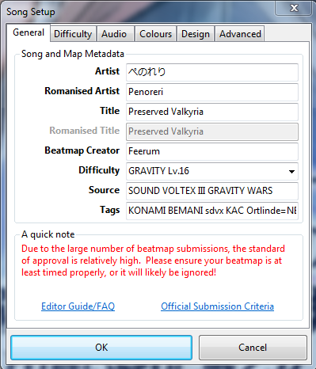
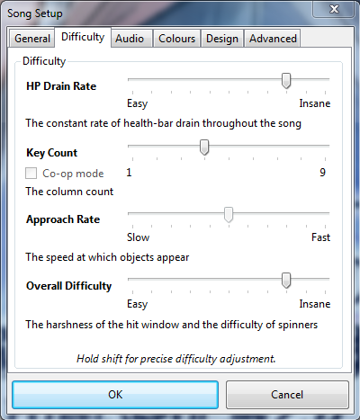
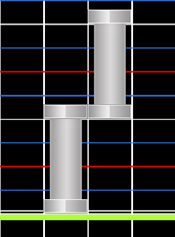
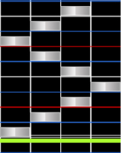
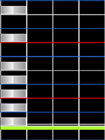
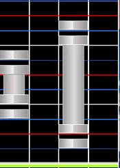
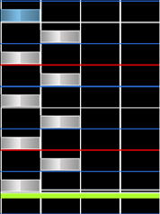
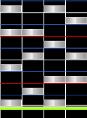

osu!mania Mapping Guide
=========================

Prologue
---------

### What is osu!mania?

*Main page: [osu!mania](/wiki/Game_Modes/osu!mania)*

osu!mania is one of the four game modes. osu!mania falls under the genre **Vertical Scrolling Rhythm Game** (VSRG). As the name already suggests, that the musical notes are falling down or rising up in a vertical manner. There are many rather similar games to osu!mania such as "Stepmania", "O2Jam" or "Beatmania IIDX".

One advantage of osu!mania is the customizable number of playable columns and its simple to use beatmap editor.

### What is the beatmap editor?

As stated, the editor allows a customizable amount of columns. For simplicity, this guide will revolve around 4-key-mapping. Below you can see a screenshot that details the editor compartments.

#### osu!mania editor

**1. Mapping Area**: This is where you place your objects.

**2. Density Graph**: This is the density of individual parts in the map. *Pink* bars indicates that the density is too high to be shown.

**3 & 4. Notes and Hold**: These options can be toggled by clicking. **Notes** are placed by clicking, **Hold Notes** *(also known as Long Notes)* can be created by clicking and dragging.

*Shortcut:* `2, 3` 

**5. Hitsounds**: Objects can be assigned with sounds during play. More info on hitsounds later in the guide.

*Shortcut:* `W, E, R`

**6. Lock Notes**: If Lock Notes is activated you can't move any notes, which is useful when hitsounding. Without this activated, you may accidentally move notes as you hitsound them.

*Shortcut:* `L`

**7. Beat Snap Divisor**: Using the slider, you can select the beat snap you wish to map in. The slider goes from 1/1 to 1/16, most mappers commonly use 1/4.

Specifics on what snaps should be used for ranking are detailed in the [osu!mania ranking criteria](https://osu.ppy.sh/help/wiki/Ranking_Criteria/osu!mania).

*Shortcut:* `Ctrl + MouseScrollWheel`

**8. Sample Set & Additions**: Sample Sets and Additions allow you to add even more hitsounds than shown in point 5. As an example, you can layer a drum-finish sound over the normal-finish. Using this, you can give your song a even larger variety of hitsounds!

*Shortcut:* `Ctrl + (W, E, R), Shift + (W, E, R)`

### Alright! I want to Map!

Now we know how to place notes in the editor. Should something still be unclear; read it again! You have all time in the world! If you have understood everything we can directly jump to point 2, the basics! This is where I will explain the song setup and how to time your beatmap!

Basics
-------

### Song Setup

Alright! Let's drag the `.mp3` of the song we want to map into osu! and a new map will be created automatically. The map will have no name until we open it once with the editor. Whenever you open your map for the first time in the editor, the song setup will open automatically!

#### General

| Name | Description |
| ---- | ----------- |
| Artist: | Here you'll have to add the original name of your songs Artist. No matter if it is Japanese, German or Russian. If the name of the artist has at least one special character you must add it here! As an example: If your artist name is "Die Ärzte" you must add it here because of the "Ä". |
| Romanised Artist: | Here you have to add the romanised artist name, which translates to the original artist name in Roman (Latin) script. With our example used earlier, it would be "Die Aerzte" because the "Ä" is translated to "Ae". If your artist name does not include any special characters in its name, this field will be filled out automatically. |
| Title & Romanised Title: | Exactly the same thing as with artist, but with the title of the song. |
| Beatmap Creator: | This field is automatically filled out with your name when you are signed in into osu!. If you are not online at the time of creating the beatmap, add your name there. |
| Difficulty: | Here you have to give your difficulty a name. The standard difficulty names for osu!mania are "EZ", "NM", "HD", "MX", "SC" and "SHD", but you are not forced to use these! If your song is from an other game you can use the difficulty names of that game! For example Sound Voltex, which uses the following names for their respective difficulties: "BASIC, NOVICE, ADVANCED, EXHAUST, INFINITE, GRAVITY".You can even add own difficulty names. The only important part of the naming process is that the chosen names have to show a clear indication of their difficulty. This does not apply to marathon maps. |
| Source: | Here, you have to add where your song comes from. Is it from another game? Or an anime? Perhaps a TV-show? Add it here! For example: If your song comes from Sound Voltex, you have to add it here. Keep in mind that it has to be the exact name of the game! |
| Tags: | You can add additional information about your song here. Album for example, or producer. Everything that helps to find your song in the beatmap listing. You also have to add the names of every osu! mapper who made a difficulty in your mapset as well. |

#### Difficulty

| Name | Description |
| ---- | ----------- |
| HP Drain Rate: | Here you have to select how much HP the player will lose when he misses a note and how much HP they will gain from notes. Important to add: Unlike osu! standard and Catch the Beat, the player does not lose their HP automatically over time but only when they miss a note or get the 50 judgement! The HP drain rate for example can be set higher when your song is really easy to play compared to the automatically set star rating. But don't exaggerate! Experiment with the HP drain to find a fair value - you don't want too many players failing out |
| Key Count: | Here you have to set the key count in which you want to map. In this Guide I will use 4K. You want to have more? Go for it! Just select the amount of keys you want to map and start! You have the free choice! 4K and 7K are the most popular key modes. Important: Not every key count is rankable! Currently only 4K, 5K, 6K, 7K 8K and 9K are able to reach the ranked status! The checkbox "Co-Op" can be selected when you choose 5K and above. This allows you to map more than 10 Keys! As an example: When you choose 6K Co-Op, you will map in 12K. While playing that, there will be two osu!mania stages, both with 6K each. This allows you to play with a friend on one keyboard! |
| Approach Rate: | This point is not used in osu!mania and you can ignore it. |
| Overall Difficulty: | Overall Difficulty orOD changes the judgement of how accurate you have to hit a note to get a 300, take note that the hit error range of MAX doesn't change with OD, instead only with HR and EZ mod. A detailed table can be found here; hereAlso: Should your map have a lot of Long Notes you should set it to a lower OD, if you have more single notes than long notes it is recommended that you set it to a higher OD. |

#### Design

| Name | Description |
| ---- | ----------- |
| Countdown: | Here you can set a countdown for your map. Newer maps and especially osu!mania usually don't use this, so it should be disabled. |
| Widescreen Support: | This box should only be enabled when your map has a storyboard. |
| Display epilepsy Warning: | Should you use a storyboard with rapidly flashing lights, it's very important to enable this box! This warns the player about the storyboard so he can disable it or increase the Background Dimmer. |
| Letterboxing during Breaks: | Letterboxing shows little boxes at the top and bottom of the screen while in a break. Breaks are uncommon in osu!mania, so disable this point. |

#### Advanced

| Name | Description |
| ---- | ----------- |
| Stacking: | This Point has no effect for osu!mania so no need to change anything here. |
| Allowed Modes: | With this point, you change the mode of the editor to the one you want to use for your map. This guide is about osu!mania so we use "osu!mania" of course.Should you choose "All", your editor will be set to osu! Standard, then your map will be automatically converted into any other game mode. |
| Use special Style (N+1 style) for osu!mania: | If you map in a keymode which can use a special key (5K and 8K) you can enable this point. It is known from "BMS" as "Scratch". It's a special extra key, especially used in 8K osu!mania. You can map the song like a normal 7K map, but you will have (depending on the skin settings the player uses), an extra key for scratching on the left or right of the playfield. |

The point **Colours** is not used in osu!mania so we don't need to change anything there.

The point **Audio** will be explained in the part "Hitsounds"

### Timing

Once we finished our song setup we need to time our song. The timing of a song sounds really complicated at first and if this is your first map, you might have problems with it but you can always ask the community whether or not someone can help you with the timing! Once you have timed a few songs you will get used to it! So don't worry!t!

**How to start?** First you need to listen closely to your song to get a feeling of the Main Beat. Once you think you can hear the main beat, just start to press "T" to the beat! Follow the instructions on the screen until the editor finally has the beat. You can tap longer to get a more accurate BPM, but the most important thing is to get the "basic" BPM or at least get near to the actual BPM of the song. It is also handy to take note that most BPMs are integers. Once you have a timing point set, you need to set the accurate offset. Many inexperienced mappers don't really know what the offset actually is, even though it is quite simple:

**The offset is the first beat of your current BPM!** That's all! Go to the point of your song where you can hear the first beat, press F6 again, choose your timing point and press "Use current time". Now the timing point should be on the current offset, the first beat! Now you need to check whether or not the BPM is really correct. Press F3 and play the song. Watch the beats and check if they're on the white lines you can see above the Timing line. Should it be wrong, you can adjust it by increasing or decreasing the BPM. Listen closely to the metronome and adjust it until the beats are on the same tact as the metronome! Should it be right, your song is finally timed!

I also would like to show you a little program that can be really helpful to find the right BPM really fast. It is called ***MixMeister BPM Analyzer***. This program will show you the average BPM of your song. It has just one weak point. It can not show you multiple BPMs. It will show you the average BPM of all BPM points in your song. To say it simple: It helps with single BPM only. You can search for it on Google or just click [here](https://www.dropbox.com/s/m4pjenvo4n65943/bpmanalyzer.zip?dl=0). Don't try to use it to time every map of you. You will never learn how to time songs when you let this program time everything for you. Use it to compare it with your BPM to check if you got the right one!

**Multiple BPM**: A lot of songs don't have a constant BPM. For those, you need to add another BPM point. It works similar to the normal BPM. Go to the point where the BPM changes (This is the offset again because it's the first beat of the BPM!), press F6 to open the Timing panel. Now just add another timing point by clicking on the green "plus" and adjust it to the BPM change while listening to the metronome again, or you can press Ctrl + P to set a BPM point at the time stamp you are currently at. Do this for every BPM change in your Map!

#### Timing Setup Panel

| Name | Description |
| ---- | ----------- |
| Timing Points: | The timing points or "Red Lines" are there to time your song. Without these you can't map. I already explained how you can find the right BPM and offset for your song earlier! |
| Inherited Point: | The inherited point are also called "Green Lines". These points are used to add "effects" to your map. With these, you can change the volume, the sample set, the slider velocity (SV) and you can add a [Kiai-Time](/wiki/Beatmap_Editor/Kiai_Time). |
| Kiai: | The Kiai can be selected in "Style" and can be added between two inherited points. The Kiai Time is normally used in the chorus of your Song. It let appear star fountain on the left and right side of the screen and is used to make this moment of your Map "more exciting". |

### Pattern

Once you finally have the right timings in your map it's time to start with the mapping! But how exactly do you start? In this part of the guide I would like to show you different kinds of patterns you can use to map your song. It might be that some pattern looks really confusing for new mappers, but once you get used to it and you know how the patterns are actually called and when to use them i'm pretty sure you will learn them really fast! I will add a screenshot for each and every pattern with a short description for what they are and when you should use them.

#### Long Note

Here we can see a Long Note or just LN. A long note is the "Slider" in osu!mania. Using LNs are the best way to map long sounds in your song. There are lot of ways to use a LN which I will explain in another part of this guide.

#### Chord

Here we can see the Chord. The chords, who also can be called "doubles", "triples" or "quads" is used to emphasize strong sounds in your song like heavy drums or cymbals. In the screenshot I have used a two note chord but you can of course use more notes for it! If you are planning to rank your map, depending on the key-count you map in, you can use up to six notes! Anything more is against the Ranking Criteria.

#### Burst

Here we can see the Burst. Bursts are what they sound like - quick bursts of notes. It's not necessarily 1/4, but usually is defined by something that is much faster than the normal density of notes in the song for a very short period of time

#### Staircases

Here we can see the Staircases. The staircase is mostly used for fast sounds. It is recommended that you should map staircase streams conservatively as it gets very hard to execute after a certain bpm threshold for players, this is mainly due to the jacks formed on columns 2 and 3.

#### Roll

Here we can see the Roll or Stair. Usually rolls are delimited by a repeating pattern of 4 or more notes, but more generally, it's notes going in a certain direction. A 1234 is a roll and a 1324 is a split roll.

#### Jackhammer

Here we can see the Jackhammer or just Jack. It is recommended to use jacks for two sounds that sound exactly the same. Should you use jacks randomly you will very quickly notice that it doesn't play well. As an example you can use the jack very well for dubstep sounds or for similar drum-sounds. But be careful, do not over-use it! When you use too many jacks at once it often plays too hard.

#### Shield

Here we can see a Shield. The shield can be recognized by the fact that its always note right before or after a LN.

#### Chordjack

Here we can see the Chord Jack or or Double/Jumpjack. The chord jack is a combination of the jackhammer and the chord. The way to use it is the same as for the jackhammer. For same sounds, just that you use these as chords for heavier sounds.

#### Trill

Here we can see the Trill. The trill is used for two really fast changing sounds in your song. In the screenshot we see the one handed trill but that is not the only way to map it. You can also use both hands for it, as an example you can use columns 1 and 3 instead

#### Chordtrill

Here we can see the Chord Trill or Double/Jumptrill. The chord trill can raise the difficulty of your map really fast so do not overdo it! The chord trill should never be mapped above 1/4. Like the trill, the chord trill is used to emphasize two much louder sounds that change really fast. Like the trill this is not the only way to map it.

#### Jumpstream

Here we can see the Jumpstream. The jumpstream is often the most complicated pattern to play for a player because it's a mix between normal notes and chords that change hands really fast. The jumpstream should only be mapped when it really fits to your song. As an example; loud melody between more quiet sounds. Drums between hi-hat etc. There a lot of different ways to map jumpstreams. In the screenshot we can see a really safe way to map it because there no 1/2 beat triple jacks in it. But of course you don't have to map it that way!

Okay! These are some of the different patterns you can use in your song! There's still many more configurations of patterns not covered in this guide however. A lot of them can be really good combined. Try to experiment these patterns in your song and I'm sure you can find a good mix of them for your song!

### Mapping

After we finally know which patterns we can use and how they are called we can start with the mapping. Just drag the song you want to map into osu!, fill out the song setup up and add the timing! If your first tries look kinda strange or you don't like it, don't give up! No one is born as a master. Testplay your map as often as you can and when it is finished try to get as much feedback as possible! Ask friends that play osu!mania, ask in \#osumania or write directly to some player in-game and ask for feedback. It really helps a lot when you use the 25% playback rate while mapping. Alright, let's go! In this part I would like to explain what exactly you should have an eye on while mapping an Easy/Normal/Hard or Insane difficulty.

**Notice**: Keep in mind that everything what I will write from here is just a guideline and you should not take this as actual rule. You don't need to follow this guideline verbatim.

If you want to rank your beatmap there some points you have to take note of.

**First**: You need a full spread in your beatmap. An osu!mania beatmap needs usually 3 difficulties or more. An Easy/Normal, a Hard and a Insane one. Of course you can decide for yourself if you want an Easy or Normal but it is best to have both. However you are not forced to have an Easy difficulty in your Mapset. The [osu!mania Ranking Criteria](/wiki/Ranking_Criteria/osu!mania) says that your lowest difficulty has to be below 2\*. That means you can have a Normal as the lowest as long as it is below 2\*. **Maps for approval are not affected of this rule!**

While creating a full spread, it is very important to look at the pattern spread, not at the star rating! It can happen that the star rating becomes really high just because of one really dense part in your map. Osu!mania has a really helpful tool for mapping different difficulties when you already have one ready. As an example: You already have the Hard difficulty for your mapset finished and now you want to map a Normal one. Open the new difficulty, click on "File", then on "Open Difficulty" and then click on "For Reference". Now choose the Hard difficulty. Now, a second mapping field will appear next to your current mapping field. It's the Hard difficulty. It shows you exactly how you have placed the pattern there and you can take this as reference on how to map the Normal difficulty!

Here are also some general tips for mapping:

**Be consistent!** What does that mean? Do not use different kinds of patterns for exactly the same sound in your map. As an example; if you use a chord for drums or snare, keep it like that! Do not change it to a single note later on. Consistency of the patterns is one of the most important aspects of osu!mania mapping. It just feels wrong when playing if you use different amounts of notes for the same sounds.

Now I'll explain the **general guidelines** on what to chart for particular difficulties, ranging from Easy to Extras

**Like I said this is just a guideline and you don't have to follow these 1:1**.

**The "Easy" difficulty**: Like the name already says, we are mapping the easy difficulty here. And this it should be: Easy to play! We want to introduce the newer players to osu!mania and he should learn the basics. That's why we want to keep our difficulty as simple as we can. We don't use any 1/4 pattern, even ½ pattern should be used carefully. Use chords only to emphasize the beginning or the end of a part with a heavy cymbal. Make sure you always try to balance the hands very well. Use a lot of LNs for the long sounds in your song and to map heavy 1/4 sounds and above. If you want to use chords for example in your kiai, make sure the player has enough time to react. That means give him 1/1 beat time! In most songs the second down or main beat is always louder than the first one, with heavy drums, kicks or clap sounds. These you could map a chord while you use a normal note for the quiet sounds. But still: In the best case just use normal, single notes. Also do not use single notes while having a LN! The player should first learn how to handle a LN and how to release it at the right time. If you really want to use single notes during a LN you should watch out that the single note is on the other hand. Means, when you have mapped a LN on the right hand, the single note must be pressed with the left hand! Also don't forget: If you want to add an easy difficult to your song you should try to keep it below 1,5\* to have the easy icon.

**The "Normal" difficulty**: Now that we know how to map an easy difficulty, we can raise the density of the notes for the normal difficulty a little bit. We can use more 1/2 patterns now, but we should try to avoid using 1/4 patterns or just use them really carefully. In the best case only when your song has a really low bpm or only really short stairs. Also we can use more chords now. If you have a heavy snare drum or a heavy cymbal in the middle of the part we can map this with a chord to emphasize these. Also, we can use single notes during a LNs but please try to use different hands like explained in the easy difficulty! Should you have more notes than one during the LN it's okay to have some on the same hand as the LN, but most of them should still be played with the other hand! Here we should definitely map the kiai with chords and normal notes like already explained in the easy, but do not overuse it. Depending on the bpm of your song you can also add 1/2 normal notes here. But do not forget: The player just learned the basic pattern and you should not overdo it! A also good point for a normal difficult is to follow the PR (pitch relevancy) with your notes. Higher sounds can be mapped on the right side, deeper sounds on the left side of the play field.

**The "Hard" difficulty**: In the Hard difficulty we can start to add more complicated patterns since the player should have learned the basics from easy and normal. We can start to add longer 1/4 bursts and stair patterns, we can also start to use 3-note chords for heavy cymbals at the end or at the beginning of a part. Also, depending on the bpm and the part of your map, we can use short jump streams but make sure they fit to the part you currently map. When the song gets more hectic and faster, it's the perfect time to add such a jumpstream. You can start to use short jack patterns here as well. What you should avoid are chord trills. Chord trills have a really high pattern density which may result in a very high star rating. You can of course use short triples of chords, these should not have a big impact on the star rating. The kiai should be the most dense part of your map if possible. Also, you can try to combine more LNs and ¼ single note patterns. Try to combine different lengths of LN patterns at the same time! It can give your map a special feeling by using more than one LN at the same time. But be very careful here. Make sure every LN follows a sound! Do not add these "randomly" into your song just because you think it could play well. Depending on the BPM it's also okay to add short 1/6 or 1/8 stair patterns. But use these carefully. Only when the song provides enough for these. The 1/6 burst should not be longer than a 1/2 beat and the 1/8 not longer than 1/4 beat! The lower the bpm of your song is, the longer these burst patterns can be.

**The "Insane" and "Extreme" difficulty**: Now we focus on the insane and extra difficulties. Again, we raise the density of the pattern and start to use even more complicated patterns! You can now use all kinds of pattern and try to combine them. Also, you can now use long 1/8 patterns as well as chord trills! An insane and extra difficulty is mostly for more experienced players, so you should try to make a really nice to play and still exciting difficulty. Try to combine jumpstreams with trills and heavy chord mashing. You can now use 3-note chords for more than just emphasizing the ending of a certain part in your song. But keep in mind: Should you plan to add another difficulty like an extra difficulty, you should not go to the limits! You should leave some space to make an even harder difficulty. I can't tell much since you just have to create a harder difficult than the hard in a good spread. If you plan to add an extra difficulty you can go to the limits of the song. You can use heavy jumpstreams together with heavy chordmash. You can use 3-note chords in jumpstreams between two-note chords. You have to try out what's the limit of the song. But take note of the following: A guideline says that you must be able to pass your own difficulties and I have to agree with this point. If you really want to create a good and playable insane/extra difficulty you should know how they play and for this you have to be able to pass them.

### Hitsounds

You have placed your first notes and you like it? Or you Or you may have even finished a full difficulty or spread? Excellent! But something is missing, right? Yes! The Hitsounds.

Hitsounds are important in every game mode. They give feedback when pressing a note so the player knows what he just hit. Also having different hitsounds in your map can give it a special feeling because the song sounds different all of the sudden, maybe even better than without hitsounds! Osu!mania has two different ways to hitsound.

First, there is the normal way that uses the samples and effects provided by the game itself, like whistle/finish and clap. The other way is via the sample menu that you can open with`Ctrl` + `Shift` + `I`. That sample menu is especially important for keysounding that's why I will explain it later!

For now, we want to focus on the normal way of hitsounding.

First you have to decide; do you want to use the default hitsounds that osu! gives you or do you want to add custom hitsounds?

If you want to use the default one you don't really need to change a lot. Everything you need is to decide which sample set you want to use as a default. Go into the Timing Setup Panel and change your timing point to the sample set you want to use. Osu!mania usually uses "soft" as default because the hit-normal isn't that loud.

You can always change the sample set for a whole part by selecting all notes and changing it to the desired sample set or you can add an inherited point (green line) and change the whole part to the selected sample set until the next inherited point. Now you just need to add the hitsound you wish! You can choose between Finish, Whistle and Clap. All of these effects sounds different when you change the sample set. Try around for a little bit and i'm sure you can find the perfect one for your song!

Now I will explain how to add **custom hitsounds** to your beatmap.

First you need the hitsounds you want to add. These have to be a .wav file. You can not use hitsounds in a `.mp3` or .ogg format, because this is unrankable. Also you have to make sure your used hitsounds are rankable! Means, they have to be at least 100ms long and the hitsound must have an acceptable range of delay under 5ms. In the best case, your hitsound has absolute no delay, you can always cut the delay with programs like Audacity. Also it's not allowed to use silenced hitsounds in osu!mania. Every pressed note has to give a feedback. Once you have the custom hitsounds you want to add you need to rename them. When you want to hitsound the usual way your hitsounds must have following one of the names:

#### Hitsound List

Following hitsounds can be changed in the song folder:

- normal-hitnormal
- normal-hitwhistle
- normal-hitfinish
- normal-hitclap
- soft-hitnormal
- soft-hitwhistle
- soft-hitfinish
- soft-hitclap
- drum-hitnormal
- drum-hitwhistle
- drum-hitfinish
- drum-hitclap

You can add more than just these! You can name your hitsounds as well! As an example "soft-hitnormal2". You need to change the sample set you want to use in the Timing Setup Panel.
**Also notice:** The "xxx-hitnormal" is the hitsound which gets played when you don't give the note a specific hitsound. For example; when you change the "soft-hitnormal", every note in your map that has the soft sample-set active will have this hitsound! Be careful when changing them.

Once you have added your custom hitsounds you need to activate them!

For this, we open the Timing Setup Panel in the editor and mark all points. Now we go into "Audio" in the Timing Setup Panel and change the Sample Set to "Custom 1". That's it!

All your hitsounds in sample set 1 are now activated! Should you use another sample set, you choose the third point and choose the sample set you also chose for your hitsounds.

After you finally have your hitsounds, don't forget to activate "Lock Notes". That way, no notes can be moved when your hitsounding your map. Hitsounding doesn't take a lot of time at all. You can choose one or more notes at the same time, change the sample set on the top-left of the screen and add the effect on the right side. Now all these notes have a hitsound!

You don't even have to select all of this by hand. You can also change the sample set, the additions and the effect with hotkeys! Once you know which hotkey is for what hitsounding becomes an extremely easy task! Here's the list of hotkeys you can use for hitsounding your beatmap:

#### Hitsound Hotkeys

- `Shift` + `Q` changes the Sample set to "Auto"
- `Shift` + `W` changes the Sample set to "Normal"
- `Shift` + `E` changes the Sample set to "Soft"
- `Shift` + `R` changes the Sample set to "Drum"

- `CTRL` + `Q` changes the Additions to "Auto"
- `CTRL` + `W` changes the Additions to "Normal"
- `CTRL` + `E` changes the Additions to "Soft"
- `CTRL` + `R` changes the Additions to "Drum"

- `W` gives your note the effect "Whistle"
- `E` gives your note the effect "Finish"
- `R` gives your note the effect "Clap"

**Note:** Of course you can add more than one effect on a note!

**What I want to mention**: Never hitsound more than one note in the same chord with the same hitsound! Please keep in mind that every note that gets played also plays the hitsound. When you have two notes with the same effect, the effect will also be played twice. This is just too loud.

Hitsounding may take some time but like I already mentioned it's important for the beatmap. Once you get used to it, hitsounding will go really fast!

Advanced Knowledge
-------------------

In this part I would like to explain more details of osu!mania mapping like keysounding, SV changes and pitch relevancy. Also, together with the community I want to explain different mapping styles here. The osu!mania community consists of players from different VSRG's like o2 jam, Stepmania and BMS. All these games have a special mapping style.

### Pitch

Mapping to the pitch can lead to a fun to play map, especially in osu!mania!

Basically it's not even that hard, you place your notes to the pitch like on a piano, lower pitched sounds are mapped on the left side, the higher sounds on the right side. This is used more frequently in the higher keycounts, (7K, 8K, etc.) where you have more possibilities because of the wider playfield and more columns.

Of course you shouldn't map the whole song to the pitch because this can cause some balance problems in your map.

What you always can try is to map the calm parts in your map to the pitch, especially when you use mostly single notes in that part. Also, when your song has audible instrumental pitch changes, you should try to follow it.

Of course you don't need to follow the pitch in your map but you can see it as a "little extra" that can make your map more exciting to play.

### Slider Velocity (SV)

The Slider Velocity acts a bit different in osu!mania; it changes the speed, at which the notes scroll downwards. Higher slider velocity means that the notes fall faster, lower Slider Velocity means the notes fall slower.

This is mainly used to emphasize specific part of the maps! For example; when the song gets calm and slower, you can use a low slider velocity, to make the map fit to the mood of the song. But when the song has a few, short and fast breaks, you can use higher SV to make the map more exciting, that way, it fits the song even better!

Also you need to add SV changes to your map when your song has multiple BPM changes. As an example: If your song has a BPM change from 150 to 200, the scroll speed of your notes will also get higher! To prevent this, we need to add an SV point at the BPM change to adjust the scroll speed to the average BPM.

The formula to adjust the SV to the BPM is: **SV = Mode BPM / Current BPM**

The mode BPM of your map is always the number in brackets that you can find in the song select menu on the top-left beside the BPM.

You take this number and divide it by the current BPM. What you will get is the SV you need to set with a Inherited Point at exactly the same timing as the BPM change.

### Design/Mapping Styles

As mentioned before, the osu!mania community consists of players from different VSRGs so they are used to having different mapping styles as well.

While every person who's mapping has his own style, there some basic features on which you can recognize the other games mapping styles.

**Stepmania Style**

Stepmania has one of the largest communities for VSRG Games. Therefore it also has a large mapping community!

Stepmania style consists, besides of the personal style of every mapper, basically out of two different mapping styles. The NB5/Yolomania 4 and the DCP/LCP style.

The DCP/LCP style emphasizes the musical relevancy through mapping techniques like pitch relevancy and jack theory. (The jack theory is basically creating jacks to emphasize a certain instrument like a cymbal crash). The DCP/LCP charts are more appreciated by other charters than the players because they focus mostly on musical relevancy and not so much on playability.

The yolomania style relies more on pattering than anything else. It cares more about creating good playable charts for the player and the community. While it still uses the concept of pitch relevancy, it has not the highest importance.

Generally said: DCP-Style charting cares more about the songs rhythm and its pitch and yolomania-style cares more about the players and how they'd respond to certain pattern choices.
