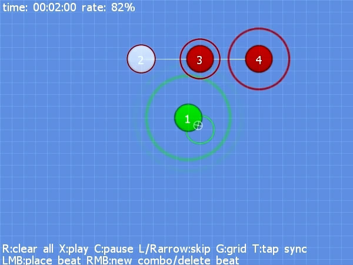
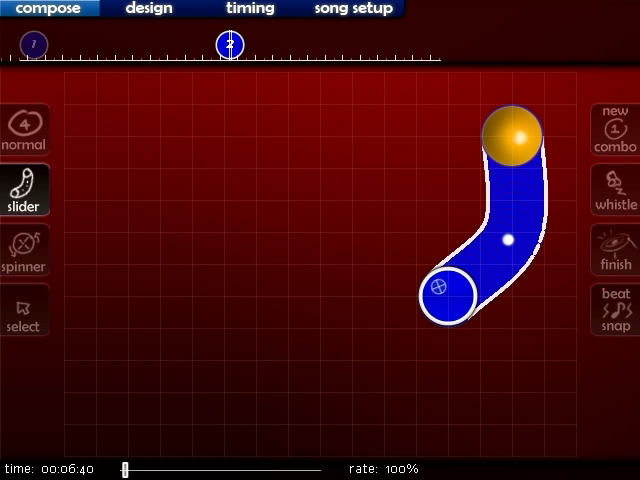
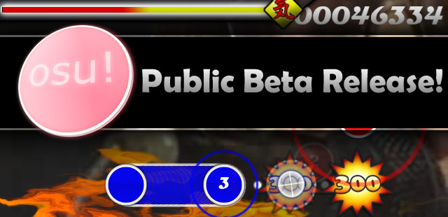
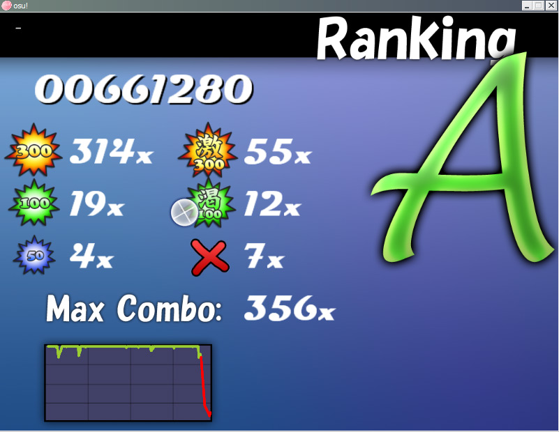
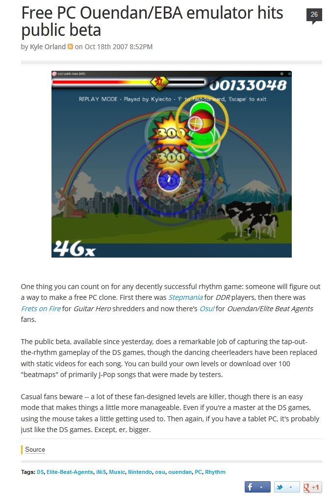
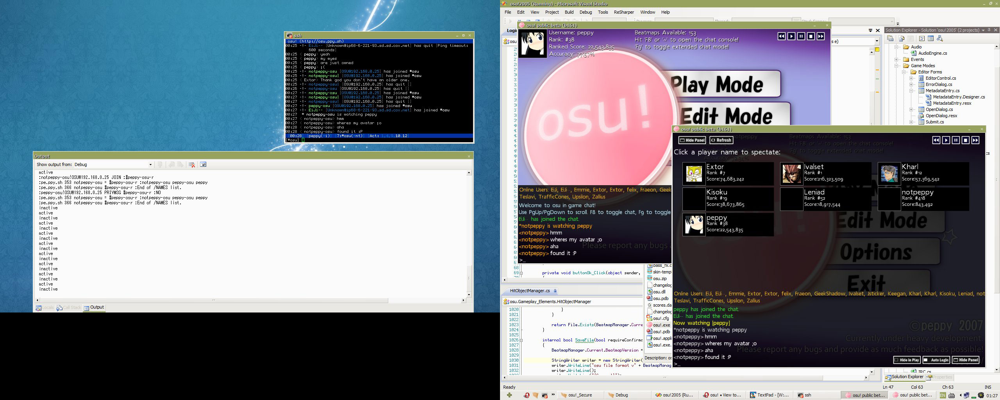

# Histoire d'osu! 2007

Ce qui suit contient certains des évènements majeurs de l'histoire d'osu!, et ce depuis début. Un grand merci a [Sinistro](https://osu.ppy.sh/users/5530) pour avoir aidé a compiler le contenu de 2007 et 2008. 

## Juillet

osu! a débuté en tant que preuve de concept nommée "ouentest". La première version a été publiée le 1er Juillet 2007 a un petit groupe d'amis proches de [peppy](https://osu.ppy.sh/users/2) et contenait un [éditeur de beatmaps](/wiki/Beatmap_Editor) très basique ainsi qu'un mode de jeu. L'éditeur pouvait seulement permettre la création de [beatmaps](wiki/Beatmaps) *très* simplistes sans fonction de recherche ou de [snapping](/wiki/Beatmapping/Snapping) disponibles, et il n'y avait ni sliders, ni spinners, seulement des cercles et des compteurs basiques de score/combo. La première version a pris environ 16 heures de programmation, et a été réalisée en *une seule nuit blanche*. `pUpdater` a été introduit (bientôt connu en tant que `osume`) pour prendre en charge les mises à jour a la dernière version.

A la fin du mois de Juillet, le système de menus a été changé pour ajouter un peu de style au jeu. Une première implémentation des sliders a été réalisée, avec une balle orange non animée, et quelques courbes relativement moches. Le beat snapping a été ajouté a l'éditeur, ainsi qu'une timeline, et une interface d'édition plus robuste (similaire a celle visible dans [Composer](/wiki/Beatmap_Editor/Compose/) aujourd'hui). 

## Août

Le menu principal a été mis à jour avec un nouveau look, et beaucoup de fonctionnalités ont été ajoutées a l'éditeur, incluant le support du copier-coller. La barre de menu de Windows ainsi que le curseur ont été ajoutés, rendant les fonctionnalités de l'éditeur plus accessible qu'avant; les sliders ont été améliorés avec la présence de [slider ticks](/wiki/Beatmapping/Slider_tick); l'[empilement](/wiki/Mapping_Techniques/Stack) de [cercles](/wiki/Hit_object/Hit_circle/) est présent; les scores locaux sont mieux supportés; et le format `.osu` a été revu et complètement refait, tout en incluant une conversion des anciens fichiers a ce nouveau format.

Le gameplay a été amélioré avec les débuts du [combo fire](/wiki/Glossary/Combo_fire), de la barre de [Vie (ou HP)](/wiki/Beatmapping/Health), de la trainée du curseur, et des sliders plus beaux. A ce point la, osu! have une humble collection d'environ 10 beatmaps, créés par l'équipe de test composée d'environ 5 personnes.

## Septembre

Le 17 septembre 2007 marque la "naissance" d'osu! pour le grand public. Les forums tels qu'on les connais on été établis, et hébergés sur le domaine de peppy (`ppy.sh`). L'attention du public a été gagné via un article sur le site [bemanistyle](http://bemanistyle.com) qui a fait quelques intéressés dans les habitués de jeux de rythme.

")

Peu après la sortie publique, les premiers [mods](/wiki/Game_modifier), [Easy](/wiki/Game_modifier/No_Fail) (EZ) et [No fail](/wiki/Game_modifier/No_Fail) (NF), ont été ajoutés, avec aussi les pauses (qui jusque la étaient ignorées et manquaient). Un grand nombre de changements ont rapidement fait qu'osu! ressemblait de plus en plus a un jeu de rythme légitime.

") ")

## Octobre

Le 1er octobre 2007 est le jour où les classement en ligne ont été disponibles publiquement. Cette date a aussi vu le lancement de la méthode de compression en `.osz`, ainsi que d'une base de données de beatmaps en ligne accompagnée d'un premier système de soumission de beatmaps. Les classement en ligne ont été ajoutés a l'interface en jeu, mais également affichés sur le site.

L'écran de sélection de musiques a vu des améliorations avec le groupages des difficultés et un mouvement de scroll plus intuitif. Le set d'échantillons souples, les raccourcis clavier, et la recherche en jeu ont tous été ajoutés ce mois la. Les joueurs pouvait créer des [skins](/wiki/Skinning) globaux, mais aussi par beatmap pour la première fois, et les Tablet-PC ont été complètement supportés. 

`pUpdater`(`osume`) version 2 a été sortie, supportant des téléchargements optionnels. Cela incluait de rendre les premiers skins réalisés par les utilisateurs disponibles pour tous via l'updater. L'éditeur a vu l'ajout du [snapping a la distance](/wiki/Beatmap_Editor/Distance_Snap), le support des marque-pages, plusieurs types de courbes pour les sliders, couleur personnalisées, la possibilité de tester, le temps d'introduction, et bien plus.

## Novembre

Un nouvelle note, le SS, a été ajoutée au système de ranking, remplaçant les S dans les cas ou la perfection était atteinte. Les mods [No video](/wiki/Game_modifier/No_Video) et [Hidden](/wiki/Game_modifier/Hidden/) (HD) ont étés introduits, les notes SH (S argenté) et SSH (SS argentés) également. Pour la première fois, les joueurs pouvaient modifier et assigner les sets d'échantillons normaux et doux suivant les sections. Les fichiers `.osz` peuvent maintenant être chargés avec un double-clic, ou en les glissant sur l'icône d'osu!.

") ")

---

")

Le [système de soumission de beatmaps](/wiki/Glossary#bss) (BSS) a été rendu public, autorisant les utilisateurs à facilement envoyer et partager leurs créations. Cela a introduit le statut des maps [En attente](/wiki/Beatmaps/Category#work-in-progress-and-pending) et [Classée](/wiki/Beatmaps/Category#ranked) pour aider à l'organisation de la collection grandissante des maps soumises. Le chat en jeu a été ajouté grâce a un client [IRC](/wiki/Internet_Relay_Chat) (Internet Relay Chat) réalisé a partir de rien, et connecté a un serveur IRC standard (sans [Bancho](/wiki/Bancho_(server)));  le chat étendu était visible; les avatars et statistiques simples étaient affichés en jeu en utilisant une communication http; les contrôles audios ont aussi été ajoutés au menu principal, qui jouait une musique aléatoire au démarrage; les [replays](/wiki/Replay) pouvaient être regardés pour les score locaux et en ligne. Les joueurs pouvaient regarder d'autres joueurs (les données spectateurs étaient envoyées en brut via IRC).

## Décembre
Les musiques peuvent être éditées en les glissant dans la fenêtre osu!; les infos-bulles qui expliquent les boutons variés des menus d'osu! et de l'interface d'édition ont été ajoutés; beaucoup de nouveau skins de qualité on été soumis par les premiers skinners ([Holiday par LuigiHann](https://osu.ppy.sh/community/forums/topics/1139), [WindWaker par awp](https://osu.ppy.sh/community/forums/topics/761)); de nouvelles méthodes de tri ont été ajoutées au menu de sélection de musiques; peppy peut maintenant envoyer des annonces globales a tous les joueurs d'osu!; et des changements mineurs ont été fait au gameplay.

