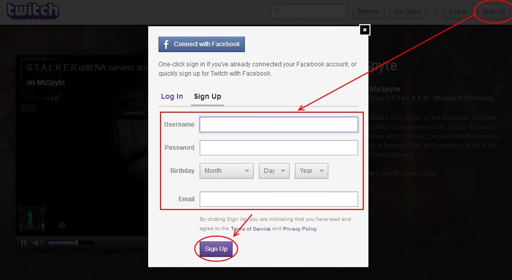
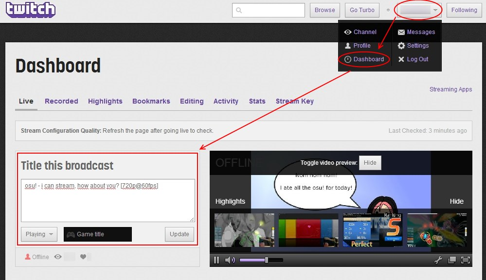
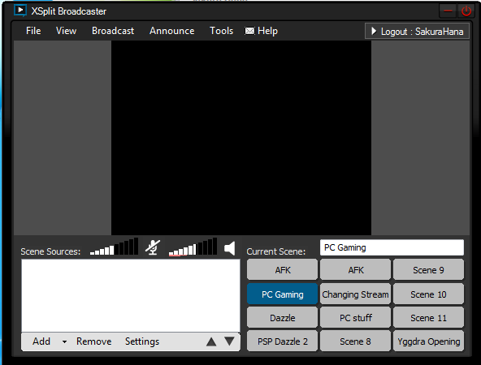
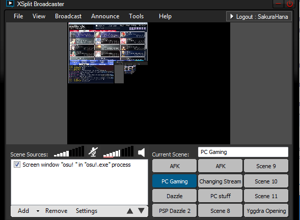
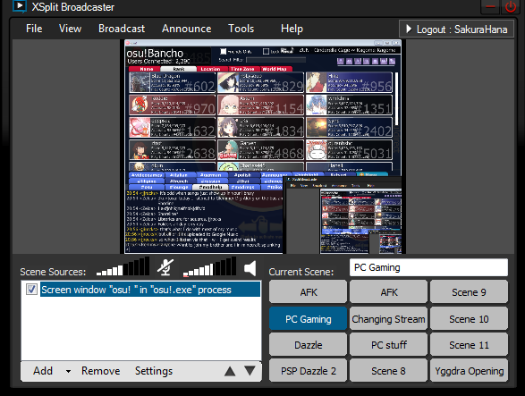

# Live streaming osu!

If you are visiting this page, then it is likely you have an interest and want to learn how to live stream *osu!* on twitch.tv. Doing so is a very simple process but you may require a reliable computer to be able to run both osu! and send live encoding to [twitch.tv](https://www.twitch.tv) (which from now on will be referred to as TTV) at the same time.

## Step 1 - Registration



1.  Registering for an account for TTV is very easy, just head to the website https://www.twitch.tv and click on the `Sign Up` button in the top right corner.
2.  Afterwards, fill in the fields.
3.  You will get an activation link via e-mail.
4.  Once you are done, your channel will be at www.twitch.tv/"username" (username being your chosen username).

## Step 2 - Prepare twitch.tv for streaming

Twitch.tv is a gaming community, and as such, there will be *a lot* of gaming libraries to select from. However, you only need to worry about finding *osu!* since that is what this guide is about.


1.  Once you have logged in, click on your username at the top right corner.
2.  Click on `Dashboard` from the drop-down list.
3.  Input the title and click on the icon where it says `Not Playing` to change into `Playing` then type "osu!". A list of games with similar names should appear, the one you want is *osu!*

Once you are done with that, you are ready to start streaming if you want. There is one last question remaining, how can you make TTV recognize your *osu!* window and live stream it? We will cover that in the next step. If you already have a preferred program you want use for this then go ahead and start streaming, otherwise read on.

**Warning**: If you do not pause/mute the stream preview in either your channel or dashboard, your viewers may get echo. Also, you may click on the wheel icon on the chat and click on `popout` to pop out the chatroom and put it wherever you want without the need to constantly have your browser open.

## Step 3 - Live streaming programs

### XSplit

#### Introduction

[XSplit](https://www.xsplit.com/) is one of the most common live streaming programs nowadays, specially because it does not cause too much stress on your computer and comes with a neat screen-capture feature. The downside? Some options are disabled and have lower quality unless you buy the license.

**Pros**:

-   Able to setup your own scenes with multiple screens / media / text
-   Up to 4 different scenes unpaid, and up to 12 if you pay.
-   Low stress on the computer
-   Easy to link your TTV account with it
-   Your own account will save up all the data on scenes and settings so you can access it from any computer.

**Cons**:

-   Low quality (including audio) if you do not pay
-   Price is quite high. [(Starting at USD 14.95!)](https://www.xsplit.com/Account/License/Buy/)

#### Installation

To get started with XSplit, head to their website: https://www.xsplit.com/
Register and download the program. Once you have logged in you will be in a window that looks like this:



To capture any region of your screen or a window, click at the bottom left on `Add`, then click `Screen Region`, afterwards just click on your *osu!* window and you will get this:



Capture-window too small? Do not worry, you can drag and resize it as you want along your streaming area. You may add multiple screen regions/cameras or even text/watermarks to a single scene, and you can easily switch between scenes.
For example, you could have an AFK scene to let viewers know that you are AFK... ahem, anyways if that is all you want to include then you want to expand it to like this:



Afterwards, you will have to connect your XSplit account with your Twitch.tv account. Click on `Broadcast` then `Edit Channels...``

On the window that appears click on `Add` then click on `Justin/Twitch.tv`. Now you should see this:


Input your username and password(you may use your stream key instead of your password if you know it, but it is not necessary). This is where things become complicated, here is an explanation for each part in detail:

-   **Preset** - Always use XSplit Default.
-   **Quality** - The higher this number, the less compressed the frames are. More importantly, the higher this number, the better the quality of your stream but may also cause lag on the your viewer's end if your **bandwidth cannot support it** and puts more stress on your PC.
-   **VBV Max Bitrate (kbps)** - This set the maximum amount of bandwidth you want to allocate to your video portion of your stream. Use testing websites like https://www.speedtest.net to check how high is your **upload speed** and know how much you can allocate. Remember that you must split bandwidth on both video and audio encoding. The higher this value, the more bandwidth you will use for your video frames, so your viewers will get faster and higher quality frames and may lag on people with **download speed** lower than the amount you set here.
    -   A fair warning, if you set this higher than your own **upload speed**, every viewer in your stream will experience lag.
-   **VBV Buffer (kbit)** - This should not be necessary, but this is the max amount of kbits stored in the buffer for viewers should you lag for some reason while streaming.
-   **Audio Encoding Format** - It is better to set it to "Stereo". The default is Mono.
-   **Bitrate** - This number in bytes adds to your bandwidth used along with the video max bitrate. This also comes from your **upload speed** and from the viewers' respective **download speed**.

If you have trouble figuring out the best video and audio bitrates, click on `Test Bandwidth.`

Once you are done with the settings, go ahead and go back to the main window, since there is a few other options there that you will need to use, just remember that you can only change these settings while you are **offline** so if you need to change them, you will need to turn off the broadcast momentarily.

#### Extra notes

On the main window, click on `View`. Here you can set different options, these options only affect what the viewers see, not what you see.

-   **Resolution** - Also referred to as the recording resolution. This is the size of the frames that will be sent to twitch.tv. The higher the resolution, the more stress on your PC but better quality for your viewers. If your resolution is not listed, click on `Edit Resolutions`. It will show you a list of commonly-used resolutions you can use, or you can click on `Add` to add your own resolution by inputting the width and height manually. For twitch.tv to use the whole screen, the "Resolution" you set must be a widescreen (16:9). Any other combination will result in twitch.tv using only the middle.
-   **Frame Rate** - The rate that you upload frames to the server. Again, the higher this value, the more stress on your PC and the smoother the stream for your viewers.
-   **Transition** - If you use multiple scenes, transition is the type of transition when you switch scenes.
-   **Projector** - Choose which screen to project on.
-   **Scale Viewpoint** - This adjusts the size of the preview on XSplit for your stream.

### OBS (Open Broadcaster Software)


 [OBS](https://obsproject.com/) is an open source streaming program currently in active development and has high popularity among TTV streamers. Although highly debated, it is often claimed that it uses less CPU than XSplit.

**Pros**

-   Free / Open Source
-   Can have many different scenes
-   Better audio codecs / quality than XSplit Free
-   Can stream at 60FPS
-   Can choose from x264, QuickSync or Nvidia NVENC as a video encoder. There is also WIP support for AMD VCE.

**Cons**

-   Incompatible with some older GPUs
-   Less mature than XSplit
-   Slight learning curve

**Indifferent**

-   No Windows XP or below support
-   Interface isn’t skinned, fairly basic.

### Installation

To get started with OBS, head to their website [OBS](https://obsproject.com/) and download the program. The first time you start OBS, it will likely update on language files and shaders. Allow the update. After the update, you will be directed to the Main Menu as shown above.

#### Setting up Twitch.tv in OBS

Go to twitch.tv and log in. Navigate to your dashboard and locate the `Stream Key`. Click on the `Show Key` button and copy the key.


Next, go over to OBS and open the Settings. Locate the `Broadcast Settings`.


Use "Twitch / Justin.tv" as Streaming Service, choose a server located close to your physical location and put the copied `Stream Key` in the text window below. As you can see, OBS already mentions that some settings are wrong for twitch. This is due to the quality expectations from twitch and should ensure an overall high streaming quality on their site.
Note that you should not show your stream key to anyone, unless you trust them and want them to record on your account. If your stream key was compromised, repeat these steps.


#### Settings for streaming

This will be a guide to all the setting pages, explaining the important settings with recommendation on that settings. Since streaming experience is highly correlated with your PC specs and Internet connection, you have to do some tinkering to optimise your stream flow. You can refer to the help provided inside if you want.

**General**

-   You can set your language and save profiles, by renaming the profile and saving it. Pretty self-explaining.

**Encoding**

-   `Use CBR`: Has to be checked for using OBS with twitch!
-   `Enable CBR padding`: If you want to be able to change your bitrate while streaming, disable it.
-   `Quality Balance` is disabled due to Constant Bit Rate (CBR).
-   `Use Custom Buffer Size`: Unless you have a stable internet connection and a decent PC, you should leave it turned off. You can set it to double the size of your bitrate to raise your streaming quality a bit. (Less artifacts and noises on fast movements).
-   `Max Bitrate(kb/s)`: This is the most important setting, as it determines in what resolution you can stream. But it is very dependent on your connection speed and stability. Do some [speedtest](https://speedtest.net) or, for more exact values, [ShaperProbe](https://www.cc.gatech.edu/grads/p/partha/diffprobe/shaperprobe.html) to determine your maximal bitrate. Usually, you should only use ~50 % of you maximal upload for streaming or your viewers might experience *lag*. Also if you use high bitrate, the data required would be *heavy* for slow connection spectators (128kb/s connection on 1mb/s stream). However, please note that Twitch recommends you stay at 3000 kb/s as a maximum.

Some standard bitrate-resolution recommendations (for 30fps):

-   360p (640 x 360) — Minimum: 400kbps — Recommended: 750kbps
-   480p (854x480) — Minimum: 500kbps — Recommended: 1,000kbps
-   720p (1280x720) — Minimum: 1,500kbps — Recommended: 2,500kbps
-   1080p (1920x1080) — Minimum: 3,000kbps — Recommended: 4,500kbps

For a higher framerate, adjust accordingly.

**Tip:** You can record everything in original resolution (eg 1080p), and downscale (eg 480p) it later. This takes *much less* computing power than rescaling everything (Upscaling rarely looks pretty).

-   `Audio Encoding`: As *osu!* usually has a 192kbps@44,1kHz MP3 Format you can use either that or a 128kbps AAC@44,1kHz (recommended). If you have a really good microphone and will do some verbal commentary, you can also set this higher but keep in mind that those kbps are on top of your video bitrate.

**Video**

-   `Base resolution`: Here you can set your resolution for the scene to be streamed. If you do not plan to include anything else (your face/desktop/irc/etc) other than *osu!* itself, just set it equal to your *osu!* resolution.
-   `Resolution Downscale`: Here, you have the possibility to downscale your scene to match your bitrate! If you do so, and the limitation is due to the connection, leave it at Bilinear Filter. Otherwise, you might want to go for the 16 samples bicubic one.
-   `FPS`: Since osu! is a rhythm game (frame-freeze and you are screwed with Miss), you can tell the difference between 30fps and 60 fps. If you have only a half-decent PC and low bandwidth, 42 fps works well. For starters, 30fps is recommended and you can try increasing fps later until you see fit.
-   `Disable Aero`: For weak PCs or if you also want to capture whole windows or monitors. It is good to note that OBS has very poor monitor/window capture performance if you do not disable Aero.

**Audio**

-   Only needs to be changed in special cases such as if you want a push-to-talk or have a 2nd soundcard and split your sound-outputs (one for mic use, one for game use). You can also define hotkeys for muting. Pretty much everything in here can be ignored.

**Advanced**

-   `Use Multithreaded Optimizations`: If you have a multicore processor (usually high-end PC), it is a definite must-have-enabled!
-   `Process Priority`:  Leave it normal, unless you know what it does! On lower-end machines, it can be changed to above normal. You can do this to *osu!*, but it is not recommended.
-   `x264 CPU Preset`: Best setting to experiment with when you have problems with the CPU usage! Set it to superfast to lower the usage for some quality loss. \*\*Otherwise, do not touch and leave it at veryfast.
-   `x264 Encoding Profile`: **Must** be changed to main for twitch.tv use!
-   `Keyframe Interval`: **Must** be changed to 2 for twitch.tv use! (FYI: Youtube also needs this at 2)

If you experience a motion-audio-shift in your stream, play around with the `Global Audio Time Offset`. Mostly happens only when you using a PCI-E sound card!

##### Summary

Use CBR, Set MaxBitrate to a suited value (~50 % of real upstream or 3000kb/s, whichever is lower), Use AAC 128kbps@44,1kHz, Use osu! resolution and downscale it if needed, Set x264 profile to main, Set keyframe interval to 2, Adjust Global Audio Offset when needed.

#### Setting up a basic scene

Go back to the main OBS window. We are going to set *osu!* as `Global Source` (aka the main character) and hence, click the `Global Sources…`-button > Add > Add Game Capture.


Give it an appropriate nickname (simply name it "osu!" to prevent confusion) and choose *osu!* from the dropdown menu. Enable `Stretch image to screen` and disable `Capture mouse cursor`.


Go back to the main window and `right-click` in Sources > Add > Global Sources > "osu!" (unless you use different nickname). Give it a name that *osu!* should have within the scene (eg "osu! play by rem470").


And done. You should now be able to click `Preview Stream` and there should be the *osu!* window in Fullscreen in the preview window. Also if you click `Start Streaming`, you should start streaming on your Twitch channel!

#### Setting up an advanced scene

Everything from here on is not as detailed and pictured as the basic one. It is for people that already are a bit familiar with the OBS Options. This includes:

-   Layer Order
-   Snapping to specified sides
-   How to use the `Edit Scene`-mode
-   Where to find settings

##### Insert your Twitch.tv Chat in the Scene

The basic idea here is, that if spectators are watching your stream in fullscreen, they are unable to follow the chat. So why not include it in your stream? Also if you watch the video later and maybe have an audio commentary by yourself, you still know what you are referring to. If you are not playing osu! in windowed mode (in fullscreen in other words), this method will requires you to use a 2nd monitor connected with it! If the Color Key step does not work properly for you, try using the BetterTTV plugin and going to the gear icon in chat, and hit Black Chat. Chat must be popped out for this option to show.

1.  Pop out the twitch.tv chat
2.  Add a Source > Window Capture
3.  Choose the popped Twitch Chat, Inner Window
4.  Disable Capture Cursor
5.  Set Subregion > Select Region > Drag the mask, so only the chat messages themselves are in.
6.  Use Color Key and select the background of your twitch chat.
7.  Approve everything and rearrange your scene.

You might want to add an image behind the captured chat and set its opacity to 50-70 % for better reading.
There is also the possibility to change the appearance of the twitch chat per browser plugins. (i.e. Stylish for Chrome) This requires only basic HTML/CSS understanding.
Another possibility is to use a 3rd party IRC Client to connect to the twitch.tv chat and capture that window!

##### Insert the song you are playing

There is no direct way to get the played title into OBS. (there *is* the possibility to capture the window title, but that is *ugly* and pretty unforeseeable with long song-titles)
One possible way is to read the Window title out of the process and cut out the `osu! -`. The most usable solution would be a little helper program. A very safe (in terms of no side-effects/extra requirement) way is to do this per [AutoHotkey](https://ahkscript.org/download/) script. Go there and download it. Make a file with Notepad and insert the following code.
```
    F10::pause
    F11::reload
    !s::
    {
        YourPath =  D:\Games\osu!\
        loop {
            sleep, 5000
            WinGetTitle, ActiveTitle, osu!
            StringTrimLeft, ActSong, ActiveTitle, 8
            filedelete, %YourPath%actualSong.txt
            if ActiveTitle = osu!
            {
                fileappend, Selecting song..., %YourPath%actualSong.txt
            }
            else
            {
                fileappend, +++++ Now playing: %ActSong%,%YourPath%actualSong.txt
            }
        }
    }
```
Change `YourPath` to your osu! folder, or any other location you want. Save the File as `OsuTitleToFile.ahk`. This Script remaps your `F10` key to pause the script and the `F11` key to reload the script. If you are using those keys in *osu!*, you can change it as you may. Start the script by dbl click it out of the explorer. With pressing `Alt` + `s` (!s::) you start the script and it writes the actual used title every 5 seconds in the specified file. (In this Version in D:\\Games\\osu!\\actualSong.txt) Now go to your OBS and add a text to your scene. Use this file as source. The text itself will change every time the file got changed. You can also make it a marquee and use borders to make it more visible. Just experiment with it :)

### OBS MultiPlatform (Open Broadcaster Software MultiPlatform)


[OBS MultiPlatform](https://obsproject.com/) is an open source, multiplatform streaming program currently in active development, and is the successor to OBS. It is raising in popularity, mainly amongst OS X and Linux users, and despite being new and slightly buggy, has more features than is predecessor.

**Pros**

-   Free / Open Source
-   Can have many different scenes
-   Better audio codecs / quality than XSplit Free
-   Can stream at 60FPS
-   Multiplatform
-   More features than OBS

**Cons**

-   Relatively new
-   May be incompatible with older GPUs
-   Less mature than OBS and XSplit
-   Slight learning curve
-   Possibly buggy

#### Installation

To get started with OBS MultiPlatform, head to [their website](https://obsproject.com/) and download the program. You will need to choose OBS MultiPlatform on the right for your correct operating system. When installation is complete, you will arrive at the Main Menu as shown above.

##### Setting up Twitch.tv in OBS MultiPlatform

Go to twitch.tv and log in. Navigate to your dashboard and locate the `Stream Key`. Click on the `Show Key` Button and copy the Key.


Next, go over to OBS MultiPlatform and open the Settings. Locate the `Stream Settings`.


Use "Twitch" as the Streaming Service, choose a server located close to your physical location and put the copied `Stream Key` in the text box labelled Stream Key.

Note that you should not show your stream key to anyone. If the stream key was compromised, reset it via Twitch.tv and repeat these steps.

#### Setting up a basic scene

Go back to the main OBS MultiPlatform window. Create a Scene if one does not exist, and then add a Source. Choose Game Capture. You can name it whatever you wish.


Next, a few settings will need to be changed.

-   Untick "Capture any fullscreen application"
-   Under "Window", choose "\[osu!.exe\]"
-   Set "Window Match Priority" to "Executable Name"
-   Tick "Multi-adapter Compatibility" (this fixes *osu!* crashing)
-   Tick "Limit capture framerate" (this fixes *osu!* running under 60fps)
-   Untick "Capture Cursor"


You should now see your *osu!* gameplay within your OBS MultiPlatform window. If you click `Start Streaming`, your stream should appear in your Twitch channel shortly. From here, you may add more sources similar to OBS, however beware that plugins may not be ported to OBS MultiPlatform yet.


Evolve
------

[Evolve](https://www.evolvehq.com/) is a gaming utility with a built-in game recorder, which you can broadcast (Evolve's term for live streaming) directly to TTV.

**Pros**

-   Free
-   Simple interface
-   Easy TTV account linking

**Cons**

-   Limited customization

## Moderating the Chatroom

Twitch.tv commands for chat moderation (all usernames must be converted to lowercase when using these):

| Action  | Command             | Description                                         |
|---------|---------------------|-----------------------------------------------------|
| Mod     | `/mod username`     | Give moderator powers to "username" in your channel |
| Unmod   | `/unmod username`   | Opposite of /mod                                    |
| Timeout | `/timeout username` | Silences a user for 10 minutes                      |
| Ban     | `/ban username`     | Permanently ban a user from your channel            |
| Unban   | `/unban username`   | Unban a user from your channel                      |

You, the broadcaster, are responsible for whatever happens in your chatroom.
