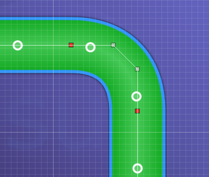
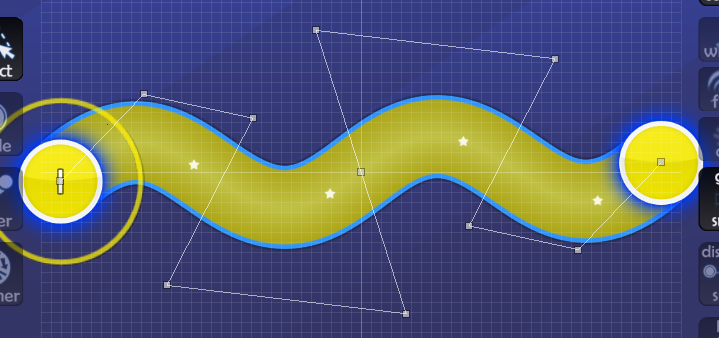

<!-- TODO: Needs to be rewritten, the article does not match with other articles (writing style, formatting).
Also check if the article matches with ASC. See #5729 for more informations -->

# Making good sliders

This article is a how-to on making good sliders.
In the most basic form, all you need is a [bézier curve](https://en.wikipedia.org/wiki/B%C3%A9zier_curve).

From [Ephemeral](https://osu.ppy.sh/users/102335),

> always align slider endpoints to the smallest possible value - that is, if you drag them any further backwards, the slider will shorten. the point will center itself in the slider end and will make attaining passable curves much easier to accomplish.

Also, doing this makes reverse selection on sliders not fuck them up. Which is a good thing.

## Arcs

Use essentially the same technique for any sliders symmetrical in one axis.

This is the easiest shape to make.
You basically place all of your points symmetrically in the grid first of all.
Select it and press `Ctrl` + `H` when you think you have it accurate to make sure the points are on symmetrical grids.
Then move the points around until the slider is the right length and falls just a little short of the final point.
It's important that whenever you move a point, you move the corresponding point exactly the same way to keep all the points symmetrical with each other.
Make sure you `Ctrl` + `H` often to check you haven't made a mistake.

To make the slider-end and endpoint line up hold shift to disable grid snap and move the top point down until the slider-end is right on the last point.
When you think it's perfect, select and `Ctrl` + `H` a few times and see if the endpoint moves around.
If it doesn't, congratulations, you have a beautiful slider.
Show it off to your friends.
If it does, move the top point around until it does.

If you want an arc at an angle, it's usually easiest to make it upright as above, then `Edit`, then `Rotate By...` to make it the angle you want.

## Waves

Use essentially the same technique for any sliders that are rotationally symmetrical.

Waves are made very similarly to arcs, only your points should be rotationally symmetrical with each other as opposed to horizontally flipped.
If you press `Ctrl` + `H` + `J` it rotates the slider by 180 Degrees so you can check the points correspond.

To line the slider-end and endpoint up choose two corresponding symmetrical points.
Disable grid snap and move them both in by a tiny bit at a time until the slider-end and last point are right on top of each other.

## Beat Blankets

*Main page: [Blanket Combos](/wiki/Mapping_Techniques/Formations#blanket-combos)*

Blankets are easiest to do if you eyeball the slider first of all to get it roughly correct, then scroll to a point on the timeline where the approach circle of the beat lines up with the closest edge of the slider's startpoint.
It may help to go into 1/8 snap to get it just right.
Then just tweak the points until the whole slider lines up with the approach circle as perfectly as you can.

Keep in mind that if you want a slider to blanket **and** be perfectly symmetrical, worry about symmetry first then adjust the points symmetrically to improve the blanket.

---

From [Gonzvlo](https://osu.ppy.sh/users/237733),

> as a variation of beat blankets, sometimes I use a spinner to make nice circles.

## Circles

Courtesy of mm201.

The number of control points you want depends on the angle covered by your arc:

- 0 degrees: 2 points.
- 0 degrees - 20 degrees: 3 points.
- 20 degrees - 170 degrees: 4 points.
- 170 degrees - 200 degrees: 5 points.
- 200 degrees - 300 degrees: 6 points.
- 300 degrees - 350 degrees: 7 points.

None of this is really exact, just a general idea.
Similar to waves, the further the control point is from the start/end in order, the further away from the curve it goes.
Make sure the first and last control lines are pointed in the direction you want your loop to begin at.
The others, just adjust by eye until it's mostly round.
Using an approach circle as a guide can help with this.

Like with most shapes, keep one (two if the number of points is even) control point to take out of grid snap so you can line up the endpoint.

## Elbows

Use the same technique for any slider with straight bits and curved bits.

When you want a slider with a transition between a curved bit and a straight bit you use a red point where it switches.
The most important thing is to **always put the red point and points on either side in a straight line**.
Like exactly straight.
Get a ruler if you have to.
We don't want any sharp bends here kthx.
But yeah it's pretty straightforward apart from that.

## Hearts

Use same technique for any slider which is symmetrical, but the startpoint is on the centre line.

A nice shape to use sometimes.
Here is how you make one.

### How to make a heart shape

First, make a basic heart shape, slightly longer than you need, with both the start and end points in the same place at the bottom.
Try and copy these points roughly if you're having trouble.
Putting just a redpoint at the top is fine, but I prefer to use an elbow curve :P

---

Next, copy and paste this slider to the tick immediately after itself and horizontal flip like so.

---

Then grab the endpoint of the first slider and pull it back to the length you want your slider to be.

---

See how it's asymmetrical and ugly?
Well mess with the points on the tail half of the slider until it lines up perfectly with the slider behind.

---

If you managed all that, you're done!
Delete the slider behind and edit/scale by if you want to fill any gaps.

## Wiggles

There are a couple of ways to do this, depending on what kind of wiggle you're after.

### Type 1

Start and end pointing the same way.

The important thing here is that each arc that make up the wiggle is made up of four points, and as you get closer to the centre the taller the four points need to be.
Once you have the basic shape, it's just messing around and eyeballing until it looks even and the tail end of the slider lines up on the last point.
As with arcs, don't forget to be `Ctrl` + `H`ing all the time to make sure the points are symmetrical.
Other than that, it's mostly practice.
Once you've made a few nice looking wiggles you'll be able to knock them out in no time.

### Type 2

Start and end pointing different ways.

Similarly to [type 1](#type-1), each arc is made up of four points, but according to experienced mappers, it helps if they're kinda twisted round, like in the image above.
These are rotationally symmetrical, like waves, so use `Ctrl` + `H` + `J` to check points.

### Type 3

Super Tight Wiggles.

Sometimes wiggles are just too tight to use the above method, so red-points are necessary.
Make sure that the points of each section between each pair of red-points are identical, apart from the end ones.
You can check this by duplicating the slider and moving them around, checking it lines up all the way along, or by simply counting grids.
Also, make sure that each redpoint and the two points either side make a perfect straight line, to avoid unwanted bumps.
The sections towards the end really need to be eyeballed, and should be what you adjust when you want to make the tail end land on the last point.
This just takes a lot of messing around, but hopefully you'll get there eventually.

## Loops

An easier said than done kind of slider.

The things to remember when forming loops is that the points go up a lot further than the loop does:

- The further each point is from the ends, the further away it needs to be from the slider.

The biggest problem often seen in loops are the holes.
You're looking for an open, rounded teardrop shape like the above slider.
If the hole of the loop looks like any of these, your loop isn't as awesome as the above screenshot:

