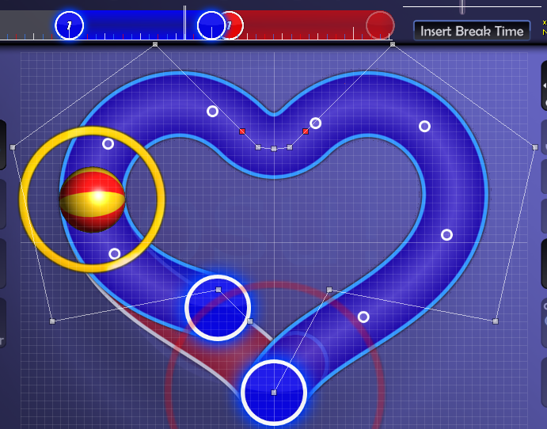
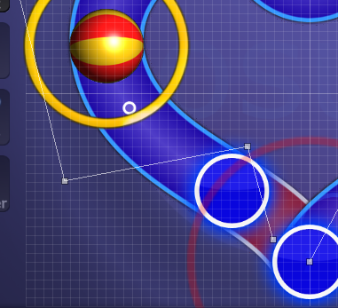
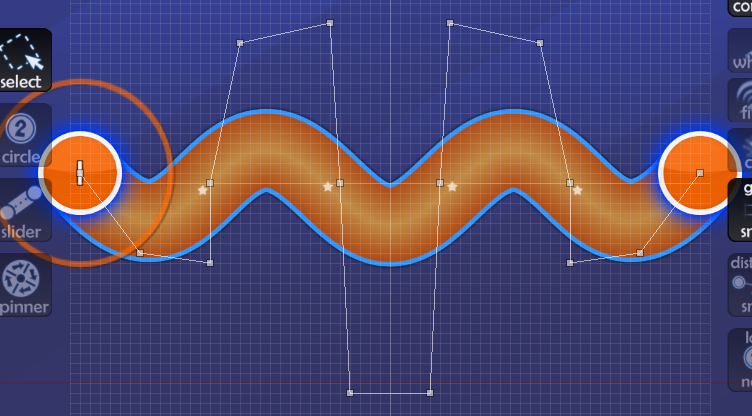
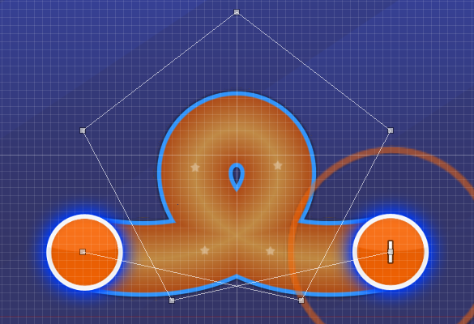
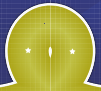
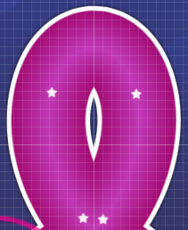

# Réaliser de bons sliders

Cet article est un mode d'emploi pour réaliser de bons sliders.
Dans la forme la plus basique, tout ce dont vous avez besoin est d'une [courbe de Bézier](https://fr.wikipedia.org/wiki/Courbe_de_B%C3%A9zier).

De [Ephemeral](https://osu.ppy.sh/users/102335),
> alignez toujours les slider endpoints sur la plus petite valeur possible - c'est-à-dire que si vous les faites glisser plus loin vers l'arrière, le slider se raccourcira. le point se centrera sur l'extrémité du slider et rendra l'obtention de courbes passables beaucoup plus facile à réaliser.
  De plus, en faisant cela, la sélection inverse sur les sliders ne les "fout" pas en l'air.
  Ce qui est une bonne chose.

## Arcs

Utilisez essentiellement la même technique pour tous les sliders symétriques sur un axe.

C'est la forme la plus facile à réaliser.
Vous commencez par placer tous vos points de façon symétrique dans la grille.
Sélectionnez-le et appuyez sur `Ctrl` + `H` quand vous pensez l'avoir placer précisément pour vous assurer que les points sont sur des grilles symétriques.
Déplacez ensuite les points jusqu'à ce que le slider soit de la bonne longueur et se trouve juste un peu en dessous du point final.
Il est important qu'à chaque fois que vous déplacez un point, vous déplaciez le point correspondant exactement de la même manière pour que tous les points restent symétriques les uns par rapport aux autres.
Assurez-vous de faire `Ctrl` + `H` souvent pour vérifier que vous n'avez pas fait d'erreur.

Pour que l'extrémité du slider et le point final s'alignent, maintenez la touche Maj pour désactiver le grid snap et déplacez le point supérieur vers le bas jusqu'à ce que l'extrémité du slider soit juste sur le dernier point.
Quand vous pensez que c'est parfait, sélectionnez et faites `Ctrl` + `H` plusieurs fois et regardez si le point final se déplace.
Si ce n'est pas le cas, félicitations, vous avez un magnifique slider.
Montrez-le à vos amis.
Si c'est le cas, déplacez le point supérieur jusqu'à ce que ce soit le cas.

Si vous voulez un arc à un angle, il est généralement plus facile de le faire droit comme ci-dessus, puis `Editer`, puis `Rotate By...` pour lui donner l'angle que vous voulez.

## Vagues

Utilisez essentiellement la même technique pour tous les sliders qui sont symétriques en rotation.

Les vagues sont faites de manière très similaire aux arcs, sauf que vos points doivent être symétriques en rotation les uns par rapport aux autres, et non inversés horizontalement.
Si vous appuyez sur `Ctrl` + `H` + `J`, cela fait tourner le slider de 180 degrés pour que vous puissiez vérifier que les points correspondent.

Pour aligner l'extrémité du slider et le point final, choisissez deux points symétriques correspondants.
Désactivez le grid snap et déplacez-les tous les deux vers l'intérieur, un tout petit peu à la fois, jusqu'à ce que l'extrémité du slider et le dernier point se trouvent l'un au-dessus de l'autre.

## Beat Blankets

*Page principale : [Blanket Combos](/wiki/Mapping_Techniques/Formations#blanket-combos)*

Les blankets sont plus faciles à faire si vous regardez d'abord le slider pour qu'il soit à peu près correct, puis faites défiler jusqu'à un point de la timeline où l'approach circle du battement s'aligne avec le bord le plus proche du point de départ du slider.
Il peut être utile d'aller au 1/8e de la courbe pour l'ajuster au mieux.
Il suffit ensuite d'ajuster les points jusqu'à ce que l'ensemble du slider s'aligne sur l'apporach circle aussi parfaitement que possible.

Gardez à l'esprit que si vous voulez qu'un slider couvre **et** soit parfaitement symétrique, préoccupez-vous d'abord de la symétrie puis ajustez les points symétriquement pour améliorer le blanket.

---

De [Gonzvlo](https://osu.ppy.sh/users/237733),
> comme une variation des beat blankets, parfois j'utilise un spinner pour faire de beaux cercles.

## Cercles

Avec l'aimable autorisation de mm201.

Le nombre de points de contrôle que vous voulez dépend de l'angle couvert par votre arc :

- 0 degré : 2 points.
- 0 degrés - 20 degrés : 3 points.
- 20 degrés - 170 degrés : 4 points.
- 170 degrés - 200 degrés : 5 points.
- 200 degrés - 300 degrés : 6 points.
- 300 degrés - 350 degrés : 7 points.

Rien de tout cela n'est vraiment exact, cela est juste une idée générale.
Comme pour les vagues, plus le point de contrôle est éloigné du début/de la fin de l'ordre, plus il s'éloigne de la courbe.
Assurez-vous que la première et la dernière ligne de contrôle sont dirigées dans la direction où vous voulez que votre boucle commence.
Les autres, il suffit de les ajuster à l'œil jusqu'à ce qu'ils soient presque ronds.
L'utilisation d'un approach circle comme guide peut y contribuer.

Comme pour la plupart des formes, gardez un (deux si le nombre de points est pair) point de contrôle pour sortir du grid snap afin de pouvoir aligner le point final.

## Coudes

Utilisez la même technique pour tout slider avec des mèches droites et des mèches courbes.

Lorsque vous voulez un slider avec une transition entre une mèche courbée et une mèche droite, vous utilisez un point rouge à l'endroit de la transition.
La chose la plus importante est de **toujours placer le point rouge et les points de chaque côté en ligne droite**.
Comme exactement droit.
Prenez une règle s'il le faut.
Nous ne voulons pas de virages brusques ici, merci.
Mais oui, c'est assez simple à part ça.

## Cœurs

Utilisez la même technique pour tout slider qui est symétrique, mais dont le point de départ est sur la ligne centrale.

Une forme agréable à utiliser parfois.
Voici comment en faire un.

### Comment faire un cœur

Tout d'abord, réalisez une forme de cœur de base, légèrement plus longue que nécessaire, avec les points de départ et d'arrivée au même endroit, en bas.
Essayez de recopier ces points grossièrement si vous avez des difficultés.
Mettre juste un point rouge au sommet, c'est bien, mais je préfère utiliser un coude :P.

---

Ensuite, copiez et collez ce slider sur la coche immédiatement après lui-même et le retournement horizontal comme suit.

---

Saisissez ensuite l'extrémité du premier slider et tirez-le vers l'arrière jusqu'à la longueur souhaitée pour votre slider.

---

Vous voyez comme c'est asymétrique et moche ?
Modifiez les points de la moitié arrière du slider jusqu'à ce qu'il soit parfaitement aligné avec le slider arrière.

---

Si vous avez réussi tout cela, vous avez terminé !
Supprimez le slider derrière et éditez/réduisez si vous voulez combler les lacunes.

## Wiggles

Il y a plusieurs façons de procéder, selon le type de wiggle que vous recherchez.

### Type 1

Le début et la fin pointent dans la même direction.

L'important ici est que chaque arc qui compose le wiggle est constitué de quatre points, et plus vous vous rapprochez du centre, plus les quatre points doivent être hauts.
Une fois que vous avez la forme de base, il suffit de jouer et d'observer jusqu'à ce que la forme soit régulière et que l'extrémité du slider s'aligne sur le dernier point.
Comme pour les arcs, n'oubliez pas de faire `Ctrl` + `H` tout le temps pour vous assurer que les points sont symétriques.
A part ça, c'est surtout de l'entraînement.
Une fois que vous aurez réalisé quelques jolies wiggles, vous serez en mesure de les réaliser en un rien de temps.

### Type 2

Commencez et terminez en pointant de différentes manières.

Comme pour le [type 1](#type-1), chaque arc est composé de quatre points, mais d'après des mappeurs expérimentés, il est préférable qu'ils soient un peu tordus, comme dans l'image ci-dessus.
Ceux-ci sont symétriques en rotation, comme les vagues, donc utilisez `Ctrl` + `H` + `J` pour vérifier les points.

### Type 3

Des wiggles super serrés.

Parfois, les wiggles sont tout simplement trop serrées pour utiliser la méthode ci-dessus, il faut alors utiliser des points rouges.
Assurez-vous que les points de chaque section entre chaque paire de points rouges sont identiques, à l'exception des points d'extrémité.
Vous pouvez le vérifier en dupliquant le slider et en le déplaçant, en vérifiant qu'il s'aligne sur toute la longueur, ou simplement en comptant les grilles.
Veillez également à ce que chaque point rouge et les deux points situés de part et d'autre forment une ligne droite parfaite, afin d'éviter les bosses indésirables.
Les sections vers la fin doivent vraiment être observées à l'œil, et devraient être celles que vous ajustez lorsque vous voulez faire atterrir la queue du slider sur le dernier point.
Cela demande beaucoup de travail, mais vous finirez par y arriver.

## Boucles

Un slider plus facile à dire qu'à faire.

Ce qu'il faut retenir en formant des boucles, c'est que les points montent beaucoup plus haut que la boucle :
- Plus chaque point est éloigné des extrémités, plus il doit être éloigné du slider.

Le plus gros problème que nous pouvons remarquer avec les boucles des mappeurs, ce sont les trous.
Vous recherchez une forme ouverte et arrondie en forme de goutte d'eau comme le slider ci-dessus.
Si le trou de la boucle ressemble à l'un de ces éléments, votre boucle n'est pas aussi impressionnante que la capture d'écran ci-dessus :

