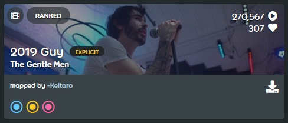

# Откровенное содержание

Создавая карту, мапперы могут отметить наличие в ней проблемного контента, установив флажок во всплывающем окне языка/жанра на сайте.

Это относительно новая функция, но тем не менее она регулируется небольшим сводом правил, которые нужно учитывать.

## Что такое откровенное содержание?

В первую очередь это весь **аудиоконтент** карты. Сюда относится тема и содержание трека, а также наличие в тексте *обилия* ненормативной лексики.

**К визуальным элементам карты это не относится — они ДОЛЖНЫ соответствовать [Критериям визуального содержания](/wiki/Rules/Visual_Content_Considerations).**

В некоторых случаях существуют исключения, например, для трудоёмкого контента. Такая практика применяется в художественных целях для элементов сториборда или видеоконтента, изготовленного на заказ.

Вообще говоря, с появлением нового «откровенного» тега большинство музыки (с небольшими исключениями) теперь можно использовать при создании карт. Но при условии, что они отмечены соответствующим образом.

## Что считается обилием нецензурной лексики?

Чтобы отметить наличие в карте откровенного содержания, одного или двух известных матерных слов в тексте будет недостаточно. Такие карты можно не помечать «откровенным» тегом до тех пор, пока используемый в них текст соответствует требованиям рейтинговой системы PG-13 (иными словами, пока не потребуется родительский контроль). Если возникают споры по поводу какого-то конкретного трека, то, скорее всего, он не соответствует этим требованиям.

Для того, чтобы считаться «откровенной», нецензурная лексика к тексте должна встречаться постоянно и часто повторяться, играть значительную роль или использоваться с целью провокации.

Сюда также относится подробное и продолжительное обсуждение проблемных тем или чего-либо ещё, что разумный человек сочтёт "чрезмерным". Некоторые примеры (но не все):

- Причина или последствия самоубийства, а также его художественные образы;
- Явный намёк на насилие; 
- Подробное изображение, а также обсуждение последствий жестокого насилия;
- Крайне откровенные сексуальные намёки или имитация полового акта.

Хороший способ определить, следует ли что-то помечать «откровенным» тегом или нет, — подсмотреть, как классифицируют какие-то конкретные треки на крупных стриминговых сервисах потокового аудио. Spotify — неплохой вариант для начала.
