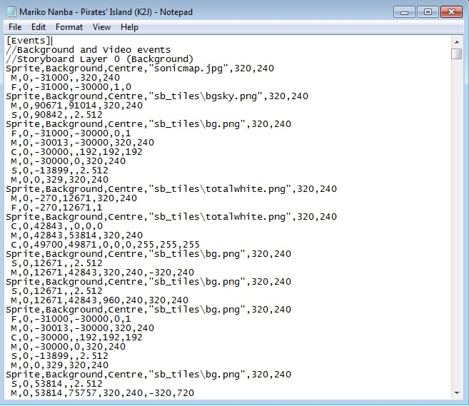

# Storyboard scripting

In addition to the [built-in storyboard editor](/wiki/Beatmap_Editor/Design), a plain text editor, such as Notepad or [Notepad++](http://www.notepad-plus-plus.org/), can also be used to create [storyboards](/wiki/Storyboards) for beatmaps. This workflow is called **storyboarding by scripting** (*SBS*) and it allows one to be more precise (to the pixel and the millisecond) as to when sprites appear, how they behave, and so on.

## Overview

There is an overview of the storyboard scripting concepts provided by [Doomsday](https://osu.ppy.sh/users/18983): [osu! - Storyboard Scripting for Beginners (12:22)](http://www.youtube.com/watch?v=UJ1YLDs-bZg "YouTube").

## Full specification

*Note: Save your work in the built-in editor first, as it optimises some things out, and only then in a plain text editor. **Save often** to prevent accidental progress loss.*

The storyboard scripting process is primarily based on [the official specifications](https://osu.ppy.sh/community/forums/topics/1869) and experience in making large storyboardss. Although the osu! wiki articles provide simple examples, they are not step-by-step guides. Instead, the explanations aim to exhaustively detail how the basic scripting commands translate into the on-screen actions in osu!.

Before writing storyboard scripts, check [the terms and basic concepts](/wiki/Storyboard_Scripting/General_Rules) to prevent possible further issues and misunderstanding. For more in-depth explanations, see:

- [Storyboard objects](/wiki/Storyboard_Scripting/Objects)
- [Storyboard scripting commands](/wiki/Storyboard_Scripting/Commands)
