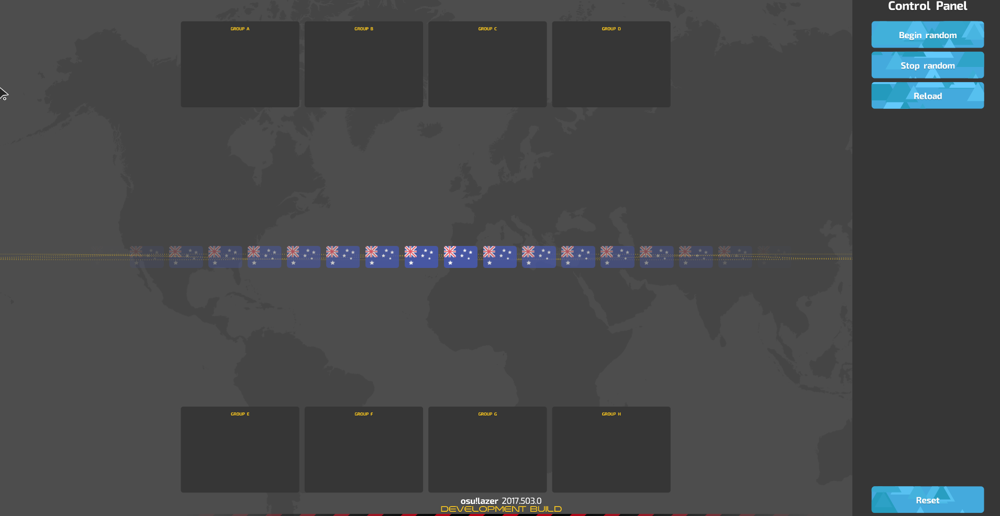
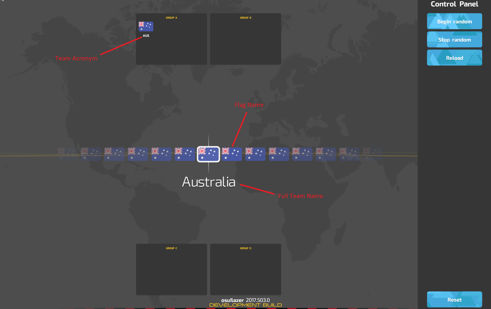

# Tournament Drawings

The tournament drawings screen is used to livestream the sorting of teams into groups that will compete in the group stages for a tournament. It is only available in the [osu!lazer](https://github.com/ppy/osu/releases) client.

Please note that the osu!lazer client is currently under development and there may be bugs.

## Accessing the client

Open osu!lazer and press `Ctrl + O` to reveal the game settings. From there, click "Open osu! folder". Create the following two files in this directory:  
`drawings.ini`  
`drawings.txt`  
Next, add the following line to the `drawings.txt` file:  
`AU : Australia : AUS`

We'll go over what each of those files do later, however for now let's jump into the screen.

### Usage

From the main menu, press `Ctrl + Shift + D` to access the drawings screen. The following should appear:


This is the screen we'll be working with. There are two sections to this screen - the main section on the left with the world map as a background, and the control panel section on the right. Please **avoid** livestreaming the control panel.

There are 4 buttons in the control panel, let's go over them:

- **Begin random**
  - This will start the randomization process, causing the flags on the screen to scroll.
- **Stop random**
  - This will stop the randomization process, causing the scrolling to slow down until eventually stopping and centering on a flag in the middle of the screen.
- **Reload**
  - This will reload the `drawings.txt` file.
- **Reset**
  - This button should rarely, if ever be used. It is destructive and will reset all your progress.

Press the `Begin random` and the `Stop random` buttons. When the scrolling stops on a flag at the centre of the screen, go back to the osu! folder and notice that there is now an additional file created: `drawings_results.txt`.  
Open the file and observe the format - this is what you'll be using to extract the results of this process for use in Google Spreadsheets or your management tool of choice.

### The `drawings.ini` file

As you might have noticed, a tournament may not have as many as 8 groups, and likewise a tournament may not have 8 teams per group. The `drawings.ini` file is a configuration file that allows you to adjust such properties.
A valid configuration file looks like:
```
Groups = 4
TeamsPerGroup = 4
```

The following are properties which are configurable through this file:

| Property | Description | Valid Values | Default Value |
| -------- | ----------- | ------------ | ------------- |
| Groups | The number of groups to sort teams into. | Between 1 and 8 (inclusive) | 8 |
| TeamsPerGroup | The maximum number of teams in any one group. | Between 1 and 8 (inclusive) | 8 |

### The `drawings.txt` file

This file provides a way to specify the teams that will be sorted into groups. We have already written a line into this file, so let's dissect it:  
`AU : Australia : AUS`  
This line has three sections separated by a colon (`:`):

| Flag Name | Full Team Name | Team Acronym |
| :-------: | :------------: | :----------: |
| AU | Australia | AUS |

- The flag name refers to the name of a file that provides the flag image. By default, osu!lazer provides country flags as [ISO 3166 Alpha-2 Country Codes](https://www.iso.org/iso-3166-country-codes.html).
- The full team name is displayed in the centre of the screen when a team is selected through the scrolling process.
- The team acronym is displayed in the group boxes.



A valid `drawings.txt` file with multiple countries as teams is:
```
AU : Australia : AUS
RO : Romania : RO
IT : Italy : IT
US : United States of America : USA
```

You can define you own flags. To do so, go back to the osu! folder where you created the files previously, create the folder `Drawings`, and inside it create the folder `Flags` such that you end up with the folder hierarchy `osu/Drawings/Flags/`.  
You can place your custom flag image files inside the Flags folder. For example if you place `my-flag-file.png` inside the Flags folder, you can then add the following line to the `drawings.txt` file:  
`my-flag-file : My Team : MT`

The optimal resolution for flag images is 70x47 pixels (or the same aspect ratio).

## Questions?

Please don't hesitate to contact `tournaments@ppy.sh` if you have any further usage questions.
