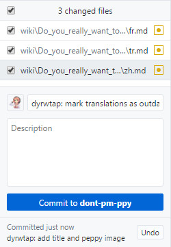

# GitHub para Escritorio

*Éste artículo es la continuación de [la página principal](/wiki/osu!_wiki_Contribution_Guide)* y asume que estarás usando [GitHub para Escritorio](https://desktop.github.com). **Puedes usar otros clientes de Git bajo tus propios términos.** Incluso si es que trabajas localmente, seguirás necesitando entrar a GitHub para crear 'pull requests' para hacer que tus cambios pasen.

## Instalando GitHub para Escritorio

1. Instala [GitHub para Escritorio](https://desktop.github.com) si es que todavía no lo tienes instalado.
2. Cuando la instalación se haya completado, GitHub para Escritorio te pedirá iniciar sesión, haz click en `Sign in to GitHub.com`.
3. Rellena los datos que te pidan.
4. Continua en [Clonando](#clonando).

## Clonando

1. Haz click en `Clone a repository`.

2. Ésto te mostrará una lista de tus repositorios; selecciona el repositorio `osu-wiki`.

3. Selecciona la carpeta en donde quieres clonar el repositorio. No importa dónde lo clones, solo recuerda donde es.

   

4. Haz click en `Clone`. Ésto puede tomar un momento dependiendo de tu velocidad de internet.

5. Continua en [Ramificando](#ramificando).

## Ramificando

Mientras que la ramificación es técnicamente opcional, es [altamente recomendable por un par de razones](https://www.atlassian.com/git/tutorials/comparing-workflows/forking-workflow). Para nombrar unas cuantas:

- Las ramificaciones aislan diferentes cambios lógicos unos de otros: puedes trabajar en más de un artículo y tenerlos revisados y unidos de manera separada.
- Cuando tus cambios están fuera de tu ramificación `master`, puedes [sincronizarlo de manera segura](/wiki/owcg/Common_Issues#¡mi-ramificación-está-desactualizada!) sin conflictos de unión.

1. Haz click en la opción desplegable `Current branch` localizado en la aprte de arriba del menú.

2. Ingresa el nombre de la ramificación. Es recomendable el usar el resumen de tus cambios como el nombre de tu ramificación. Por ejemplo, editar el artículo `Forums` puede resultar en una ramificación llamada `update-forums`.

   

3. Continua en [Editando](#editando).

## Editando

1. En el archivo en el que has clonado el repositorio, navega al archivo que quieres editar. Los artículos están organizados por el nombre de las carpetas siendo el nombre de los artículos y los archivos `.md` siendo las traducciones.
2. Una vez que has encontrado el archivo correcto. ábrelo usando tu editor de texto favorito.
3. Ahora puedes hacer tus cambios. Cuando haces cambios, sigue el [Criterio de Estilo de Artículos](/wiki/Article_Styling_Criteria) tanto como puedas.
4. Continua en [Haciendo 'commits' y 'pushes'](#haciendo-'commits'-y-'pushes').

### Moviendo archivos existentes

1. Usa el Explorador de Archivos de Windows para mover archivos a cualquier parte.
2. Continua en [Haciendo 'commits' y 'pushes'](#haciendo-'commits'-y-'pushes').

### Creando nuevos archivos

*Precaución: Si vas a crear artículos usando el Explorador de Archivos de Windows, asegúrate de que la opción `Extensiones de nombre de archivo` esté activa.* Vea [Cómo mostrar o esconder las extensiones de los archivos en el explorador de Windows](https://support.microsoft.com/en-us/help/865219/how-to-show-or-hide-file-name-extensions-in-windows-explorer) para las instrucciones.

1. Usa el Explorador de Archivos de Windows, tu editor de imágenes favorito y/o tu editor de texto favorito para crear nuevos archivos. Si estás creando nuevos artículos o traducciones, renombra el archivo siguiendo los [Archivos en el Criterio de Estilo de Artículos](/wiki/Article_Styling_Criteria#locales).<!-- TODO: change this wikilink header according to translation in the Article_Styling_Criteria article when its created -->
2. Continua en [Haciendo 'commits' y 'pushes'](#haciendo-'commits'-y-'pushes').

### Eliminando archivos

1. Usa el Explorador de Archivos de Windows para eliminar archivos.
2. Continua en [Haciendo 'commits' y 'pushes'](#haciendo-'commits'-y-'pushes').

## Haciendo 'commits' y 'pushes'

1. Vuelve a GitHub para Escritorio. Debería de verse algo similar a esto:

   

2. Por defecto, GitHub para Escritorio automáticamente seleccionará todos tus cambios.
3. Lo mejor es separar cada acción "grande" como un 'commit' aparte.

Por ejemplo, como se muestra arriba, [pippi](/wiki/Mascots#pippi) ha agregado una imagen, ha modificado el archivo `en.md` para agregar un título y un link a la imagen y ha marcado las traducciones como desactualizadas. De esto podemos hacer dos 'commits', una para los cambios que afectan al archivo `en.md` y otra para marcar las traducciones como desactualizadas.

4. Selecciona los archivos que vayas a añadir al 'commit'.
5. Escribe un resumen para el commit. Ésto tiene un límite de 72 caracteres y **debe de estar en Inlés**.
6. Escribe una descripción. Ésto es opcional, no tiene un límite de caracteres y puede ser en cualquier idioma.

   

7. Haz click en el botón azul `Commit to` y, si es que aplica, empieza de nuevo desde el paso 4 para hacer los otros 'commits' que quieras hacer.

   

8. Una vez hayas terminado de hacer tus 'commits', haz click en el botón `Publish branch` en la parte superior.

   

9. Continua a [Finalizando](/wiki/osu!_wiki_Contribution_Guide#finalizando) para la última pieza de información en relación a tus cambios y a tu 'pull request'.
