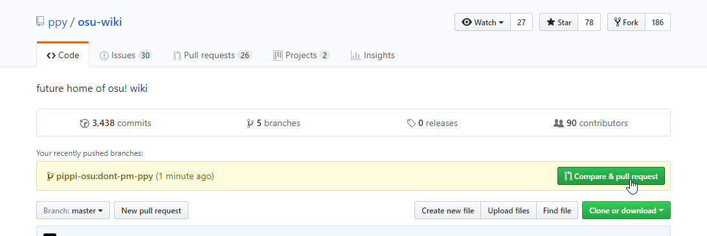

# Посібник по роботі з osu! wiki

Дякую за інтерес, проявлений до osu! wiki.

Ця стаття адресована тим, хто раніше не працював з GitHub і не брав участь в редагуванні osu! wiki. Якщо такий досвід є, то далі можна не читати: користуйтеся схемою «одна стяття (чи група статей на одну тематику) - одна гілка».

Якщо вам потребується допомога з цим посібником або osu! wiki, звертайтесь в [діскорд osu!dev](https://discord.gg/ppy), канал `#osu-wiki`.

## Початок роботи

### Реєстрація

1. [Зареєструйтесь](https://github.com/join) на GitHub, якщо у вас немає акаунта.
2. [Зайдіть в свій акаунт](https://github.com/login).
3. [Створіть форк](#форк-репозиторія).

### Форк репозиторія

1. Відкрийте [репозиторій `osu-wiki`](https://github.com/ppy/osu-wiki).

2. Натисніть на кнопку `Fork`.

   

3. Натисніть на кнопку `Fork` ще раз, щоб відкрити форк.

4. Якщо ви зробили все правильно, то побачите щось подібне:

   

5. [Синхронізуйте](#синхронізація-форка) свій форк.

### Синхронізація форка

1. Відкрийте свій форк `osu-wiki`.

2. Над списком файлів можна прочитати, в якому стані знаходиться вибрана гілка, порівняно з `ppy:master`. Якщо там написано «behind» або «ahead and behind», ваша гілка відстає.

   ")

   ")

   ")

   ")

3. Відстаюча гілка не містить в собі всіх свіжих змін з оригінального репозиторія. В такому випадку, при редактуванні osu! wiki, ви можете працювати з застарілими статтями і не знати про нові правки.

4. Щоб дізнатись, як синхронізувати гілку, подивіться в [список проблем при роботі з osu! wiki і їх рішень](/wiki/owcg/Common_Issues#відстающа-гілка-master).

5. Після синхронізації гілки можна переходити до редагування.

## Редагування статей

Статті можна правити двома способами:

- Через [веб-інтерфейс GitHub](/wiki/owcg/GitHub_Web_Interface), що зручно при роботі з одною статтею.
- В вашому улюбленому текстовому редакторі, використовуючи [GitHub Desktop](/wiki/owcg/GitHub_Desktop). Цей варіант підходить для декількох статей або масових правок.

*Примітка: насправді, інструментів для роботи з git і GitHub набагато більше, проте тут вони не згадані, заради спрощення статті.*

**Після знайомства з одним із способів редагування переходьте до наступного розділу.**

## Публікація змін

### Створення пулл-реквеста

1. Відкрийте репозиторій [`ppy/osu-wiki`](https://github.com/ppy/osu-wiki).

2. При наявності ваших недавніх коммітів в форк ви побачите жовту смужку, як на скріншоті нижче.

   

3. Якщо ви бачите смужку, натисніть на кнопку `Compare & pull request` і перейдіть до 8 кроку. Якщо ні - на кнопку `New pull request` (наступний крок).

4. Якщо перед вами є тільки дві кнопки, як на скріншоті, виберіть `compare across forks`.

   

5. В списку `head fork` виберіть ваш форк (другий по списку).

   

6. В списку `compare` виберіть гілку, яку ви хотіли відправити в пулл-реквесті (вони відсортовані в алфавітному порядку).

   

7. Натисніть на кнопку `Create pull request`.

8. В заголовку коротко опишіть суть пулл-реквеста: що ви дописуєте або виправляєте. Для простоти можна вказати лише назву статті.

   Якщо це переклад, вставте перед заголовком пулл-реквеста назву мови, на яку ви перекладаєте. Наприклад, `[UK] Github Desktop` означає, що ви оновляєте (або створюєте) переклад [статті про Github Desktop](wiki/owcg/GitHub_Desktop) на українську мову.

9. Напишіть опис до пулл-реквеста. В нього можна додати все, що ви хочете донести до оглядача, наприклад, «Needs formatting check» або «Перевірте граматику, будь ласка». Крім цього, можна вказати помилки, які пулл-реквест закриє, наприклад, «resolves #1» (дв. справку GitHub [«Closing issues using keywords»](https://help.github.com/articles/closing-issues-using-keywords/)).

10. Коли все буде готово, натисніть на кнопку `Create pull request`.

   

11. Про те, що буде далі, вказано в розділах про [перевірку](#перевірка) і [злиття змін](#злиття-змін).

### Перевірка

Зразу після створення пулл-реквеста, його можуть побачити і прокоментувати інші люди, вказавши на можливі недоліки. Пулл-реквест, де довгий час нічого не робиться, можуть закрити, із-за цього ваша задача - **стежити за коментуванням, відповідати на них і виправляти знайдені помилки.** Якщо ви хочете, щоб вашу роботу перевірили, напишіть в [діскорд osu!dev](https://discord.gg/ppy), в каналі `#osu-wiki` або в коментаріях на GitHub.

### Злиття змін

Коли всі проблеми, знайдені в ході перевірки, будуть виправлені, і кто-небудь з оглядачів затвердить пулл-реквест, його можна буде влити в основний репозиторій. Про це можна попросити в коментаріях на GitHub або в [діскорді osu!dev](https://discord.gg/ppy), в каналі `#osu-wiki`. Після цього, як ваші зміни влили, через деякий час (максимум - 5 годин) вони будуть і на сторінці osu! wiki.
