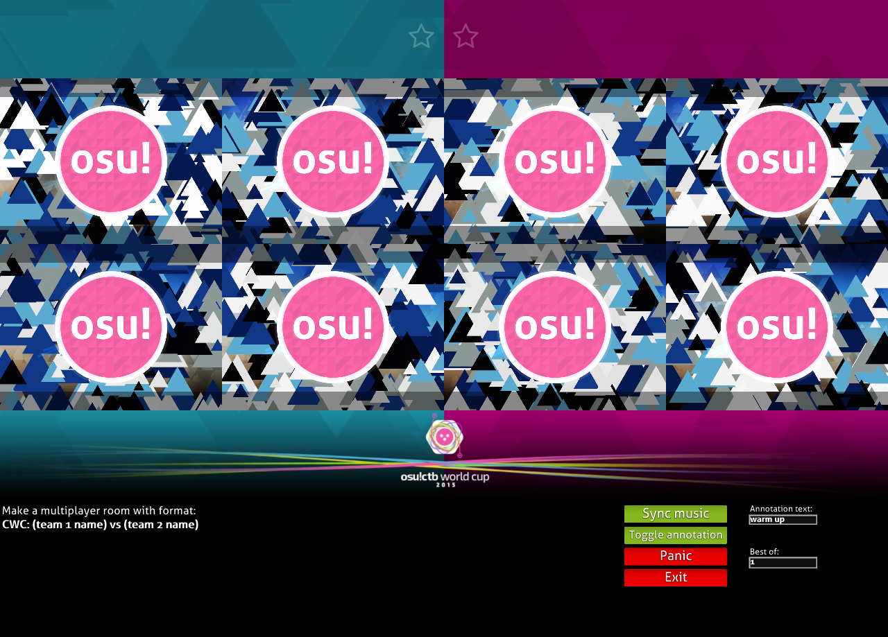
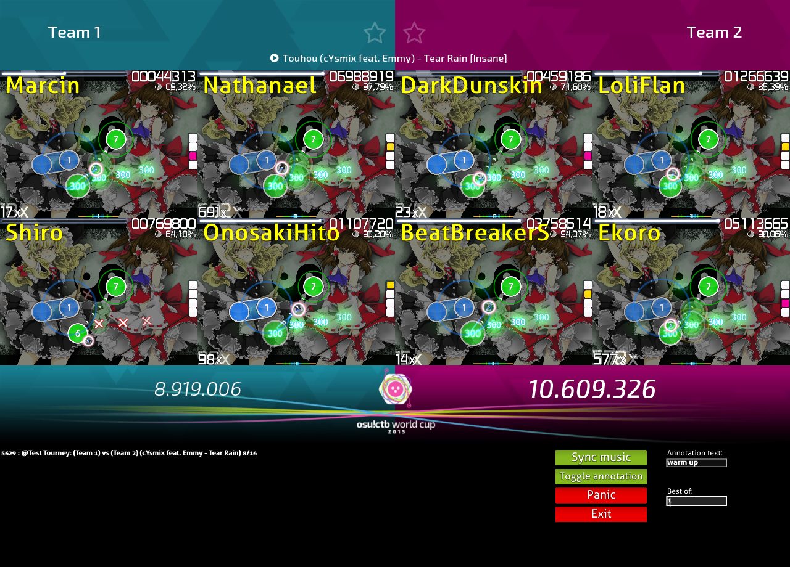
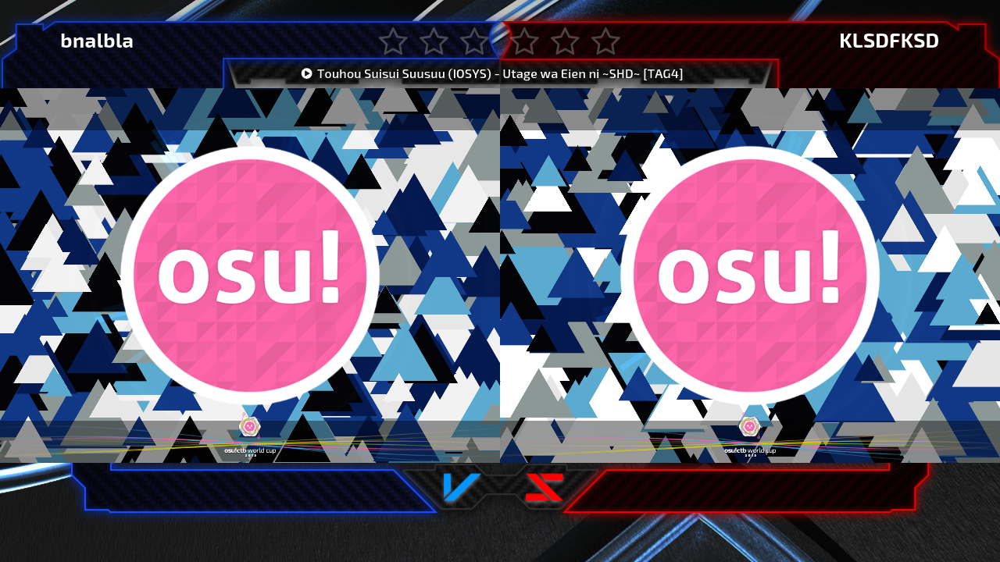

# osu!tourney

**osu!tourney** 은 멀티 플레이 경기를 동시에 관전하고, 스트리밍 하기 위해 제작된 multi-spectator 클라이언트입니다.

이 프로그램를 엑세스 할 수 있는 권한은 토너먼트 스텝만 가능합니다.
토너먼트 스텝이 되기 위해서는 **tournaments@ppy.sh** 에 연락하여 승인을 받아야합니다.
**osu!tourney**의 사용기한은 토너먼트(대회)가 끝나는 시점으로 종료됩니다. 

**토너먼트 프로그램 사용시 스트리밍을 하는 대회, 멀티 이벤트 이외의 클라이언트 사용을 금지합니다. 또한 클라이언트는 개인용으로 사용할 수 없습니다.**

사용의 **문제**가 있는 경우 **[문제해결](KO:Osu!tourney#문제해결 "wikilink")** 섹션을 읽거나, **[이 스레드](https://osu.ppy.sh/forum/t/327120)**에 게시 할 수 있습니다. 

## FAQ

### osu!tourney는 무엇입니까?

osu!tourney 클라이언트는 멀티방에서 모든 플레어어의 플레이를 동시에 관전하는데, 사용되는 공식 스트리밍 클라이언트입니다. 
클라이언트는 월드컵용으로 제작되었기 때문에 약간의 제약이 있을 수도 있습니다.

토너먼트 클라이언트는 양팀을 모두 합쳐서 16명 까지 지원 가능하며, 각 팀의 인원은 최소 1명에서 최대 8명 까지 팀을 구성할 수 있습니다. 
열린 화면 개수는 현재 변경할 수 없지만, 이 동작은 나중에 수정됩니다.

osu! tourney를 사용하려면 [토너먼트 스텝](https://osu.ppy.sh/g/26)에 일원이 되어야 합니다. 토너먼트 스텝이 되지 않으면 **osu!tourney**에 접속할 수 없습니다.

### 어떻게 엑세스 할 수 있는가?

자신의 대회 및 아래 내용을 포함, 이벤트를 정리하여  **tournaments@ppy.sh** 이곳으로 e-mail을 보내주세요.  

1.  토너먼트가 언제 시작하고 언제 끝나는지
2.  공개적으로 연결 가능한 토너먼트 링크 (오스 내 스레드를 추천합니다.)
3.  osu!tourney를 사용하려는 Osu!닉네임
4.  대회의 취지 (아랫부분 참조)

**최소 대회시작 2주전**에 메일를 보내야 합니다. 만약 당신이 이 방법대로 하면 모든 항목을 적절하게 설정할 수 있습니다. 

엑세스 권한이 부여되면, [토너먼트 스텝](https://osu.ppy.sh/g/26)에 추가됩니다. 
추가가 되면, 특정 IRC명령을 포함한 모든 기능을 사용가능합니다. 단, 토너먼트(대회)가 끝나면 만료됩니다.

게임관리자들은 모든 osu!tourney에 접근하는 것을 책임감 있게 행동할 것을 알려드리며, 악의적인 의도나, 행위가 적발될 시에는 벤처리가 될 수 있습니다.

## 설정

osu!tourney 클라이먼트를 설정하려면 몇 단계만 수행하시면 됩니다.

먼저, 노래 데이터베이스 때문에 망가질 수 있으므로 **새로운 오스를 설치하는 것이 좋습니다.** (여러개의 osu! 설치는 분리 된 폴더에 보관할 수 있습니다.)

자신의 대회에서 필요한 곡(클라이언트가 자동으로 다운로드 되지 않은 비트맵인 경우)는 /songs 폴더에 추가합니다.
클라이언트가 자동으로 다운로드되지 않는 beatmaps를 다운로드합니다.
osu!tourney는 오직 제출된 비트맵만 가능합니다.

1.  자신의 osu! 폴더에서 osu!.exe 파일을 복사하여 새로운 폴더에 붙여 넣은 후 osu!.exe파일을 실행합니다. osu!.exe 실행하면 자동으로 업데이트 및 설치됩니다.  

2.  새로운 폴더의 osu!를 실행한 후 자신의 계정(클라이언트 허가를 받은 계정)으로 **자동 로그인**합니다.

3.  오스 설정에 들어가 오스 업데이트 부분의 채널을 **테스트 버전(Cutting Edge)**으로 바꿉니다.

4.  그 이후 오스를 종료하고 새로 설치 한 osu!에 tournament.cfg 파일을 만듭니다. (확장자명이 .cfg 이여야 합니다)

5.  완료 후 osu!.exe를 실행하면 클라이언트가 실행됩니다. 시작되는데 다소 시간이 걸릴 수 있습니다. 그러면 다음의 줄을 포함하는 tournament.cfg 파일의 내용을 자동으로 생성합니다.(안될시 직접 입력하세요)

```
TeamSize = 4
privateserver =
acronym = Your tournament name
BufferTotalTime = 3000
BufferDangerTime = 1000
BufferTimeoutTime = 20000
```

osu!를 닫은 후 다른 옵션을 위하여 위의 파일을 편집하거나 추가합니다.

-   **TeamSize:** 팀의 크기를 지정합니다. 이에 따라 osu!tourney는 1-8개의 창을 엽니다(최대 값은 8입니다.)
-   **ClientNameSize:** 클라이언트 속 플레이어의 이름 크기를 변경합니다.
-   **privateserver:** 절대손대지마세요. 이것은 당신들에게 중요하지 않습니다.
-   **acronym:** 당신의 토너먼트에 대한 약자를 넣으세요, 예) 'OWC 2013'. **[멀티플레이 세션 생성 및 조작에 대한 자세한 내용](KO:Osu!tourney#플레이어 세션 생성 및 조작 "wikilink")**.
-   **BufferTimeoutTime:** 클라이언트는 이 시간동안 재생되지 않았던 플레이어화면을 다시 포맷하여 다른 모든 플레이어와 같은 재생 시간을 가지게 됩니다. (밀리초 단위)
-   **BufferTotalTime:** 클라이언트가 일시 중지 빈도를 줄이기 위하여 플레이어를 추월하는 시간입니다. 이 값은 변경하지 않는 것이 좋습니다.
-   **BufferDangerTime:** 클라이언트가 더 많은 프레임을 기다리기 위해 일시 정지전 재생 버퍼링의 남은 시간. 이 값은 변경하지 않는 것이 좋습니다. 
-   **RankingChatDelay:** 점수가 숨겨지고 순위화면에서 다시 표사하기 전의 지연시간(밀리 초)입니다.
-   **Height:** osu!tourney는 자동으로 16:9로 계산되도록 폭을 계산합니다. 검은색 컨트롤(토너먼트 자제 제어판) 패널에는 해당 높이가 포함되어 있지 않으므로 1080p/s의 스트리밍 하기 위해 1440p인치 화면이 필요합니다. 기본 값:720, 허용 범위:640x720 

tournament.cfg 파일을 수정한후에는 osu!를 다시 시작하면 osu! tourney 클라이언트는 업데이트 된 설정으로 시작합니다.

### osu!tourney 사용법

 |
_위 사진은 클라이언트의 기본적인 인터페이스입니다._

위 사진은 클라이언트의 인터페이스입니다. 
클라이언트 자체 사용은 매우 간단합니다. 화면 상단은 두 개의 파트로 나뉘여 있으며 멀티방의 두 팀을 대표합니다. 
각각의 osu! 화면은 멀티방의 슬롯에 해당됩니다. 
그러므로 여러 플레이어들은 각자의 위치에 있어야 합니다.

---


_플레이어는 멀티방에서의 위치에 따라 화면이 할당됩니다._

---
 |
_osu!tourney 컨트롤 패널_





클라이언트 하단에 제어판이 표시됩니다.이것은 당신이 원하는 멀티방의 이름을 짓기 위해 필요한 템플릿을 보여드립니다. 
그것은 tournament.cfg 파일설정과 2개의 팀 이름으로 정의된 약어로 구성됩니다.
**[자세한 내용은 멀티플레이어 세션 생성 및 조작을 참조하십시오.](KO:Osu!tourney#멀티플레이어 세션 생성 및 조작 "wikilink")**

멀티방이 적절하게 되어있는 경우, 제어판은 적절하게 제작된 멀티방을 나열합니다. 
멀티플레이어들은 자동으로 선택할 수 있도록, 선택할 수 있는 멀티방을 클릭합니다. 
모든 것을 제대로 설정하였다면 자동으로 클라이언트 사용자에게, 타 플레이어들의 연주나 노래소리를 듣거나 보게 됩니다.  

경기가 종료되면 점수가 높은 팀에게 별 하나가 채워지며 팀 점수(별)를 증가됩니다. 또한 팀 점수를 수동으로 변경할 수 있도록 하여. 
**마우스 오른쪽키와 왼쪽키를 클릭하여 별의 개수를 수동으로 변경 할 수 있습니다.**.


메시지를 표시하려면 주석단추를 클릭하여 설정할 수 있습니다. 
활성화되면 제어판의 해당 텍스트 상자에 있는 메시지가 화면 상단에 표시되고, 팀 점수는 beatmap이 완료된 후에도 변경되지 않습니다.

아래쪽 컨트롤 패널의 각 버튼의 기능은 아래와 같습니다.:

-   'Sync music': 음악이 동기화되지 않는다면 버튼을 누릅니다. osu!tourney은 음악을 다시 동기화하려고 시도합니다.
-   'Toggle annotation' 주석을 끄거나 켭니다.(자동화된 팀 점수 계산에 영향을 미칩니다)
-   'Panic': 프로그램이 잘못되어 창이 닫히거나 윈도우 충돌이 발생 할 경우 이를 누릅니다. 그러면 모든 스트림 창이 열립니다.
-   'Exit:' osu!tourney를 종료합니다.

아래에 있는 제어판의 각 텍스트 상자의 가능은 아래에 설명되어 있습니다.

-   'Annotation text:' 주석에 표시할 텍스트입니다.
-   'Best Of:' 각각의 팀이 이겨야 할 별의 개수를 지정합니다.

------------------------------------------------------------------------

## 플레이어 세션 생성 및 조작

### 매칭설정

osu!tourney을 사용하여 멀티 방을 원활하게 상호작용을 하기 위해서는 몇가지 사항에 유의해야 합니다.

먼저 멀티 방을 생성하고 제어판에 나열된 템플릿을 바탕으로 이름을 지정해야 합니다. 이 템플릿은 다음 구성 요소로 구성됩니다. 

`Your_acronym_in_tournament.cfg: (팀 이름 1) vs (팀 이름 2)`

`Your_acronym_in_tournament.cfg` 설치 중에 'tournaments.cfg'에서 정의한 값으로 대체됩니다. 
예를 들어, 이 값은 **[설정]**(KO:Osu!tourney#설정 "wikilink"). "Test Tourney"로 정의되었습니다. 다음 예제에서는 템플릿을 사용합니다.

`Test Tourney: (팀 이름 1) vs (팀 이름 2)`

팀 이름 1과 팀 이름 2를 임의로 배치할 수 있지만, 괄호를 묶어 두면 됩니다. **괄호를 묶어 두면 됩니다 '()' **.

### IRC 명령어 (옵션)

이것을 사용하려면 모든 토너먼트 스텝과 도우미가 IRC를 통해 Bancho (반쵸)에 연결되어 있고, [토너먼트 스텝](https://osu.ppy.sh/g/26) 일원이 되어야 됩니다.

다음 명령어는 모두 IRC 클라이언트를 통해 실행해야합니다. (인기 있는 선택사항은 mIRC, HexChat, HydraIRC입니다).

Bancho (반쵸)에게 개인 메시지로 '!mp help'를 보내면 모든 명령 목록을 볼 수 있습니다.
멀티방을 생성하려면 Bancho (반쵸)에게 메시지를 보내십시오. `!mp make Test Tourney: (팀 이름 1) vs (팀 이름 2)`.

이 방은 모든 플레이어들이 방을 나갔을 때 닫히지 않는 점에서 특별하며 그것은 본질적으로 방에 들어가는 플레이어들부터 보호됩니다. 
모든 토너먼트 스텝 IRC 클라이언트는 자동적으로 새로 만든 멀티방의 채팅 채널에 자동적으로 참여합니다. 
모든 멀티방의 명령은 오직 채팅 채널에서만 작성되어야 합니다.

경기가 끝나면, `!mp close` 명령을 보내 방을 닫아야 합니다. 

사용 가능한 관리 명령 목록은 다음과 같습니다. 단 대괄호 []로 묶인 속성은 선택사항입니다.

-   `!mp lock` - 플레이어가 팀과 슬롯을 변경할 수 없도록 방을 잠급니다.
-   `!mp unlock` - 위의 내용을 반대로 바꿉니다.
-   `!mp size` <size> -방에서 사용 가능한 슬롯(1-16)의 양을 설정합니다.
-   `!mp set` <teammode> `[<scoremode>] [<size>]` - 방 속성을 다양하게 설정합니다. 
    `teammode` - 0: 개인전, 1: 태그 개인전, 2: 팀전, 3: 태그 팀전 Vs
    `scoremode` - 0: 스코어, 1: 정확도, 2: 콤보
-   `!mp move` <username> `[<slot>]` - 플레이어를 방으로 이동시켜 지정된 슬롯에 넣습니다. 플레이어가 이미 방에 있으면 플레이어는 지정된 슬롯으로 이동합니다.
-   `!mp host` <username> - 플레이어에게 방장을 전달합니다.
-   `!mp clearhost` - 방장을 지웁니다.
-   `!mp settings` - 전체 세부 정보를 표시합니다.
-   `!mp start [<time>]` - 설정된 시간 (초) 후에 또는 시간이 없는 경우에는 즉시 시작합니다.
-   `!mp abort` - 경기를 중단합니다.
-   `!mp kick` <username> - 플레이어를 추방시킵니다.
-   `!mp team` <username> <colour> - 플레이어를 지정된 팀으로 이동시킵니다.
    `colour` - red, blue
-   `!mp map` <mapid> `[<playmode>]` - 방의 비트맵과 플레이모드를 변경합니다.
    `playmode` - 0: osu!, 1: osu!taiko, 2: osu!catch, 3: osu!mania
-   `!mp mods` <mod> `[<mod>] [<mod>] …` - 현재 적용중인 모드를 모두 제거하고, 이 모드를 방에 적용합니다.
    `mod` - HR, DT, FL, HD, FI, Freemod, None
-   `!mp timer [<time>]` - 카운트다운 타이머를 시작합니다.
    '시간'은 30 초입니다.
    타이머 알림은 매 순간 30초, 30초, 10초, 5초미만으로 나타납니다.  
-   `!mp aborttimer` - 현재 타이머를 중지합니다. (게임시작, 일반 타이머 모두 적용)
-   `!mp addref <username>, <username>...` - 방에 심판을 추가하여 채팅을 볼 수 있고, mp 명령을 사용할 수 있습니다.
-   `#`<userid>는 위의 모든 명령에서 <username>을 대체 할 수 있습니다. 사용자 이름에는 밑줄 (**_ **)로 대체 된 공백이 있어야 합니다.
-   `!mp password` - 멀티 플레이어 방 암호화 활성화 / 비활성화 (초기화된 경우).

다음은 명령 사용의 예입니다.

-   `!mp move Zallius 1` - Zallius를 방의 슬롯 1로 이동시킵니다.
-   `!mp move Loctav 4` - Loctav를 방의 슬롯 4로 이동시킵니다.
-   `!mp team Zallius blue` -Zallius를 파란색 팀으로 이동시킵니다.
-   `!mp team Loctav red` - Loctav를 빨간색 팀으로 이동시킵니다.
-   `!mp set 0 2` - 개인전, 스코어 모드로 설정합니다.
-   `!mp start` - 즉시 게임을 시작합니다.

### 방 관리

osu! tourney 클라이언트가 방을 성공적으로 인식하려면 !mp move 및 !mp team 명령을 사용하여 방에 들어오는 플레이어에게 올바른 슬롯으로 배정해야합니다.

**osu!tourney 사용법** 섹션에서 설명한대로, 클라이언트의 각 화면은 멀티 플레이어 로비슬롯에 배정됩니다. 
tournament.cfg의 TeamSize 변수 값에 따라 왼쪽 팀이 첫 번째 슬롯을 차지하고 오른쪽 팀이 아래 슬롯을 차지합니다.


_각 멀티방에 해당하는 화면_

예를 들어 TeamSize = 4로 설정하면 1, 2, 3, 4 번 슬롯은 왼쪽 팀에 속하게 되고, 5, 6, 7, 8 번 슬롯은 오른쪽 팀에 속하게 됩니다. 
만약 당신이 'TeamSize = 3'을 설정하면 1, 2, 3 슬롯은 왼쪽 팀에 속하게 되고, 4, 5, 6 번 슬롯은 오른쪽 팀에 속할 것입니다.

**Tip : 왼쪽 팀은 항상 파랑 팀이고, 오른쪽 팀은 항상 빨강 팀입니다.**

osu!tourney는 모든 팀의 색깔을 무시하는 것을 명심해주시기 바랍니다. 
유일하게 주목할 만한 것은 멀티방의 위치입니다.

모든 팀 멤버가 osu!tourney 내에 있는 팀에 속해 있도록 하려면 선수들은 반드시 올바른 슬롯에 위치해야 합니다. 
아래 그림은 다양한 팀사이즈를 가진 osu!tourney 사진입니다. 화면의 숫자는 멀티 플레이어 로비에서 배정된 슬롯을 나타냅니다. 
숫자는 보이지 않으며 설명 목적으로만 여기에 표시됩니다.


_TeamSize = 4_

---


_TeamSize = 3_

---


_TeamSize = 2_

---


_TeamSize = 1_

### 스킨
--------



osu! tourney는 다양한 디자인을 위해 클라이언트 스킨이 수정 가능 합니다. 
그것을 위해서 당신은 토너먼트 폴더에 스킨을 넣어야 합니다.

폴더의 경로는 `.../osu!/Skins/User/tournament`입니다.스킨 요소는 이 폴더(tournament)에 배치 할 수 있으며 `*.jpg`, `*.png` 파일 확장자를 지원합니다. 적절한 스킨 배치를 위하여 다음요소에 따라 이름을 지정하십시오.

-   `background` - 이것은 전반적인 시간동안 osu!tourney에 사용되는 뒷 배경입니다.
-   `background-win1` (optional) - 배경색은 어둡게 됩니다. 왼쪽 팀이 이겼을 때 결과화면에서 이 사진으로 사라집니다. 
결과 화면을 떠날 때 백그라운드로 다시 표시됩니다.
이 사진이 배치되지 않을 경우 '배경'이 그대로 유지됩니다.
-   `background-win2` (optional) - 배경색은 어둡게 됩니다. 오른쪽 팀이 이겼을 때 결과화면에서 이 사진으로 사라집니다. 
결과 화면을 떠날 때 백그라운드로 다시 표시됩니다. 
이 사진이 배치되지 않을 경우 '배경'이 그대로 유지됩니다.
-   `tourney-title` (optional) - 이 영상은 배경 화면 맨 위와 아래쪽에 위치합니다. 
이는 로고의 로고를 고정하는 데 사용할 수 있습니다(이것은 영상으로만 작동합니다.)

이것에 최적화된 해상도는 1280x720 60FPS입니다.


(예: 국기 또는 사용자 아바타)을 skin폴더에 생성할 수 있습니다. 아이콘은 반드시 /osu!/Skins/User/tournament/icons  `.../osu!/Skins/User/tournament/icons`. 이 경로로 배치해야 합니다. 또한 모든 아이콘은 팀 이름과 정확히 일치해야 합니다.

만약 당신의 경기가 Test Tourney: '(Team 1) vs (Team 2)' 라 불린다면 당신은 그 각각의 팀의 아이콘들은 반드시'(team 1)과 (team 2)' 불리어야 합니다. 
또한 아이콘은 `*.jpg`또는 `*.gif`형식으로 되어 있으며, '50x50 최적 해상도를 가지고 있어야 합니다.

**[다운로드 template.psd 여기] (http://osu.ppy.sh/images/tournament/template.zip)** 를 통해 개인 스킨을 간편하게 생성할 수 있습니다.

## 문제해결


===============

### 새로운 Osu!는 어떻게 만드나요? 현제 설치된 Osu!를 제거하지 않고 어떻게 설치합니까?

Osu!.exe를 빈 폴더에 복사하여 붙여넣기를 하세요. 이는 많은 문제를 해결합니다! osu!tourney를 별도로 실행하는 것이 좋습니다!

### 나의 Osu! 인스턴스가 제대로 정렬되지 않습니다.

osu! tourney는 기본 모니터에서만 실행됩니다. 보조모니터를 비활성화하십시오! 또한 화면 해상도가 너무 낮을 수 있습니다.

관리자모드로 osu를 실행하지 않도록하십시오! (osu!가 직접 요구하는 경우는 제외). 최신 빌드로 업데이트가 되었는지 확인 해주세요.

### 나에게 오류 메시지를 던지고 osu!tourney가 열리지 않습니다. / 또는 다시 종료됩니다!

-  [토너먼트 스텝](https://osu.ppy.sh/g/26) 그룹에 속하는지 확인하세요. 사용자 그룹, 대부분의 경우에는 일시적으로 추가되므로 액세스가 만료되었을 수 있습니다.
-  tournament.cfg의 privateserver 키에 값이 설정되어 있지 않은지 확인하세요.
-      osu에 로그인했는지 확인하세요. 그렇지 않으면 osu를 실행한 후, 자동 로그인을 한 다음에 osu를 닫은 다음 다시 토너먼트 클라이언트로 다시 시작하세요.
-   하나의 모니터만 사용하세요.
-   관리자모드로 osu를 실행하지 않도록하십시오! (osu!가 직접 요구하는 경우는 제외). 
-   최신 빌드로 업데이트가 되었는지 확인 해주세요.

### Osu! 노래 데이터베이스가 손상됩니다!

새로운 Osu!를 설치하고, 사용하세요.

### osu!tourney의 배경이 보이지 않습니다!

배경파일이 다음위치에 있는지 확인하십시오. `.../osu!/Skins/User/tournament/background.png`. See **[스킨](KO:Osu!tourney#스킨 "wikilink")**.

### 어떻게 osu를 어떻게 다시 일반 클라이언트로 바꿀 수 있습니까?

`tournament.cfg` 파일의 이름을 변경하거나 삭제하십시오.

### 나의 클라이언트가 관전이 안 된다!

Osu!에 들어 왔는지 확인하십시오! 굵은 글씨가 될 때까지 검정색 패널의 방 이름을 클릭하십시오. 
클라이언트가 여전히 관중이 아닌 경우 '패닉(panic)' 버튼을 클릭하십시오.

### 방들이 나타나지 않습니다!

-   멀티방의 이름이 잘못되었거나 'tournament.cfg' 잘못된 약어가 사용되었습니다. 
-   정확한 멀티방 이름을 사용했는지 확인하십시오. (see **[매칭설정](KO:Osu!tourney#매칭설정 "wikilink")**). 참조하십시오.
-   실수한 경우 방을 다시 만듭니다.

### 팀 이름이 보이지 않습니다!

-   멀티방의 이름이 잘못되었거나 'tournament.cfg' 잘못된 약어가 사용되었습니다. 
-   정확한 멀티방 이름을 사용했는지 확인하십시오. (see **[매칭설정](KO:Osu!tourney#매칭설정 "wikilink")**). 참조하십시오.
-   실수한 경우 방을 다시 만듭니다.

### Twitch.tv와 같은 서비스에 내 토너먼트를 스트리밍하려면 어떻게 해야 합니까?

스트리밍을 설정하려면 Open Broadcaster Software를 사용하는 것이 좋지만 액세스 권한이 있는 다른 스트리밍 클라이언트를 자유롭게 사용할 수도 있습니다. 
osu! tourney의 윗부분의 해상도는 1280x720입니다. 검은색 컨트롤 패널(제어판)을 스트리밍하지 마십시오.

### 내 문제는 여기에 나와 있지 않습니다! 어떻게 해야 합니까?

**[이 스레드](https://osu.ppy.sh/forum/t/327120)**에 게시하십시오. 
개발자는 문제를 해결하기 위해 이 스레드를 모니터링합니다. 
가능한 한 설명하고 스크린 샷을 제공해주세요.
