# How to Contribute to the osu!wiki

Thanks for your interest in making the osu!wiki better!
As you can see, everything has been moved to [GitHub](https://github.com/ppy/osu-wiki "osu-wiki in GitHub").

So here are a few things you should have in mind to get you started for contributing to the osu!wiki.

## Disclaimer

This quick-start guide is intended for newcomers not familiar with the feature-branch workflow.
If you have previous experience in using GitHub, feel free to skip this guide and remember to follow feature-branch workflow for content update.

For complete reference and help with using GitHub, please visit [GitHub Help](https://help.github.com/ "GitHub Help").

For a styling guide when writing a page, check out [Article Style Guide](/wiki/Article_Style_Guide "Article Style Guide") instead.

If you have any questions, you can inquire at the [osu!dev Discord Server](https://discord.gg/ppy "osu!dev in Discord"), under ``#osu-wiki`` preferably.

Reading time for the whole page is around an hour.

## Prerequisites

To contribute to the osu!wiki, you must have the following:

- A [GitHub account](https://help.github.com/articles/signing-up-for-a-new-github-account/ "GitHub Help in Signing up an account").
- Knowledge in [Markdown](https://github.com/adam-p/markdown-here/wiki/Markdown-Cheatsheet "adam-p's cheatsheet for Markdown"), specifically [GitHub-Flavoured Markdown(GFM)](https://help.github.com/articles/getting-started-with-writing-and-formatting-on-github/ "GitHub Help on Writing on GitHub").
- [Understanding the Git's workflow (feature-branch workflow)](https://help.github.com/articles/what-is-a-good-git-workflow/ "GitHub Help on Git workflow").
  - [A simplified visual explanation provided by GitHub Guides](https://guides.github.com/introduction/flow/ "Interactive visual Git workflow").
- Able to write in English, preferably British English for consistency.
  - Everything not related to the page content itself (commit messages, pull requests, filenames, etc) **MUST** be written in English.

Optionally, if you plan to make changes locally:

- A text editor.
  - Markdown syntax highlighting is an optional preference.
    - We either use Microsoft's [Visual Studio Code](https://code.visualstudio.com "Visual Studio Code"), Adobe's [Brackets](http://brackets.io/ "Brackets"), or GitHub's [Atom](https://atom.io "Atom").
- A Markdown previewer with **GFM** support.
  - We use [Shiba](https://github.com/rhysd/Shiba "Shiba") or Visual Studio Code's/Atom's built-in GFM previewers.
- Basic knowledge in VCS (Version control system), particularly in using [Git](https://git-scm.com/ "Git").

## Forking osu-wiki repository

To make changes to the osu-wiki repository, you must first create your own copy of the repository.
This is known as "forking".

Go to the [osu!wiki repository](https://github.com/ppy/osu-wiki "osu-wiki in GitHub").

You should see something like this.

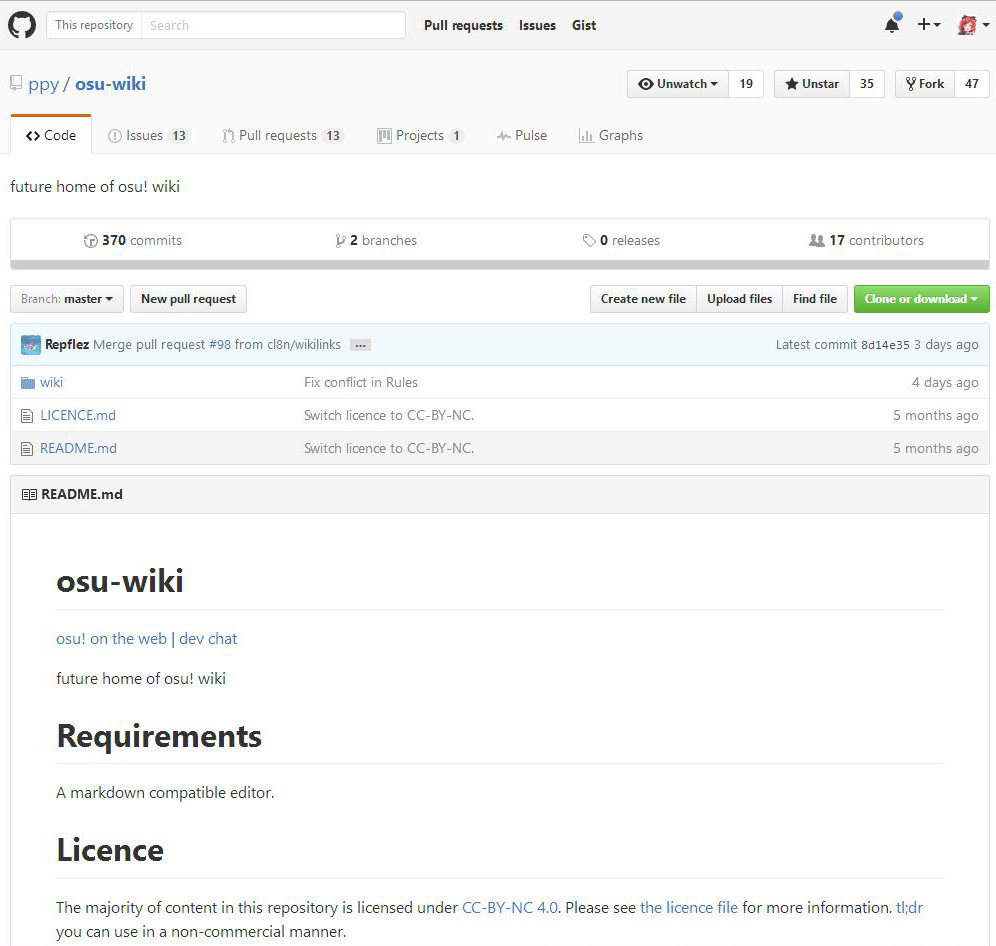

Click on the "Fork" button, located at the top-right of the page.
This should redirect you to the location for the fork.


Now click at your profile and GitHub would redirect you to where the fork is.

Finally, you should see something like this.

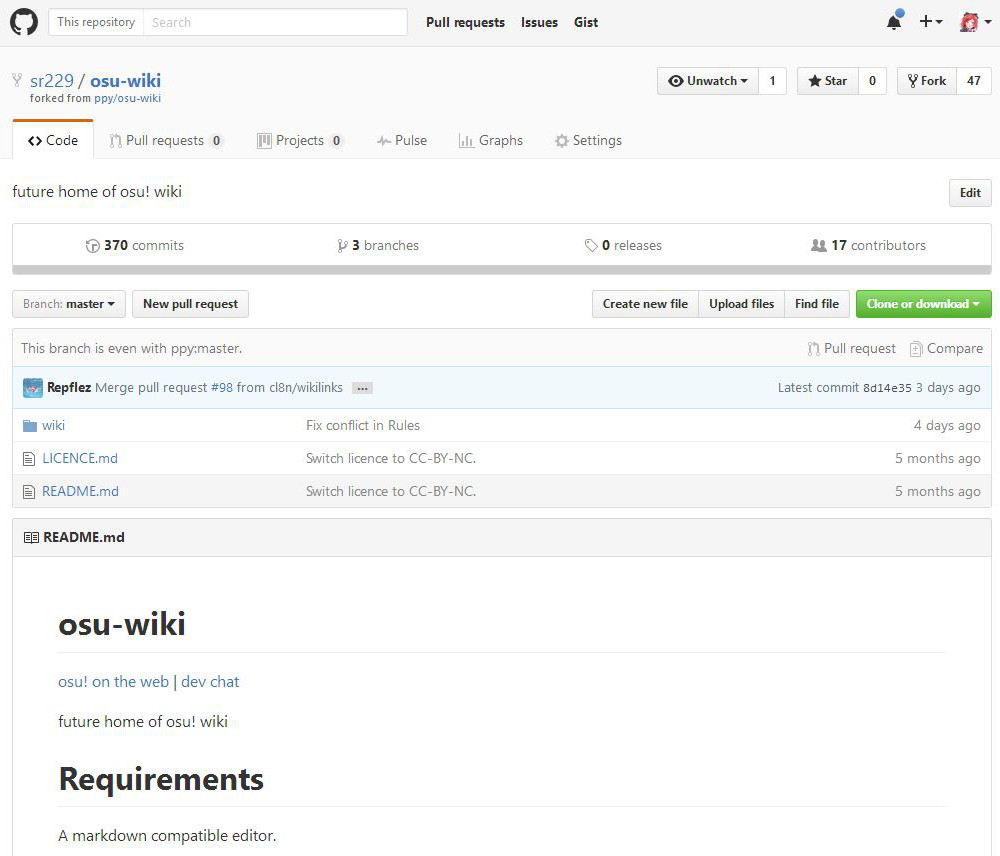

Congratulations!
You have made a copy of the osu-wiki repository!

You can now proceed to make changes.

## Making Changes

### Through GitHub's Web Editor

#### Accessing the correct repository and branch.

If you don't want the hassle of cloning your fork into your local machine, GitHub offers a web editor for editing through your browser.

First, visit your own forked repo (you can rename the ``ppy`` part in ``https://github.com/ppy/osu-wiki`` with your own GitHub's name for quicker access or click on the "Fork" button in ``ppy/osu-wiki``).

You should be in the ``master`` branch by default.

#### Branching

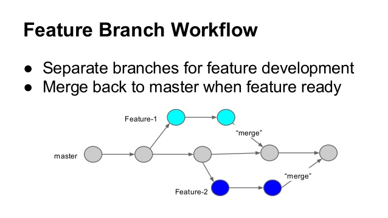

_[Image taken from Slide 6 from Git branch management by Matt Liu](http://www.slideshare.net/MatthewKLiu/git-branch-management "Git branch management by Matt Liu")_

Frankly speaking, you _could_ do all of your changes in the ``master`` branch. However, it is _bad practice to do this in the long run_.

This is where branching comes into play.
By branching, you can keep your original ``master`` branch clean while you make changes in the branches you make.
In the event of major slip-ups, you can cut off the branch and start a new branch copy based on the clean branch.

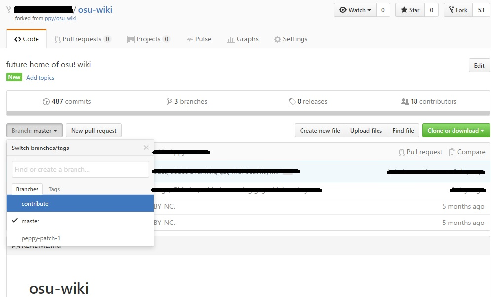

Click on the ``Branch: master`` dropdown button.
There may be some branches shown but the only important branch is the ``master`` branch.
Type in your new branch name in the textbox shown with translucent text, "Find or create a branch...".
Hit ``Enter`` key to go to the branch name.
If the branch name was not found, a new branch based on ``master`` branch will be made.

_Note: Make sure you are in ``Branch: master`` before making a new branch.
The new branch will always base itself from the previous branch where the branch search was initiated._

Now, see the same dropdown button at the same position again.
It should be ``Branch: <your branch name>``.

You are now all set to make changes safely with a solid bailout plan.

#### Update

To edit a page, go to the folder of that page and select the language of that article.
From here, you should see something like this:

*Note: Each article is grouped into folders where they contain markdown files arranged by language and their media.
All article pages inside these folders must use the two letter language codes.
To know which language code to use, see the [List of ISO 639-1 codes](https://en.wikipedia.org/wiki/List_of_ISO_639-1_codes) following the `639-1` column.
Please follow this format when creating a new article.*                


##### Add a file

If you cannot find your language code inside the folder, click on the "Create new file" button.


You will be given an empty file with no filename given, as shown above.

Name the file in accordance to two letter [ISO 639-1 codes](https://en.wikipedia.org/wiki/List_of_ISO_639-1_codes) of your language, following the `639-1` column, with an ``.md`` file extension at the end, all in lowercase.
For example, if you are writing in Japanese, then name it as ``jp.md``.

Write on the empty file content.

After making your changes, scroll down to _Commit Changes_ and fill the following fields to explain your file creation to other contributors.

##### Add a directory/folder

Before adding a directory, please explain what you are doing in the [Issues](https://github.com/ppy/osu-wiki/issues "osu-wiki Issues page") tab to prevent wasted effort and connection usage.
This is because once you upload the directory, renaming or moving the directory must be done using Git.

To add a directory, prepare a properly named folder with at least a filled file inside and nothing else.
The file must follow the naming convention of [ISO 639-1 codes](https://en.wikipedia.org/wiki/List_of_ISO_639-1_codes).

Navigate to the proper filepath to put the directory in.
Then, click on the "Upload files" button.

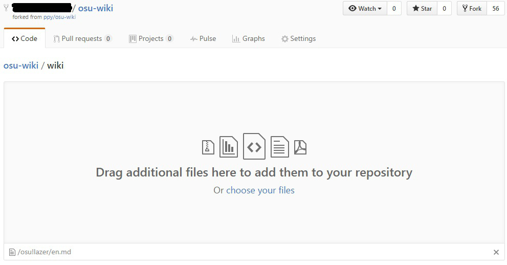

Drag and drop the folder to the upload window.

After uploading your changes, scroll down to _Commit Changes_ and fill the following fields to explain your upload to other contributors.

##### Update a file

If the file exist but was written badly or syntax errors were found, click on the pencil icon to edit.
This should redirect you to the web editor.


If you want to preview your changes, click the "Preview Changes" tab.
Click the "Edit File" tab to continue editing the file.

After making your changes, scroll down to _Commit Changes_ and fill the following fields to explain your edit(s) to other contributors.

#### Commit Changes


_**Note: Your commit message(s) must thoroughly explain your changes, otherwise, they may not get merged!
Also, please write it in English.**_

You would be given an option where to save your edits.

- **"Commit Directly to the ``xyz`` branch"**
  - This will commit the changes through your (current) branch directly.

- **"Create a New Branch"**
  - Automatically creates a branch for your edits.
    A commit and a branch with a default name (normally, it would be called ``username : patch-#``, with ``#`` being a number, starting from ``1``) would be created.

Pick an option and click the green "Commit Changes" button.

### Through your Local Machine

GitHub under the hood, is a Git Service.
You can clone your fork to your PC and make changes there.

This guide was written for Command Line Interface (CLI) version of Git.
If you have any adversity in using the CLI, you can find and self-learn the GUI (Graphical User Interface) version of Git or programs like [Git Extensions](https://gitextensions.github.io/ "Git Extensions").
Some editors (ie. Visual Studio Code) may provide a Git interface.

Please be reminded that local copy and remote copy are two different things.
If you did commits without pushing to remote copy, you are effectively talking to yourself.

You can delay the push to remote copy for as long as you want, but you must push your commit at the end when you are done.
It is usually preferred to push the local commit immediately to the remote copy.

#### One-time setup only

##### Preparation of local copy

_Note: If you do not have Git installed, you can go to [the official Git website](https://git-scm.com/ "Git official website") to download Git and [set it up](https://help.github.com/articles/set-up-git/ "GitHub Help in Setting up Git") (only ignore step 1)._

Once you have Git installed and ready to deploy (see the note above if you have not), open up Git Bash or your terminal and enter this in the Command Line Interface (CLI):

```prolog
git clone https://github.com/<your GitHub username>/osu-wiki.git
```

Replace ``<your GitHub username>`` with, well, your GitHub username you sign up with and fork from.

This will clone your fork (``master`` branch only) in the filepath you specified (usually in your root user's home folder, when running Git directly by default).
Moreover, the link is now nicknamed to ``origin``, and the significance will be explained at the next header.

Make sure you are connected to the Internet before using the command.
Also, please consider doing this in an unmetered connection like a Wi-Fi area to preserve your connection quota, as the content size of osu-wiki is _quite large_.

_Note: For further reference, check [GitHub Help on fork a repo](https://help.github.com/articles/fork-a-repo/ "GitHub Help on fork a repo")_

##### Nicknames significance

Head to the cloned fork folder first. Type this to the CLI:

```prolog
cd osu-wiki
```

The terminal command, `cd`, will move Git down to ``osu-wiki``, which is where your freshly created local copy is at.

Remember previous mention about ``origin``?

Well, do the below first:

```prolog
git remote add upstream https://github.com/ppy/osu-wiki.git
```

The command will set the link (which is the osu!wiki official repository link) to the nickname of ``upstream``.
If you do not like the ``upstream`` nickname, you can change it to whatever you like, but the guide onwards will still use ``upstream`` nickname to refer to the ``osu-wiki`` official repository link.

Now you have two nicknames, ``origin`` and ``upstream``.
Nicknames are just link-shorthand for you to type in Git when you want to do something, such as telling Git to push (important) local changes to where it should be or telling Git to cross-check and update your own local copy with the latest official copy.
You can have more nicknames with links based on other repositories of ``osu-wiki``, but two is mostly sufficient for now.

Use the command below if you want to know what nickname is referring to what link:

```prolog
git remote -v
```

It will show you all the nicknames and the links it reference to.
It should show something as below:

```prolog
origin  https://github.com/<your GitHub username>/osu-wiki.git (fetch)
origin  https://github.com/<your GitHub username>/osu-wiki.git (push)
upstream        https://github.com/ppy/osu-wiki.git (fetch)
upstream        https://github.com/ppy/osu-wiki.git (push)
```

##### Default terminal text-editor

Reference: <http://web.mit.edu/6.005/www/sp14/tutorial/git/config.html>

To do a quick test, type in ``nano``/``vim``/``emacs`` in Git Bash or terminal, and see what happens.
If the terminal changed rather than an error given, then Git is most likely using this terminal text-editor by default.
Read what was given for the quit command.

- By default, you will be using ``nano`` if you are in Linux environment.
- If you are in Windows environment or your Linux environment does not provide ``nano`` by default, then ``vim`` will be used instead.
- For Mac OSX environment, ``emacs`` should be set by default if it is not ``nano``, or ``vim`` will be used instead.

If you have an adversity to terminal text editor, and want to use a familiar text editor like Notepad++ or GitHub's Atom instead, [swcarpentry provides a guide to set Git to always use that instead](https://swcarpentry.github.io/git-novice/02-setup/ "swcarpentry on setting up the default editor").

If you are fine with the given terminal text editor, then you can skip the above configuration and read below.
If you already set your own, ignore below and head to the next header.

---

For ``nano``, it is very self-explanatory as all the important commands was shown at the lower part of the editor.

Use ``Ctrl``-``X`` to exit ``nano`` editor.
If the content was changed, the lower-part will be changed to ask for confirmation; type in ``Y`` to save changes, or type in ``N`` to cancel changes.

---

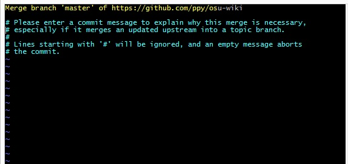

For ``vim``, it has its own set of keyboard commands, and most of it can be ignored unless you are using it to write files.

The only three keywords you need to remember when using ``vim`` appears are as follow:

```
1. i   (lowercase i key, once)
2. Esc
3. ZZ  (UPPERCASE Z key, twice) or :q (a colon and a lowercase q key)
```

By default, you will be in normal mode.

- The first command tells ``vim`` to go to insert mode, so you can write on it.
  - If you do not want to modify the text content, you can directly skip to the third command if the first command was not used.
- The second command tells ``vim`` to go back to normal mode, which allows you to exit.
- The third command tells ``vim`` to save and exit if some text was given; exit and abort the commit if no text was given.

Oh, and if you got the [E325 error](https://stackoverflow.com/questions/14513349/e325-attention-found-a-swap-file-by-the-name-git-commit-editmsg-swp), do this:

```prolog
rm .git/.COMMIT_EDITMSG.swp
```

#### Accessing your local copy

Open up Git Bash or your terminal of choice (if you have not), and type in this command in the CLI:

```prolog
git status
```

This command is used to check for Git's response about the status of the local copy in this directory.

If it throws up an error (meaning, you are in the wrong directory), type in this command in the CLI:

```prolog
cd $HOME
cd osu-wiki
```

Assuming you are following the guide and did not do any modification to Git Bash/terminal (saving the cloned osu-wiki repository in your home's root folder):

- The first command tells the terminal to go back to your home directory, `~` (if you somehow end up somewhere).
  - An alternative method is to reopen the Git Bash/terminal again.
- The second command, using the terminal command, `cd`, will move the terminal down to ``osu-wiki`` if found, which is where your freshly created local copy is at.

There should be a light-blue coloured brackets with text inside (``master``) at the end of the line when done right in Git Bash.
That is the branch name your local copy is currently in.

You can now proceed to make your changes.

#### Branching

To check for available branches, enter the command below in the CLI:

```prolog
git branch
```

This command will show all the branches of the remote repository (namely, your forked repo, nicknamed ``origin`` by default) copied into your local copy.
If you are starting fresh, you will be in ``(master)`` branch by default.

To switch to a branch, enter the command below in the CLI:

```prolog
git checkout <branchname>
```

Once completed, your local copy will be updated exactly to the branch copy version you switched to.
You are now in the branch specified in ``<branchname>``.
If you forgot to save the files before switching, try and see if your text editor still keeps it or not.

To make a new branch, enter the commands below in the CLI:

```prolog
git checkout master
git checkout -b <branchname>
git push origin <branchname>
```

- The first command returns the Git back to ``master`` branch.
  If you are already in ``master`` branch, nothing happens.
- The second command makes the ``<branchname>`` branch copy based on ``master`` branch.
- The third command updates your forked remote copy (``origin``, remember?) with a new ``<branchname>`` (make sure you are connected to the Internet before pushing anything).

You are now in the new branch you created and its time to make some local changes.
Go ahead and mess with the ``osu-wiki`` directory content.

#### Update

After making your changes locally (such as add/delete/rename/move/modify files/folders), you will need to commit (update) this on your local copy.

This can be done by entering this to the Git's CLI:

```prolog
git add .
git commit -m "<short title>" -m "<long description>"
```

- The first command will **stage everything**, including untracked and changed files.
  - You can also substitute ``.`` with the filepath you want to stage manually, one-by-one.
- The second command takes a GitHub's snapshot (``commit`` keyword) with a refined commit message of a title (the first ``-m "<short title>"``) and a description (the second ``-m "<long description>"``).
  - Please try to avoid the use of punctuation, to prevent errors or unexpected behaviour.
  - Also, write the commit message in **English**.
  - If you write longer than the 72 characters limit for the title, the rest of the text will be shown in GitHub's hidden commit description instead.

_Note: Omitting the ``-m`` attribute will send you to a CLI text-editor interface by default instead to write your summary.
If you are not well-versed with CLI text-editor, or do not want to open your predefined text-editor to write, use the ``-m`` attribute._

After committing your changes, you need to push the commits to GitHub so everyone can see it.

To do this, enter the following to your CLI:

```prolog
git push origin <branchname>
```

This should prompt you to enter your GitHub login credentials.
After you enter them, this should push your commits to GitHub.

**Note:**

- Always check if your local branch copy is synced with your remote branch.
  - Enter ``git status`` to check for any uncommitted changes and the status of your local repository versus your remote repository.
- If your authentication details were saved in Git already, no prompt will appear and will proceed directly to push.
  This can be done by [caching your Git credentials](https://help.github.com/articles/caching-your-github-password-in-git/).

## Pull Requests

### Finding the pull request button

After pushing your commits, you must make a "Pull Request"(abbreviated as "PR").
This lets us know that your commits are ready to be reviewed.

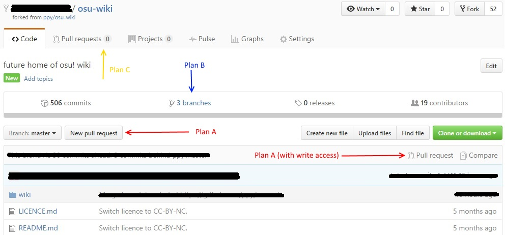

There are three ways (four, if you have write access to the repository) of making a pull request.
Each of the ways are separated by a plan header, and all of them will lead to the creation of a PR.
Pick your favourite plan and stick to it.

To begin, go to your own forked repository.

#### Plan A (PR current branch)

Switch your ``Branch: master`` dropdown button **to the branch you want to do a PR** for.
Then, press on either the "New pull request" right beside the dropdown button, or the "Pull request" with a merge-branch icon right beside the "Compare" button.

Either of the buttons will still lead you to the same PR branch compare page.

#### Plan B (The branch page)

Click on the "Branches" icon and text to go to the branches page.


You should roughly get the screen as shown above.
You can overview your branch status and do clean-up like deleting the branches by pressing the red trashcan icon.

Since you are here for PR, click on the "New pull request" on the branch you want to do PR on.

#### Plan C (The PR page)

Go to the "Pull Requests" tab, or the "New Pull request" button beside the branch.

This would lead you to the pull requests page.


This is the Pull Request Page.
Now click on "New pull request"

### Preparing the PR


We want to compare ``ppy:master`` as base fork branch against your branch as head fork branch.

From here, select the branch that contains your commits besides your "head fork".


_However, if you made changes in your master branch, the changes will be shown without the need to change anything in the head fork options._

Now after viewing your changes, click "Create Pull Request" and fill it with the following details:

- **Title** : The summary of the changes you have made
  - It is really important to have a meaningful and clear title, otherwise it will cause confusion
  - Please write it in **English**

- **Leave a Comment** : The details of the changes you have made
  - Also, write it in **English**


Click on the "Create pull request" button.

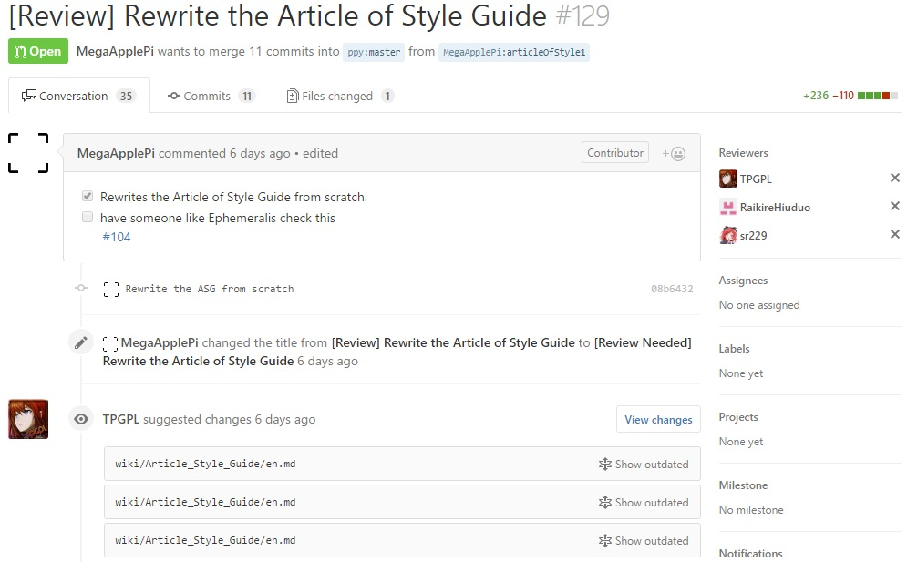

With the PR up, you can either refine your PR content and files by pushing to the branch or wait for a reviewer to check for errors.
If your PR was deemed good enough, a Team osu! member may come and merge your changes to the official branch.

**Your commit messages should thoroughly explain your changes.
Otherwise, the pull request may not be merged to the official branch!**

## Repo Sync and cleanups

Two important things you must do at all cost:

1. Updating your ``master`` branch to the latest official ``master`` commit.
2. If the branch has merge conflicts, fix it immediately.

Updating a branch and cleaning up stale/merged branches is an optional personal task.

### Through GitHub's Web Editor

#### Branches cleanups

Go to your own forked repository.

There are two ways of cleaning a branch:

- overview branch cleanup, and
- merged/closed PR manual branch deletion.

As the second way requires the branch to be merged/closed for the branch's delete button appear in the merged/closed PR page, the first way of cleaning the branches is preferred for this guide.

Click on the "Branches" icon and text to go to the branches page.


You should roughly get the screen as shown above.
Click on the red trashcan icon on the branch you want to delete.
The branch will be marked for deletion, and will be deleted after you leave the page.

Once you have done cleaning the branches, it is time to update your own forked repository.

_Note: For further reference, see [GitHub Help in viewing branches in your repository](https://help.github.com/articles/viewing-branches-in-your-repository/ "GitHub Help in viewing branches in your repository")_

#### Branch sync

Go to ``ppy/osu-wiki`` repository this time.

_Note: While technically you can go back to your own repository to do the PR, the amount of clicks needed coupled by zealous page refresh the moment you change the fork or branch may soon become a test of your patience, and your connection quota._

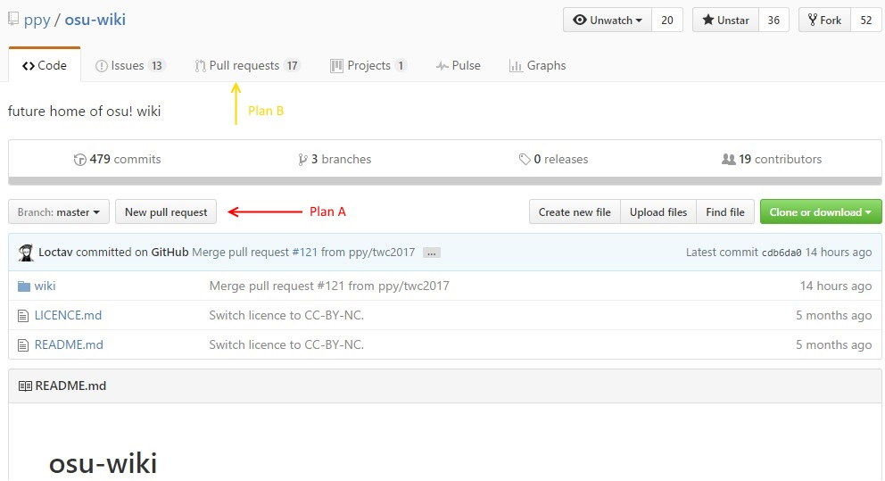

Pick either one of the plan to access the PR compare page.

If you go for plan B, click on the green "New pull request" button.


Now, you should see the page as shown below:

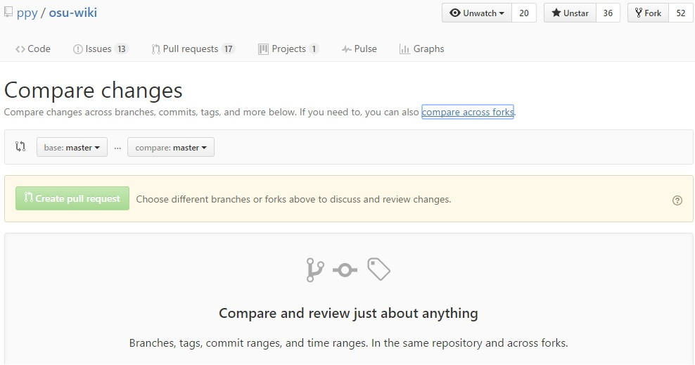

Click on the blue keyword, _compare across forks_.
The fork dropdown buttons will be added.
Set the base fork as your own forked repository (the second one in the dropdown list, usually).
A page refresh will occur when the fork was changed.

If there are changes to PR, you should see the page now as below:

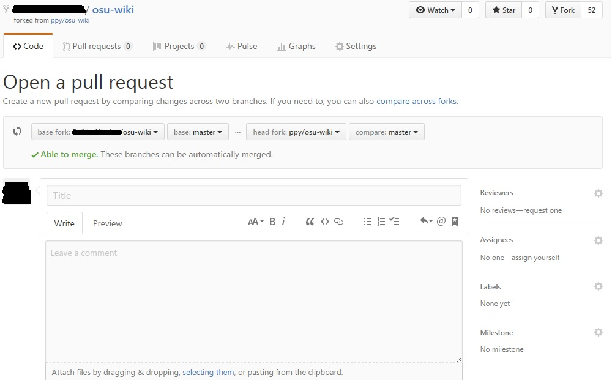

Pick the branch you want to pull from and a page refresh will occur.

Fill up the PR information (you can just write anything since it is your own repo), and press the green "Create pull request".

You will be directed to your freshly-created PR page:

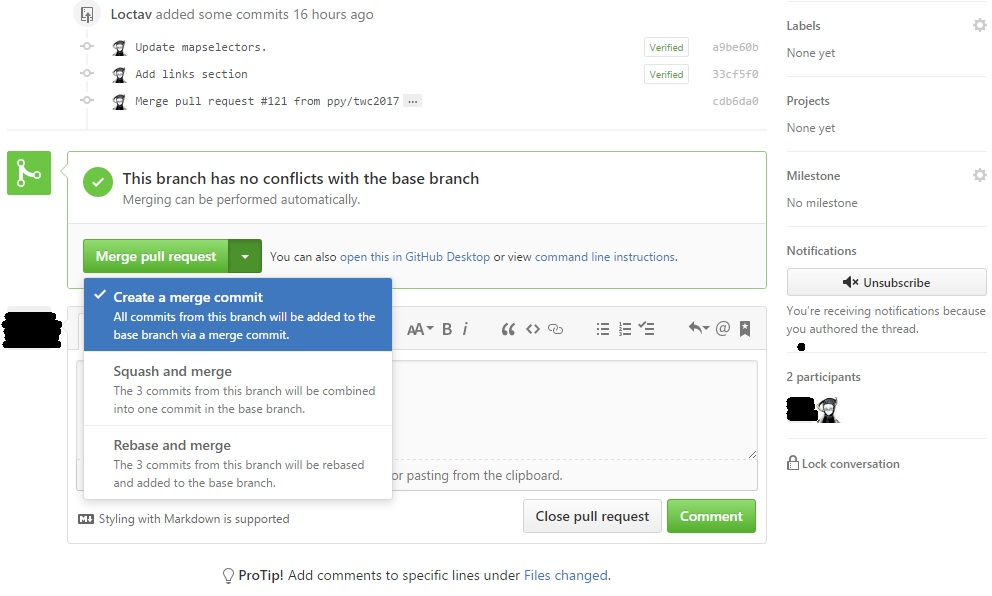

Scroll down to the lower part of the page.
Always set your green "Merge pull request" button to "Create a merge commit", which is set by default.

Press the green "Merge pull request" button.


Click on the green "Confirm merge" button and the branch will be updated successfully to the latest version.

To update your other branches, do the same thing in this section in a new PR but with different branch this time.

#### Merge conflicts

[Read this GitHub Help for an overview about merge conflicts](https://help.github.com/articles/about-merge-conflicts/)

[Read this GitHub Help on resolving merge conflicts in GitHub itself](https://help.github.com/articles/resolving-a-merge-conflict-on-github/)

### Through your Local Machine

#### Branches cleanups

_Note: It is highly suggested to do branch cleanups locally.
It is best not do any web branch cleaning in GitHub if you have a local copy._

```prolog
git checkout master
git branch -d <branchname>
git push origin :<branchname>
```

- The first command set the branch to master.
  This will allow you to delete the other branches.
- The second command will tell Git to delete the branch.
  If Git refuse to delete it for a reason (usually the branch was not updated) but you do not want the branch anyway, use the force delete variant by replacing the soft local delete attribute, ``-d``, to force local delete attribute, ``-D``.
- The third command will update the forked remote repo to also remove the branch (make sure you are connected to the Internet).
  The colon, ``:``, will tells Git to delete this ``<branchname>`` branch in the ``origin`` nickname (which is your forked remote repo).

#### Branch sync

Do a checkout to the branch you want to sync.

```prolog
git checkout <branchname>
```

There are two ways of updating it:

- The first way provides a open choice (will not be explained in this guide) to do a forensic check on what was changed before doing any merging.
- The second way is best used if you know that there will not be any merge conflicts, does not care about what was changed, and lazy to type two commands.

Both commands will provide the same outcome, and will complain about the merge conflict(s) if found.

##### Fetch + Merge

```prolog
git fetch https://github.com/ppy/osu-wiki.git
git merge https://github.com/ppy/osu-wiki.git/master
git push origin <branchname>
```

or, if you nicknamed ``https://github.com/ppy/osu-wiki.git`` to ``upstream`` for example, then the below will work too:

```prolog
git fetch upstream
git merge upstream/master
git push origin <branchname>
```

- The first command collects all the changes from all the official repository branches (must have connection to the Internet).
  - If you want to know all the branches, including the fetched remote branches: ``git branch -a``.
    - The fetched remote branches will all be coloured in red in Git Bash if the command was used.
  - All fetched changes will be stored as ``https://github.com/ppy/osu-wiki.git/<branchname>``, or if nicknamed, ``upstream/<branchname>``.
  - You only need to fetch once before attempting to update all the local branches.
    - For other branches, continue directly to the second command after you fetched and merged the first branch.
- The second command attempts to merge the official master branch changes to your current branch.
  - If a merge conflict arise, refer to _Merge conflict_ below on how to resolve it.
    In this case, the merge commit will fail, and you must do the regular commit after solving the conflict.
  - If the local merge commit was successful, Git will ask for a commit message with a default given for this merge commit using the terminal text-editor/your text-editor.
    Just exit it (the default message is more than enough to explain the commit itself).
- The last command is to update your own remote repo's branch with the updated local copy of this branch.
  As usual, make sure you are connected to the Internet before doing any pushing.

##### Pull

```prolog
git pull https://github.com/ppy/osu-wiki.git master
git push origin <branchname>
```

or, if you nicknamed ``https://github.com/ppy/osu-wiki.git`` to ``upstream`` for example, then the below will work too:

```prolog
git pull upstream master
git push origin <branchname>
```

- The first command is, frankly, a fetch and a merge in one command.
  - Read the description of the _Fetch + Merge_ above for the first command and the second command.
    It is exactly the same.
- The last command is to update your own remote repo's branch with the updated local copy of this branch.

#### Merge conflict

If you received merge conflict(s) when doing a merge/pull, the merge/pull will fail.
In this case, you should fix the conflicting changes, and do a regular commit instead.

When a merge conflict occurs, your Git Bash/terminal will be locked to the branch until you complete the merge conflicts.
An extra ``| MERGING`` notice will be added to the brackets to signify the importance of fixing the merge conflicts at all cost.

To remove it, there are two safe ways of doing it:

- The manual method, being much more straightforward but becomes very tedious quickly the more files with conflicts.
- The mergetool method, requiring some familiarity with the default tools used without explicit configuration and installation of other program by personal preference.

To check for files with merge conflict, use:

```prolog
git status
```

A typical textfile merge conflict will look like this:

```
<<<<<<< HEAD
    <myLocalContent>
=======
    <osu!wikiContent>
>>>>>>> master
```

Read the content difference, and decide whether to rewrite it, or keep either one.
You should delete the ``<<<<<<< HEAD``, ``=======``, and ``>>>>>>> master`` once you have decided on the content to keep.

Continue to search for next merge conflicts, and save when there is no more merge conflict in this file.

For major or complicated merge conflicts, ask for help.

##### Manually

Reference: [Githowto on resolving conflicts](https://githowto.com/resolving_conflicts "Githowto's 30. Resolving Conflicts") and [GitHub Help on resolving a merge conflict using the command line](https://help.github.com/articles/resolving-a-merge-conflict-using-the-command-line/ "GitHub Help on resolving a merge conflict using the command line")

The procedure is basically:

1. Use ``git status`` to collect the files with merge conflict(s).
2. Open the file using your text-editor of choice.
3. Find for ``<<<<<<<``.
4. Read the content difference, do a revision there, and remove all the merge conflicts symbols (``<<<<<<< HEAD``, ``=======``, and ``>>>>>>> master``) of this section.
5. Return to Step 3, until no more merge conflicts in this file.
6. Save the file.
7. Continue with other files starting with Step 2.
8. Pick the image you want to keep by deleting the old ones.

Once the ``git status`` gives all-green answer in your Git Bash/terminal, commit and push the changes.

##### Mergetool

[Read this guide by GitHub user karenyyng on using git mergetool to resolve merge conflicts](https://gist.github.com/karenyyng/f19ff75c60f18b4b8149)

For practice in using the mergetool, try [Ruslan Osipov's tutorial in using vimdiff](http://www.rosipov.com/blog/use-vimdiff-as-git-mergetool/), with a nice simulation guide to do a test merge conflict (just delete the folder once you are done with it, there is no need to push).

#### Solved merge conflicts

Once all the merge conflict(s) resolved, do a commit with a message, and push to your remote branch.
Like so:

```prolog
git commit -a -m "Solved merge conflicts"
git push origin <branchname>
```

The extra ``| MERGING`` notice will be removed from the brackets once the commit was completed.

## FAQ

### Why is the file not uploaded?

Currently, **1MB** size is the upper limit for any files.
Resize, or compress the file to stay below the file limit.

Also, check the file extension in use.
Use only lowercased variant of the file extension (like ``.jpg``, ``.gif``, ``.png``, or ``.md``).

### What are the green "Verified" button beside the commits in a PR page?

[GitHub supports GPG signature verification as written in their blog post](https://github.com/blog/2144-gpg-signature-verification "GitHub blog on GPG signature verification").

It is a personal proof that the commit made by the account user personally, not from a malicious account using the same name.
By default, all accounts will not have the "Verified" button, as it is an optional commit integrity feature.

To get the "Verified" button, it will take a while; from downloading a tool, generation of the key from the tool, and some careful configuration.

- For a Windows-only guide, check [the mrexodia's blog post guide by Duncan](http://mrexodia.cf/guide/2016/05/30/Github-Gpg "mrexodia blog post on GitHub GPG by Duncan")
- For a GitHub's guide, check the [GitHub index page for GPG](https://help.github.com/articles/signing-commits-with-gpg/ "GitHub Help on signing commits with GPG")

Do note that it is only applied to **Git usage only**, and is not related to two-factor authorisation.

### Heeeeeeeeeeeeeeeelp!

Use the search engine of your choice and type in your help request.
If you cannot find the answer, you are not trying hard enough or your question is too ambiguous.
Use only the keywords or refine your search and try again.
Usually, copy-and-paste the issue code directly might get you an answer, but effectiveness varies.

If the problem was not solved after trying some of the online solutions, ask for help in the osu!dev channel under ``#osu-wiki``.
Depending on severity of the problem and members' active time, you may or may not get the answer.

Alternatively, if you are on Git, prefers to discover a way of solving yourself, have no connection right now, and do not mind reading the manual with its own terminology, use

```prolog
git
```

or

```prolog
git help
```

It will show you a list of most of the commonly-used Git commands.

If you need further reference on the command, for example, ``git pull``, use

```prolog
git help pull
```

This will open your default browser with the manual of the command written as a HTML page.

### Why is the old osu!wiki not staying?

Due to abysmal performance, the old wiki is getting deprecated,
as stated [by MillhioreF in issue 69 (fourth post)](https://github.com/ppy/osu-wiki/issues/69).

### How would this differ from the old wiki (running on MediaWiki)?

- We use GitHub for collaboration.
  You can make mass changes easily and efficiently, and you can delay your changes for as long as you like.
- Unlike the old osu!wiki, changes has to be made via pull requests which are then reviewed by staff or someone with write permissions.
  This adds a layer of security against spammers and vandals.
- All linking must be done manually, and must be done using static linking without any filepath errors.
  - **No section anchors**.
  - **No redirects**.
    - It is a known issue since it requires specific configuration from osu!web part and no formulated syntax support to redirect ``DT`` keyword to ``Game_Modifier#-double-time`` section of the page rather than to the top of the ``Game_Modifiers`` page, for now.
- **No Templates**.
  - You must duplicate the template and paste it accordingly with changes to the article you are editing.
- Addition, deletion, moving, and renaming of media is easier and requires no special wiki function (except for moving files/folders and renaming folders, which requires Git usage).
  However, this has to undergo the pull request protocol.
- Tables are supported by a bare-minimum with GFM (without extensions), unlike MediaWiki.
  However, this does mean we may need to code some tables with HTML for extreme cases.
- Markdown is sensitive.
  - Using the wrong capitalization in links can break them (i.e. links and images).
  - Newline spacing errors for lists or tables may cause the Markdown parser to be confused and not parse the part.

## Conclusion

We hope this briefs you on how to contribute to the new osu!wiki.
If you have any questions, you can inquire at the [osu!dev Discord Server](https://discord.gg/ppy "osu!dev in Discord").
